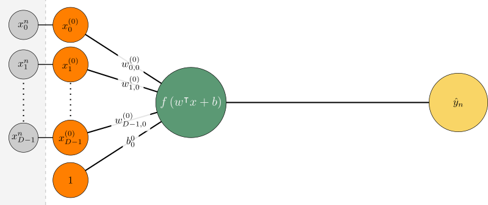
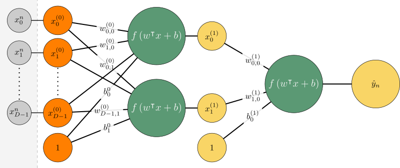

# Yapay Sinir Ağları

Bu bölümde sinir ağlarının tarihsel gelişiminden başlanarak ve günümüzde sıklıkla kullanılan çok katmanlı algılayıcı yapısına değinilecektir.

- [Yapay Sinir Ağlarının Özellikleri](#yapay-sinir-ağlarının-özellikleri)
- [Tarihsel Gelişim](#tarihsel-gelişim)
- [En Küçük Karesel Hata (LMS)](#en-küçük-karesel-hata-lms)
- [Algılayıcı Yapısı](#algılayıcı-yapısı)
  - [Aktivasyon Fonksiyonları](#aktivasyon-fonksiyonları)
  - [Tek Katmanlı Algılayıcı Eğitimi](#tek-katmanlı-algılayıcı-eğitimi)
  - [Çok Katmanlı Algılayıcı Eğitimi](#çok-katmanlı-algılayıcı-eğitimi)

## Yapay Sinir Ağlarının Özellikleri

Yapay Sinir Ağları, sinir hücrelerinin çalışma ilkelerinden ilham alınarak geliştirilmiş bir makine öğrenmesi ve veri analizi yöntemidir. Bu yöntemin günümüzde oldukça yaygın bir şekilde kullanılmasını sağlayan önemli farklılıkları aşağıda listelenmiştir.

- Doğrusal Olmama: Girdi ve çıktıları arasında doğrusal bir ilişki bulunmayan eğitim kümeleri YSA aracılığıyla öğrenilebilir.

- İçerik Bilgisi: YSA öğrenmesinde kullanılan çok katmanlı algılayıcı yapısı ile bir katmandan elde edilen içerik bilgisi sonraki katmanlar tarafından doğrudan kullanıldığından, katmanlar belirli örüntülerin bir arada olup olmadığı bilgisi de öğrenilebilir.

- Hata Dayanıklılığı: YSA yapısı gereği dağıtık yapıda bir öğrenme yöntemi olduğundan, her bir algılayıcı bağının üzerinde saklanan bilginin toplam çıktıya etkisi oldukça küçüktür. 
  
## Tarihsel Gelişim

- McCulloch and Pitts (1943) tarafından önerilen ilk algılayıcı modelinde girdiler belirli bir ağırlıkla çarpılmakta, çıktı ise bir eşikleme fonksiyonundan geçirilerek üretilmekteydi. Bu modelin ağırlıklarının öğrenilmesine ilişkin bir algoritma bulunmuyordu ve yalnızca mantıksal devre elemanlarının gerçeklemesi yapılabiliyordu.

- Rosenblatt's (1962) tarafından algılayıcıların öğrenebilmesine ilişkin bir algoritma önerildi ve günümüzde de kullanılan algılayıcının matematiksel modeli oluşturuldu.

- Minsky and Papert (1969) tarafından algılayıcıların doğrusal olmayan problemleri sınıflandıramayacağı gösterildi ve sinir ağlarının kullanımı uzun süre durakladı.

- Werbos's (1975) tarafından çok katmanlı algılayıcı ve bu katmanların eğitimine yönelik geriyayılım algoritması önerildi. Çok katmanlı yapılar doğrusal olmayan problemleri de çözebildiğinden sinir ağları tekrar ilgi görmeye başladı.  

## En Küçük Karesel Hata (LMS)

Elimizde $g(\mathbf{x}_i, \mathbf{w}) = \mathbf{w}^\intercal \mathbf{x}_i + b_i$ şeklinde verilen bir fonksiyon için hata $\epsilon_i = g(\mathbf{x}_i, \mathbf{w}) - y_i$, karesel hata $f(\mathbf{w}) = \frac{1}{2}\epsilon_i^2$ şeklinde tanımlanabilir.

Gradyan iniş yöntemi uygulamak için $f(\mathbf{w})$ fonksiyonunun gradyanı sıfıra eşitlenerek $\mathbf{w}$ çözülebilir.

$$
\begin{aligned}
    \nabla f(\mathbf{w}) &= \nabla \frac{1}{2}\epsilon_i^2 &= \epsilon_i \mathbf{x}_i\\
\end{aligned}
$$

Bu yaklaşım elde edilen gradyan ifadesi gradyan iniş yönteminde kullanılırsa aşağıdaki ifade elde edilir.

$$
\mathbf{w}_ {k+1} = \mathbf{w}_ {k} - \eta \epsilon_i\mathbf{x}_ i
$$

## Algılayıcı Yapısı

Algılayıcılar; yapay sinir ağlarının girdi ve çıktıya sahip en küçük işlem birimleridir. Girdi $\mathbf{x}_n$ ile çıktı $\hat{y}_n$ arasındaki ilişki aşağıdaki şekilde hesaplanır.

$$
\hat{y}_n = f \left( \mathbf{w}^\intercal \mathbf{x}_n + b \right) = f \left( \mathbf{a}_n \right)
$$

Burada $\mathbf{w}$ ağırlık vektörü, $b$ bias değeri ve $f$ aktivasyon fonksiyonu doğrusal olmayan, türevlenebilir bir fonksiyondur. 

### Aktivasyon Fonksiyonları

Yapay sinir ağlarının doğrusal olmayan problemleri öğrenilebilmesi için aktivasyon fonksiyonunun doğrusal olmaması gerekmektedir. Ayrıca geri yayılım algoritmasının uygulanabilmesi için bu fonksiyonun türevlenebilir de olması gerekmektedir. Bu iki temel özellik göz önünde bulundurularak literatürde farklı aktivasyon fonksiyonları önerilmiştir.

* **Adım Aktivasyon Fonksiyonu:** Adım Aktivasyon Fonksiyonu'nun en önemli özeliği tüm girdi değerlerine karşılık sadece iki farklı çıktı üretmesidir. McCulloch-Pitts nöronu olarak da bilinen bu aktivasyon fonksiyonu, Warren MuCulloch ve Walter Pitts tarafından 1943 yılında önerilen ilk yapay sinir modelidir. Önerilen modelin matematiksel ifadesi aşağıda verilmiştir.

$$
f(a) = 
\begin{cases}
0, & a < 0 \\
1, & a \geq 0
\end{cases}
$$

Bu modelde algılayıcı çıktaları sıfır yada bir şeklinde sadece iki çıkış verebildiğinden genellikle sınıflandırma problemlerinde tercih edilmektedir.

* **Lojistik Aktivasyon Fonksiyonu:** Lojistik (sigmoid) aktivasyon fonksiyonu sürekli ve türevi alınabilir bir fonksiyondur. Doğrusal olmayan ve kolay türevlenebilen bir fonskiyon olması nedeniyle yapay sinir ağı uygulamalarında en sık kullanılan aktivasyon fonksiyondur. Fonksyionun matematiksel ifadesi aşağıdaki denklemde verilmiştir.

$$
f(a) = \frac{1}{1+e^{-a}}
$$

Bu fonksiyon girdi değerlerinin her biri için sıfır ile bir aralığında bir değer üretmektedir.

* **Tanjant Hiperbolik Aktivasyon Fonksiyonu:** Tanjant hiperbolik fonksiyonu, sigmoid fonksiyonuna benzer bir fonksiyondur. Sigmoid fonksiyonunda çıkış değerleri $[0,1]$ aralığında değişirken hiperbolik tanjant fonksiyonunun çıkış değerleri $[-1,1]$ aralığında değişmektedir. Fonksyionun matematiksel ifadesi aşağıdaki denklemde verilmiştir.

$$
f(a) = \frac{e^{a}-e^{-a}}{e^{a}+e^{-a}}
$$

* **Rampa (ReLu) Aktivasyon Fonksiyonu:** Literatürde Rectified Linear Unit (ReLu) olarak da bilinen rampa aktivasyon fonksiyonu parçalı bir aktivasyon fonksiyonudur. Yukarıda verilen aktivasyon fonksiyonlarından farklı olarak rampa aktivasyon fonksiyonunun çıkışında bir sınır bulunmamaktadır. Fonksyionun matematiksel ifadesi aşağıdaki denklemde verilmiştir.

$$
f(a) = 
\begin{cases}
0, & a < 0 \\
a, & a \geq 0
\end{cases}
$$

### Tek Katmanlı Algılayıcı Eğitimi

YSA öğrenmesinde başlangıç noktası algılayıcı eğitimi aşamasıdır. Bu aşamada verilen $\mathbf{X}=[\mathbf{x_1}, \mathbf{x_2}, \dots, \mathbf{x_N}]$ girdi vektörlerine ve $\mathbf{y}=[y_1, y_2, \dots, y_N]$ hedef çıktılara en küçük hata (burada hata etiketlere olan ortalama karesel hata olabileceği gibi farklı bir ölçüt de olabilir) ile yakınsamamızı sağlayacak $[\mathbf{w}, b]$ ağırlık vektörünün öğrenilmesi amaçlanmaktadır. Burada $N$ eğitim kümesindeki eleman sayısıdır. Görsel olarak tek katmanlı bir algılayıcı aşağıdaki şekilde gösterilir.

Seçilen tek bir örnek için $\mathbf{x_n}, y_n$ çifti için  _karesel hata_ aşağıdaki şekilde yazılabilir.

$$
E_n(\mathbf{w},b) = \frac{1}{2} (y_n - \hat{y}_n)^2 = \frac{1}{2} (y_n - f\left( \mathbf{w}^\intercal \mathbf{x}_n + b \right))^2 
$$

Bu hata fonksiyonun en küçükleyen $\mathbf{w}$ ve $b$ değerleri sırasıyla $\frac{\partial E_n(\mathbf{w},b)}{\partial \mathbf{w}} = 0$ ve $\frac{\partial E_n(\mathbf{w},b)}{\partial b} = 0$ eşitlikleri çözülerek bulunabilir.

$$
\boxed{\frac{\partial E_n(\mathbf{w},b)}{\partial\mathbf{w}} =  \left( \frac{\partial E_n(\mathbf{w},b)}{\partial \hat{y_n}} \right) \left( \frac{\partial \hat{y_n}}{\partial a_n} \right) \left( \frac{\partial a_n}{\partial\mathbf{w}} \right)}
$$

Denklemde verilen üç kısmi türev ifadesinde ilk ifade, hata fonksiyonun $\hat{y}$ kestirilen çıktıya bağlı değişimini ölçmektedir. Bu değer *karesel hata* ölçütü kullanıldığı için aşağıdaki şekilde hesaplanır.

$$
\frac{\partial E_n(\mathbf{w},b)}{\partial \hat{y_n}} = \frac{\partial}{\partial \hat{y_n}} \frac{1}{2} \left( y_n - \hat{y}_n \right )^2 = \hat{y}_n-y_n
$$

İkinci kısmi türev ise $\hat{y}_n$ çıktısının $a_n$ girişine bağlı değişimi ölçmektedir. Tanım gereği $\hat{y}=f(a)$ olduğundan bu ifade aşağıdaki şekilde yazılır.

$$
\frac{\partial \hat{y}_n}{\partial a_n} =  \frac{\partial f(a_n)}{\partial a_n} = f^\prime (a_n)
$$

Üçüncü kısmi türev ise $a_n$ ara çıktısının $\mathbf{x}_ {n}$ girişine bağlı değişimini ölçmektedir. Bu ifadede $a_n=\mathbf{w}^\intercal \mathbf{x}_ {n} + b$ tanımı gereği aşağıdaki şekilde hesaplanabilir.

$$
\frac{\partial a_n}{\partial\mathbf{w}} =  \frac{\partial \left( \mathbf{w}^\intercal\mathbf{x}_{n} + b \right) }{\mathbf{w}} = \mathbf{x}_{n}
$$

Burada ileride kolaylık sağlaması açısından $\frac{\partial E_n(\mathbf{w},b)}{\partial a_n} = \left( \frac{\partial E_n(\mathbf{w},b)}{\partial \hat{y_n}} \right) \left( \frac{\partial \hat{y_n}}{\partial a_n} \right)$ çarpımını kısaca $\delta_n$ olarak isimlendirelim. 

$$
\delta_n = \left(\hat{y}_n - y_n \right) f^\prime (a_n)
$$

Hesaplanan $\delta_n$ ve $\frac{\partial a_n}{\partial\mathbf{w}}$ değerleri kutu içerisine alınan türev ifadesinde yerine yazılırsa hesaplanmaya çalışılan kısmi türev ifadesi aşağıdaki şekilde ifade edilir.

$$
\frac{\partial E_n(\mathbf{w},b)}{\partial\mathbf{w}} = {\delta_n \mathbf{x}_{n}}
$$

Benzer şekilde $b$ değişkenine göre kısmi türevi zincir kuralına göre hesaplanırsa aşağıdaki eşitlik elde edilir.

$$
\frac{\partial E_n(\mathbf{w},b)}{\partial b} = {\delta_n}
$$

Elde edilen kısmi türev ifadeleri Gradyan İniş Yönteminde kullanılarak $\mathbf{w}$ ve $b$ değerleri aşağıdaki şekilde hesaplanır.

$$
\begin{aligned}
\mathbf{w}_{k+1} &=\mathbf{w}_k-\eta \nabla_w E(\mathbf{w},b) &&= \mathbf{w}_k - \eta {\delta_n \mathbf{x}_{n}}\\
b_{k+1} & =b_k-\eta \nabla_b E(\mathbf{w},b) & &= b_k - \eta \delta_n\\
\end{aligned}
$$

### Çok Katmanlı Algılayıcı Eğitimi

Çok katmanlı algılayıcılar tek katmanlı algılayıcıların kaskat bağlanması ile oluşturulan yapılardır. Bir katmanın çıktılarının bir sonraki katmanın girişine bağlanarak oluşturulan bu yapı ile daha karmaşık problemlerin öğrenilmesi sağlanır.

Çok katmanlı algılayıcıların son katmanı doğrudan çıktıya bağlı olduğundan hata ölçülebilirdir ve tek katmanlı algılayıcılarda olduğu gibi ağırlıklar öğrebilebilir. Ancak ara katmanlarda hedeflenen değer bilinmediğinden hata tanımlamak mümkün değildir.  

Bu problem Geri Yayılım (Back Propagation) algoritması ile çözülmektedir. Geri yayılım algoritmasında en son katmanda hesaplanan hata önceki katmanlara paylaştırılmaktadır. Bu paylaştırma işlemi bir katmanın çıkışında görülen toplam hatanın o katmanın girişlerine, giriş ağırlıkları oranında, pay edilmesi ile yapılmaktdır. Bu sayede herhangi bir ara katmanın çıktıya olan etkisi (ağırlığı) düşükse, çıkışta meydana gelen hatadan daha küçük pay alırken, çıktıya olan etkisi (ağırlığı) yüksekse, çıkışta meydana gelen hatadan daha büyük bir pay alması sağlanır.

Algoritmanın türetilmesi için ilk olarak çıkışta görülen hatanın giriş ağırlıklarına bağlı değişimini zincir kuralı ile yazalım.

$$
\boxed{\frac{\partial E_n(\mathbf{W},b)}{\partial\mathbf{W}^{(0)}} = \left( \frac{\partial E_n(\mathbf{W},\mathbf{b})}{\partial \mathbf{a}_n^{(0)}} \right) 
\left( \frac{\partial \mathbf{a}_n^{(0)}}{\partial \mathbf{W}^{(0)}} \right)}
$$

Yazılan ifadede ilk kısım tanım gereği $\delta_n^{(0)}$ dir. Bu vektör farklı kısmi türevlerin çarpımı ile aşağıdaki şekilde hesaplanır. 

$$
\mathbf{\delta}_{n}^{(0)} = \frac{\partial E_n(\mathbf{W},\mathbf{b})}{\partial \mathbf{a}_n^{(0)}} = 
\left(\frac{\partial \mathbf{x}_n^{(1)}}{\partial \mathbf{a}_n^{(0)}} \right)
\left(\frac{\partial \mathbf{a}_n^{(1)}}{\partial \mathbf{x}_n^{(1)}} \right)
\left(\frac{\partial E_n(\mathbf{W},\mathbf{b})}{\partial \mathbf{a}_n^{(1)}} \right) 
$$

Yazılan ifadede birinci kısmın türevi $\mathbf{x}_n^{(l)} = f(\mathbf{a}_n^{(l-1)})$ tanımı kullanılarak; $\frac{\partial \mathbf{x}_n^{(1)}}{\partial \mathbf{a}_n^{(0)}} = \mathbf{J}(f) (\mathbf{a}_n^{(0)})$ şeklinde hesaplanır. 

$l$. katmanın girdisi $\mathbf{a}_n^{(l)} = {\mathbf{W}^{(l)}}^\intercal \mathbf{x}_n^{(l)} + \mathbf{b}^{(l)}$ şeklinde tanımlandığından, ikinci kısmın türevinden ise $\frac{\partial \mathbf{a}_n^{(1)}}{\partial \mathbf{x}_n^{(1)}} = \mathbf{W}^{(1)}$ bulunur.

Son olarak üçüncü kısımsa tanım olarak $\delta_{n}^{(1)}$ değerine eşittir. Tüm değerler yerine yazılırsa $\delta_{n}^{(0)}$ aşağıdaki şekilde hesaplanır.

$$
\delta_{n}^{(0)} = 
\mathbf{J}(f) (\mathbf{a}_n^{(0)})
\mathbf{W}^{(1)} 
\delta_{n}^{(1)}
$$ 

Kutu içerisine alınan ifadeyi hesaplamak için gereken ikinci kısmi türev, $\mathbf{a}_n^{(0)} = {\mathbf{W}^{(0)}}^\intercal \mathbf{x}_n^{(0)} + \mathbf{b}^{(0)}$ tanımı kullanılarak aşağıdaki şekilde hesaplanır.

$$
\frac{\partial \mathbf{a}_n^{(0)}}{\partial\mathbf{W}^{(0)}} = \mathbf{x}_n^{(0)}
$$

Elde edilen iki kısmi türev kullanılarak; $\mathbf{W}^{(0)}$ ve $\mathbf{b}^{(0)}$ için gradyan iniş yöntemi uygulanırsa aşağıdaki iterasyonlar elde edilir.

$$
\begin{aligned}
\mathbf{W}^{(0)}_{k+1} &=\mathbf{W}^{(0)}_k-\eta \nabla_w E(\mathbf{W}^{(0)},\mathbf{b}^{(0)}) &&= \mathbf{W}^{(0)}_k - \eta {\delta^{(0)}_n \mathbf{x}^{(0)}_{n}}\\
\mathbf{b}^{(0)}_{k+1} & =\mathbf{b}^{(0)}_k-\eta \nabla_b E(\mathbf{W}^{(0)},\mathbf{b}^{(0)}) & &= \mathbf{b}_k - \eta \delta^{(0)}_n\\
\end{aligned}
$$

Üstte tanımlanan $\delta_{n}^{(0)} = \mathbf{J}(f) (\mathbf{a}_ n^{(0)})\mathbf{W}^{(1)} \delta_{n}^{(1)}$ ilk bakışta sıradan görünse de, $\delta_n^{(0)}$ değerini $\delta_n^{(1)}$ cinsinden hesaplamaya yaradığından, son katmandaki hatanın iteratif olarak önceki katmanlara yayılabilmesini sağlamaktadır. Bu sayede çok katmanlı bir ağın çıktısındaki hata, algoritmik olarak girdilerine yayılabilmektedir. 

