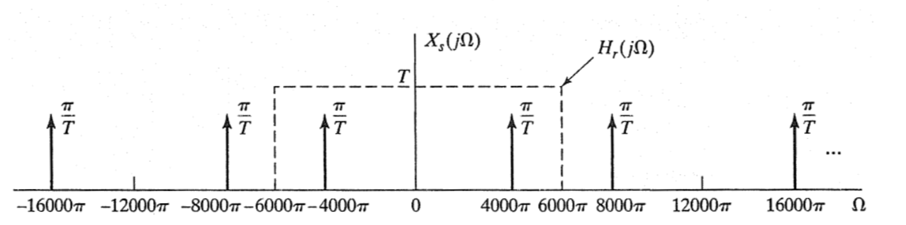
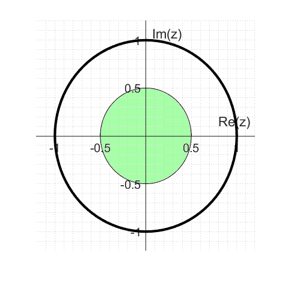
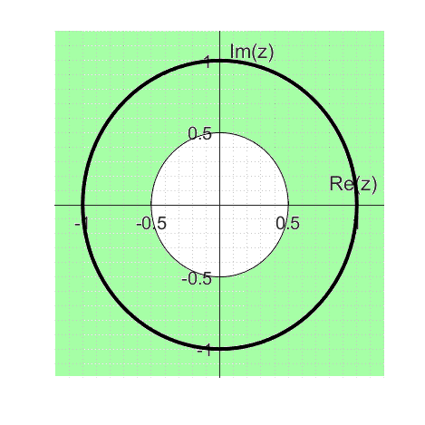
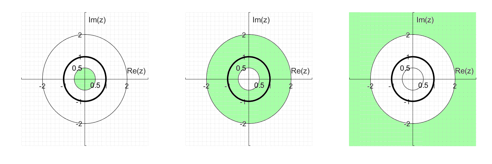
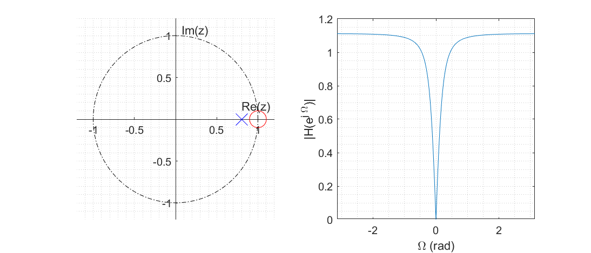
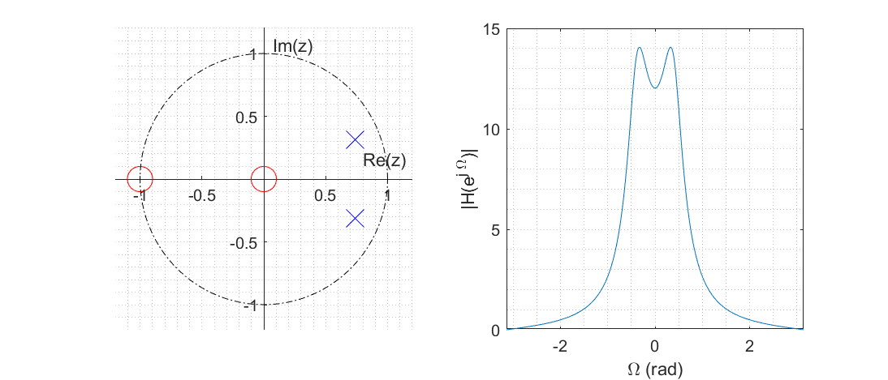

# Sayısal İşaret İşleme

Sinyaller ve Sistemler dersi altında sürekli ve ayrık sinyallerin kategorilendirilmesi yapılmakta ve bu sinyallerin davranışları ve frekans karakteristikleri gibi özellikleri incelenmektedir. 

Bu özet kapsamında ele alınacak konular Sinyaller ve Sistemler dersinin devamı niteliğindedir. Ancak konular sadece ayrık zamanlı sinyaller özelinde anlatılacaktır.

- [Örnekleme](#örnekleme)
  - [Sürekli Zamanlı Sinyallerin Örneklenmesi](#sürekli-zamanlı-sinyallerin-örneklenmesi)
  - [Ayrık Zamanlı Sinyallerin Örneklenmesi](#ayrık-zamanlı-sinyallerin-örneklenmesi)
- [Ayrık Zamanlı Sinyallerin Dönüşüm Analizi](#ayrık-zamanlı-sinyallerin-dönüşüm-analizi)
  - [LTI Sistemlerin Frekans Analizi](#lti-sistemlerin-frekans-analizi)
- [$z$ Dönüşümü](#z-dönüşümü)
  - [Fark Denklemleri ve Frekans Dönüşümü](#fark-denklemleri-ve-frekans-dönüşümü)
  - [ROC Özellikleri](#roc-özellikleri)
  - [ROC Analizi](#roc-analizi)
  - [Örnek Laplace ve $z$ Dönüşümleri Tablosu](#örnek-laplace-ve-z-dönüşümleri-tablosu)
  - [Kutup-Sıfır Grafiği Yorumlama](#kutup-sıfır-grafiği-yorumlama)
- [IIR ve FIR Filtreler](#iir-ve-fir-filtreler)
- [Tüm Geçiren ve Min Faz Sistemler](#tüm-geçiren-ve-min-faz-sistemler)

## Örnekleme

Bazı *özel durumlarda* sürekli zamanlı sinyaller, sinyalin eşit aralıklarla örneklenmesinden oluşan ayrık zamanlı sinyal ile mükemmel olarak ifade edilebilmektedir.

Bu gösterimin geçerli olabilmesi için; sürekli zamanlı sinyal bant genişliği sınırlı olmalı (Fourier katsayıları bir noktadan sonra sıfır olmalı) ve örnekler sinyalin ihtiva ettiği en yüksek frekanstan daha sık alınmalıdır.

### Sürekli Zamanlı Sinyallerin Örneklenmesi
Herhangi bir sürekli zamanlı sinyal, birim dürtü fonksiyonları yardımıyla aşağıdaki şekilde örneklenir.

$$
x_s(t) = \sum_{n=-\infty}^{\infty} x(t) \delta(t - nT_s)
$$

Evrişim teorisi gereği bu işlem frekans uzayında aşağıdaki şekilde gösterilir.

$$
X_s(jw) = \frac{1}{T} \sum_{k=-\infty}^{\infty} X(jw) . 1e^{-jkw_s} = \frac{1}{T} \sum_{k=-\infty}^{\infty} X \left(j(w - kw_s) \right)
$$

Bu gösterim ile sinyalin frekans davranışı incelendiğinde, örneklenen sinyalin frekans uzayında $w_s$ ile periyodik olduğu görülür. 

**Nyquist-Shannon Örnekleme Teoremi:** Maksimum frekansı $w_m$ olan bir sinyalin bant genişliği $2w_m$ olacaktır. Örnekleme sonrası sinyalin girişim yaşamaması için **örnekleme frekansı $w_s > 2w_m$ seçilmelidir**. Bu durumda orjinal sinyal örneklerinden mükemmel şekilde geri çatılabilecektir.

**DİKKAT:** $w_s \geq 2w_m$ olması durumunda sinyal her zaman mükemmel olarak geri çatılamayabilir. $x(t) = \sin(\frac{w_s}{2}t)$ gibi bir sinyalde, örnekleme $1w_s,2w_s,3w_s, \dots$ gibi $w_s$'in tam katlarında yapıldığında $x_s(t) = 0$ olacaktır. Bu sinyalde geri çatıldığında $x_r(t)=0$ elde edilecektir.

<blockquote>

 $x(t) = \cos(4000 \pi t)$ sinyalini $T={1}/{6000}$ örnekleme periyodu ile örnekleyiniz.

$x[n] = x(nT) = \cos(4000 \pi n T) = \cos(w_0 n)$ şeklinde yazılabilir. Bu durumda $w_0 = 4000 \pi / 6000 = 2\pi/3$, örnekleme frekansı $w_s = 2\pi / T = 12000 \pi$ olarak saplanır.

Örnekleme frekansı, girdi sinyalindeki en yüksek frekansın iki katından daha büyük olduğundan Nyquist kriteri sağlanır ve sinyal bozulmaya uğramadan örneklenebilir.

Girdi sinyalinin Fourier dönüşümü; $X(jw) = \pi \delta(w - 4000\pi) + \pi \delta(w + 4000\pi)$ şeklinde yazılır. Yani $\pm 4000\pi$ noktalarında $\pi$ genlikli birim dürtü nksiyonları ile gösterilir.
Örneklenen işaretin Fourier dönüşümü $X_s(jw) = \frac{1}{T} \sum_{k=-\infty}^{\infty} X \left(j(w - kw_s) \right)$ olduğundan aşağıdaki şekilde gösterilir.

</blockquote>

### Ayrık Zamanlı Sinyallerin Örneklenmesi

$$
x_s[n] = \sum_{k=-\infty}^{\infty} x[n] \delta[n - kN]
$$

Evrişim teorisi gereği bu işlem frekans uzayında aşağıdaki şekilde götserilir.

$$
X_s(e^{jw}) = \frac{1}{N} \sum_{k=0}^{N-1} X(jw) . 1e^{-jkw_s} = \frac{1}{N} \sum_{k=0}^{N-1} X \left(e^{j(w - kw_s)} \right)
$$

## Ayrık Zamanlı Sinyallerin Dönüşüm Analizi

Sinyaller ve Sistemler dersinde ayrık zamanlı sinyaller için Fourier ve Laplace Dönüşümleri anlatılmıştır. Bu bölümde bu dönüşümler LTI sistemler için analiz edilecek ve dönüşüm ile elde edilen bulgular kullanılarak sinyal yorumlanacaktır.

### LTI Sistemlerin Frekans Analizi

LTI sistemde girdi ile çıktı arasındaki ilişki Fourier dönüşümü kullanılarak aşağıdaki şekilde yazılır.

$$
Y(e^{jw}) = H(e^{jw}) X(e^{jw})
$$

Burada $H(e^{jw})$ girdi sinyali için karmaşık kazanç fonksiyonunu göstermektedir. Bu fonksiyon polar biçimde yazılırsa; sinyalin genliğine yapılan etki $\lvert H(e^{jw}) \lvert$, girdinin fazına yapılan etki veya faz kayması $\angle H(e^{jw})$ şeklinde gösterilir.

Tasarlanan bir sistemde girdi sinyalindeki $w_c$ frekansından yüksek sinyaller filtrelenmek isteniyorsa aşağıdaki şekilde ideal bir filtre kullanılabilir.

$$
H(e^{jw}) =
\begin{cases}
  1, & \lvert w \lvert < w_c\\
  0, & w_c < \lvert w \lvert < \pi
\end{cases}
$$

Frekans tepkisi bu şekilde olması istenen bir filtre, zaman domeninde aşağıdaki şekilde ifade edilmelidir.

$$
\begin{aligned}
  h[n] &= \frac{1}{2 \pi} \int_{2\pi} H(e^{jw}) e^{jwn} dw\\
  &= \frac{1}{2 \pi} \int_{-w_c}^{w_c} e^{jwn} dw\\
  &= \frac{1}{2 \pi j n} \left( e^{jw_cn} - e^{-j w_c n}\right)\\
  &= \frac{\sin(w_c n)}{\pi n}
\end{aligned}
$$

Buradan görüldüğü üzere **ideal alçak geçiren filtre**, $n \in  \lbrace -\infty, \infty \rbrace$ aralığında tanımlıdır. Yani $h[n]$ **sonsuz uzunluklu** bir sinyaldir. Ek olarak $h[n]$, $n < 0$ için değer aldığından sistem **nedensel değildir**.

Burada hesaplanması gereken bir önemli noktada filtrenin çıkışta yaratacağı faz gecikmesidir. Örneğin üstte tanımlanan ideal alçak geçiren filtre tasarımı aşağıdaki şekilde de yapılabilir.

$$
H(e^{jw}) =
\begin{cases}
  e^{-jw n_d}, & \lvert w \lvert < w_c\\
  0, & w_c < \lvert w \lvert < \pi
\end{cases}
$$

Filtrenin genlik etkisi incelendiğinde $\lvert e^{-jw n_d} \lvert = 1$ olduğundan, genlik anlamında ilk tasarlanan filtre ile aynı şekilde, ideal bir alçak geçiren filtre olduğu görülür.

Verilen filtrenin ilk filtreden farkı $\angle H(e^{jw}) = -w n_d$ şeklinde kattığı faz gecikmesidir. **Dönüşüm sonucu elde edilen sinyal $2\pi$ ile periyodik olduğundan, tek bir faz gecikmesi yoktur.** Bu nedenle $-\pi < \angle H(e^{jw}) \leq \pi$ şeklinde seçilen temel bileşeni göstermektedir.

**Grup Gecikmesi:** Bir dönüşüm fonksiyonunun, belirli bir frekans civarındaki gecikmesini ifade etmek için kullanılan bir terimdir. Grup gecikmesi ölçümü için dönüşüm fonksiyonunun ilgilenilen bölgede doğrusal gecikmeye sahip olduğu varsayılır ve gecikme gradyan operatörü ile hesaplanır.

## $z$ Dönüşümü

Laplace dönüşümü başlığında bahsedildiği üzere, bu dönüşüm Fourier dönüşümünü de kapsayan daha genel bir dönüşümdür. $z$ dönüşümü de benzer şekilde ayrık zamanlı işaretler için Fourier dönüşümünü de kapsayan daha genel bir dönüşümdür. Dönüşüm $z=r e^{jw}$ aşağıdaki şekilde tanımlıdır.

$$
X(z) = \sum_{n=-\infty}^{\infty} x[n] z^{-n}
$$

İfadeden görüldüğü üzere; $r=1$ **seçilmesi durumunda $z$ dönüşümü ayrık zamanlı Fourier dönüşümüne eşdeğerdir**.

Yukarıda yazılan ifade $z=r e^{jw}$ yazılması durumunda farklı şekilde de okunabilir. $z$ dönüşümü $x[n]r^{-n}$ sinyalinin ayrık zamanlı Fourier dönüşümü olarak da görülebilir. Burada $r=1$ seçilmesi durumunda $x[n]$ olduğu gibi kullanılırken, $r$ seçimine bağlı olarak zamanla azalan veya zamanla artan bir sinyal ile pencerelenerek de kullanılabilir.

<blockquote>

 $x[n] = a^{n} u[n]$ şeklinde verilen bir sinyalin z dönüşümü nedir?

$$
\begin{aligned}
  X(z) &= \sum_{n=-\infty}^{\infty} x[n] z^{-n}\\
  &= \sum_{n=0}^{\infty} a^{n} z^{-n} = \sum_{n=0}^{\infty} (a z^{-1})^{n}\\
  &= \frac{1}{1 - a z^{-1}} \quad \text{ iff } \quad \lvert a z^{-1} \lvert < 1\\
\end{aligned}
$$

Burada $\lvert a z^{-1} \lvert < 1$ koşulu ifadenin yakınsak olması için gerek bir koşuldur ve dönüşümün yakınsaklık bölgesini belirtmektedir.

</blockquote>

<blockquote>

 $X(z)=z^2\left (1-\frac{1}{2}z^{-1}\right )(1+z^{-1})(1+z^{-1})$ şeklinde verilen ifadenin ters $z$ dönüşümünü bulunuz.

İfade açık biçimde yazılırsa $X(z)=z^2+\frac{3}{2}z-\frac{1}{2}z^{-1}$ elde edilir. Verilen iafede en yüksek kuvvet $2$, en düşük kuvvet $-1$ olduğundan ifade kuvvetlerin doğrudan uzamsal karşılıkları kullanılarak dönüştürülebilir.

Doğrudan dönüşüm için $X(z) = \sum_{n=-\infty}^{\infty} x[n] z^{-n}$ tanımı kullanılarak; aşağıdaki çözüm yazılabilir.

$$
x[n]=
\begin{cases}
\phantom{-}1, & n=-2,\\
\phantom{-}\frac{3}{2}, & n=-1,\\
-\frac{1}{2}, & n=1,\\
\phantom{-}0, & \text{otherwise}
\end{cases}
$$

</blockquote>

### Fark Denklemleri ve Frekans Dönüşümü

İdeal filtreler teorik olarak işlem yapmayı kolaylaştırsa da, sonsuz uzunlukta olduklarından pratik bir uygulamada kullanılamazlar. Bu bölümde sonlu uzunlukta sabit katsayı ile tasarlanan filtre yapılarının analizi yapılacaktır.

$$
\sum_{k=0}^N a_k y[n-k] = \sum_{k=0}^M b_k x[n-k]
$$

Verilen denklem ile tasarlanan sistemde çıktı; $x[n]$, $M$ adet geçmiş girdi ve $N$ adet geçmiş çıktıya bağlıdır. Bu sistemin frekans yanıtı $z$ dönüşümü ile aşağıdaki şekilde gösterilir.

$$
H(z) = \frac{\sum_{k=0}^M b_k z^{-k}}{\sum_{k=0}^N a_k z^{-k}}
$$

<blockquote>

 Aşağıda verilen sistem yanıtının zaman domeni gösterimini bulunuz.

$$
H(z) = \frac{(1+z^{-1})^2}{(1 - \frac{1}{2}z^{-1})(1 + \frac{3}{4} z^{-1})}
$$

$H(z) = \frac{Y(z)}{X(z)}$ şeklinde tanımlandığından;

$$
\begin{aligned}
  \frac{Y(z)}{X(z)} &= \frac{(1+z^{-1})^2}{(1 - \frac{1}{2}z^{-1})(1 + \frac{3}{4} z^{-1})}\\
  &\Leftrightarrow X(z) (1+z^{-1})^2 = Y(z)(1 - \frac{1}{2}z^{-1})(1 + \frac{3}{4} z^{-1})\\
  &= X(z) (1+2z^{-1} + z^{-2}) = Y(z)(1 + \frac{1}{4}z^{-1}- \frac{3}{8} z^{-2}) \\
  &= x[n] + 2x[n-1] + x[n-2] = y[n] + \frac{1}{4}y[n-1] - \frac{3}{8}y[n-2]
\end{aligned}
$$
 
</blockquote>

### ROC Özellikleri

ROC $z$ dönüşümü sonucunda bulunan işaretin yakınsaklık bölgesini (Region of Convergence) tanımlamaktadır.

- **ROC bölgesi her zaman merkez etrafında bir halka şeklindedir**.
- Kutup noktalarında $H(z)$ sonsuza gittiğinden, **kutuplar her zaman ROC dışındadır**.
- $x[n]$ **sonsuzluk içermeyen ve sonlu süreli bir sinyalse; ROC tüm $z \setminus  \lbrace 0,\infty \rbrace$ bölgesidir**.

### ROC Analizi

- **Kararlılık:** Fourier bölümünde bahsedildiği üzere sinyalin dönüşümünün yapılabilmesi için $x[n]$ işareti mutlak toplanabilir olmaldır. $\lvert z \lvert = 1$ seçilmesi durumunda $\lvert x[n] \lvert  = \lvert z^{-n} x[n] \lvert$ şeklinde yazılabildiğinden, **kararlı bir sistemin yakınsaklık bölgesi $\lvert z \lvert = 1$ birim çemberi içermelidir**.

- **Nedensellik:** Nedensel sinyallerde $h[n] = 0, \quad n < 0$ olması gerektiğinden $H(z) = h[0] + h[1]z^{-1} + h[2]z^{-2} + \dots$ şeklinde yazılır. Kuvvetler negatif olduğundan, seri $\lvert z \lvert \to \infty$ için yakınsaktır. Yani **nedensel sistemlerde ROC $\lvert z \lvert =\infty$ içermelidir**.

- **Kararlı ve Nedensel** bir sistemin tüm kutup noktaları birim çemberin içerisinde olmalıdır.

- Sağ taraflı işaretlerin ROC bölgesi $\lvert z \lvert > \alpha$, sol taraflı sinyallerin ROC bölgesi $\lvert z \lvert < \alpha$ şeklindedir.

| Sol Taraflı Bir İşaret: $x[n]=0.5^n u[n_0-n]$ | Sağ Taraflı Bir İşaret: $x[n]=0.5^n u[n-n_0]$ |
|---|---|
|  |  |

Verilen bir fark denklemi için ROC bölgesinin seçimine bağlı olarak farklı karakteristiğe sahip filtreler türetilebilir.

<blockquote>

 Giriş çıkış ilişkisi $y[n] - \frac{5}{2}y[n-1] + y[n-2] = x[n]$ ile tanımlanan sistemin ROC analizini yapalım.

Fark denkleminin $z$ dönüşümü aşağıdaki şekilde yazılır.

$$
H(z) = \frac{1}{1 - \frac{5}{2}z^{-1} + z^{-2}} = \frac{1}{(1 - 0.5z^{-1})(1-2z^{-1})}
$$

Buradan; sistemin sıfırlarının bulunmadığı, kutuplarının ise $z=2$ ve $z=0.5$ noktalarında olduğu görülür. Yakınsaklık bölgesi kutup noktalarını içermeyeceğinden, verilen sistem için 3 ROC bölgesi tanımlanabilir.

- ROC bölgesi $\lvert z \lvert < 0.5$ olan bir sistem: ROC birim çemberi içermediğinden **kararsızdır**, ROC $\infty$ içermediğinden **nedensel değildir**

- ROC bölgesi $0.5 < \lvert z \lvert < 2$ olan bir sistem: ROC birim çemberi içerdiğinden **kararlı**, ROC $\infty$ içermediğinden **nedensel değildir**

- ROC bölgesi $\lvert z \lvert > 2$ olan bir sistem: ROC birim çemberi içermediğinden **kararsız**, ROC $\infty$ içerdiğinden **nedenseldir**

</blockquote>

### Örnek Laplace ve $z$ Dönüşümleri Tablosu

| $x(t)$        | $X(s)$          | ROC     | $x[n]$        | $X(z)$                        | ROC                                 |
| ------------- | --------------- | ------- | ------------- | ----------------------------- | ----------------------------------- |
| $\delta(t)$   | 1               | $s$     | $\delta[n]$   | 1                             | $z$                                 |
| $u(t)$        | $\frac{1}{s}$   | $s > 0$ | $u[n]$        | $\frac{1}{1-z^{-1}}$          | $\lvert z \lvert > 1$               |
| $\delta(t-m)$ | $e^{-m}$        | $s$     | $\delta[n-m]$ | $z^{-m}$                      | $z$                                 |
| $t u(t)$      | $\frac{1}{s^2}$ | $s>0$   | $n u[n]$      | $\frac{z^{-1}}{(1-z^{-1})^2}$ | $\lvert z \lvert < 1$               |
| $e^{at} u(t)$ | $\frac{1}{s-a}$ | $s>a$   | $a^nu[n]$     | $\frac{1}{1-az^{-1}}$         | $\lvert z \lvert > \lvert a \lvert$ |

### Kutup-Sıfır Grafiği Yorumlama

Bir sistemin transfer fonksiyonunun sıfır ve kutup noktaları incelenerek transfer fonksiyonu $H(z)$ hakkında çıkarımlar yapılabilir. Çıkarımlarda genellikle sistemin frekans tepkisinin genliği kullanıldığından, $r=1$ seçilerek işlemler $\lvert H(e^{j \Omega}) \lvert$ üzerinden yapılır.

Örnek olarak $z=0.8$ noktasında kutbu, $z=1$ noktasında sıfırı bulunan bir transfer fonksiyonunu ele alalım. Bu transfer fonksiyonu tahmini olarak aşağıdaki biçimde yazılabilir.

$$
H(z) = \frac{z-1}{z-0.8}
$$

Sistemin frekansa bağlı davranışı incelenmek istenirse $z=r e^{j \Omega}$ olduğu göz önünde bulundurularak, transfer fonksiyonunun frekansa bağlı tepkisi aşağıdaki şekilde yazılır.

$$
H(e^{j \Omega}) = \frac{e^{j \Omega}-1}{e^{j \Omega} - 0.8}
$$

Elde edilen sonuçtan görüldüğü üzere $e^{j \Omega} \approx 1$ iken $\lvert H(e^{j \Omega}) \lvert \approx 0$ olmakta, $e^{j \Omega} \approx 0+j$ iken $\lvert H(e^{j \Omega}) \lvert \approx 1.1$ olmaktadır. Ek olarak $e^{j \Omega} \approx -1$ olduğunda $\lvert H(e^{j \Omega}) \lvert \approx 1.11$ olmaktadır.

Buradan sistemin frekans yanıtı aşağıdaki gibi çizilebilir.

Benzer şekilde farklı bir örnek olarak $z=0.8 e^{j 0.4}$ ve $z=0.8 e^{-j 0.4}$ noktalarında kutbu, $z=0$ ve $z=-1$ noktalarında da sıfırı bulunan bir transfer fonksiyonunu ele alalım. Bu transfer fonksiyonu tahmini olarak aşağıdaki biçimde olacaktır.

$$
H(z) = \frac{z(z+1)}{(z - 0.8 e^{j 0.4})(z - 0.8 e^{-j 0.4})} = \frac{z(z+1)}{z^2 - 1.47z + 0.64}
$$

Sistemin frekansa bağlı davranışını incelenmek için transfer fonksiyonunun frekansa bağlı tepkisi aşağıdaki şekilde yazılır.

$$
H(e^{j \Omega}) = \frac{(e^{j \Omega})^2 + e^{j \Omega}}{(e^{j \Omega})^2 - 1.47e^{j \Omega} + 0.64}
$$

Elde edilen sonuçlar incelenirse; $e^{j \Omega} \approx 1$ iken $\lvert H(e^{j \Omega}) \lvert \approx 11$ olmakta, $e^{j \Omega} \approx -1$ iken $\lvert H(e^{j \Omega}) \lvert \approx 0$ olmaktadır. Ek olarak $e^{j \Omega} \approx 0.94+0.34j$ iken de ifadenin $\lvert H(e^{j \Omega}) \lvert \approx 13.9$ olduğu görülmektedir. Bu bilgilerle sistemin frekans yanıtı aşağıdaki gibi çizilebilir.

## IIR ve FIR Filtreler

LTI sistemleri iki farklı sınıf altında incelemek davranışlarını anlamak açısından daha iyi olmaktadır. 

Bu gruplardan ilkinde, $H(z)$ fonksiyonu en az bir tane sıfır olmayan bir **kutup** noktası içermektedir. Bu durumda $h[n] = \dots + a^n u[n]$ şeklinde sonsuz uzunluklu bir sinyal olacağından, bu tip transfer fonksiyonları **Sonsuz Birim Dürtü Yanıtı (IIR)** olarak gruplanır.

<blockquote>

 $y[n] + a y[n-1] = x[n]$ şeklinde verilen bir sistemin transfer fonksiyonunu sınıflandırınız.

Verilen ifadenin $z$ dönüşümünü $Y(z) + a Y(z) z^{-1} = X(z)$ şeklinde yazılır. Bu durumda transfer fonksiyonu aşağıdaki şekilde ifade edilir.

$$
H(z) = \frac{Y(z)}{X(z)} = \frac{1}{1 - az^{-1}}
$$

Bu ifade de $|az^{-1}| < 1$ şartı sağlanması durumunda;  $h[n] = a^n u[n]$ şeklinde dönüştürülür. Buradan görüldüğü üzere $h[n]$ sonsuz uzunluklu  olduğundan IIR bir filtredir.

</blockquote>

IIR filtrelerin tersine, bir sistemin transfer fonksiyonu sonlu sayıda birim dürtü elemanından oluşuyorsa, bu tip transfer fonksiyonları **Sonlu Birim Dürtü Yanıtı (FIR)** olarak gruplanır.

<blockquote>

 $h[n] = a^n, \quad n \in [0,M)$ şeklinde tanımlanan bir sistemin FIR olduğunu $z$ domeninde gösteriniz.

**FIR sistemlerin transfer fonksiyonu sıfır hariç kutup içermemelidir**. Verilen sistemin transfer fonksiyonu aşağıdaki şekilde hesaplanır.

$$
\begin{aligned}
  H(z) &= \sum_{n=-\infty}^{\infty} h[n] z^{-n}\\
  &= \sum_{n=0}^{M-1} a^n z^{-n}\\
  &= \frac{1 - (a z^{-1})^M}{1 - a z^{-1}}
\end{aligned}
$$

İlk bakışta $z=a$ sistemin bir kutup noktası gibi görünse de; ifadenin pay kısmını da sıfır yaptığından transfer fonksiyonunun limiti incelenmeldir.

$$
\lim\limits_{x \to 1} \frac{1 - x^M}{1-x} = \frac{-M x^{M-1}}{-1} = M
$$

Olduğundan $H(z)$ herhangi bir kutup içermemektedir ve dolayısıyla FIR bir sistemdir.

</blockquote>

## Tüm Geçiren ve Min Faz Sistemler

**Tüm Geçiren (All Pass)** sistemler, transfer fonksiyonunun genliği frekansa bağlı olmayan sistemlerdir. Bu tip sistemler **tüm frekans bileşenlerine sabit bir kazanç** uyguladıklarından tüm geçiren olarak isimlendirilirler.

$z$ Dönüşümü konusunda türettiklerimize göre dönüşümünün kararlı ve nedensel olması için sistemin kutup noktalarının birim çemberin içinde olması gereklidir. Bazı uygulamalarda sistemin tersinin de kararlı ve nedensel olması şartı aranabilir. Bu durumda; ters sistemin transfer fonksiyonu $H_i(z) = 1/H(z)$ olduğundan, $H(z)$ **transfer fonksiyonunun sıfırlarının da birim çemberin içinde olması** gereklidir. Bu tip sistemlere **Min Faz** sistemler denir.

Herhangi bir rasyonel sistem transfer fonksiyonu; $H(z) = H_{ap}(z) H_{mp}(z)$ şeklinde Tüm Geçiren ve Min Faz iki sistemin transfer fonksiyonlarının çarpımı şeklinde yazılabilir.

