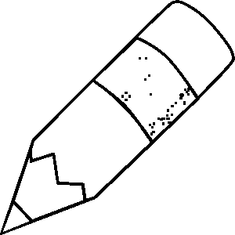
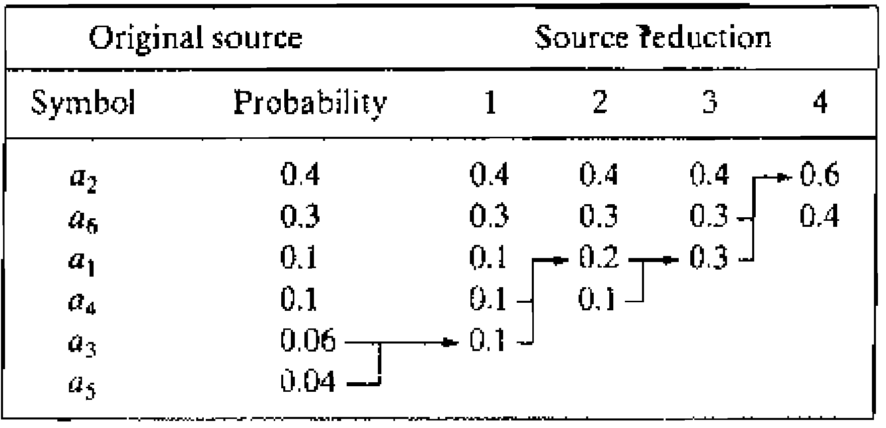

# Görüntü İşleme

Bu ders kapsamında görüntü sıkıştırma, kodlama, morfolojik işlemler ve bölütleme yöntemleri hakkında bilgiler verilecektir.

- [Temel Kavramlar](#temel-kavramlar)
  - [Renk Uzayları](#renk-uzayları)
  - [Histogram İşlemleri](#histogram-i̇şlemleri)
  - [Filtreleme](#filtreleme)
- [Morfolojik İşlemler](#morfolojik-i̇şlemler)
- [Bölütleme](#bölütleme)
  - [Eşikleme](#eşikleme)
  - [Kenar Tespiti](#kenar-tespiti)
- [Görüntü Kodlama ve Sıkıştırma](#görüntü-kodlama-ve-sıkıştırma)
  - [Huffman Kodlama](#huffman-kodlama)
  - [Golomb Kodlama](#golomb-kodlama)
  - [LZW Kodlama](#lzw-kodlama)

## Temel Kavramlar

**Piksel** görüntünün en küçük birimidir. Birden fazla pikselin biraraya gelmesi ile imge oluşur. Tipik bir renkli imgede pikseller ışığın ana renkleri olan **R**ed,**G**reen ve **B**lue olmak üzere 3 kanaldan oluşur. Tüm kanallar için 0 siyahı, 1 ise o kanal için olabilecek en parlak rengi gösterir. İmgeler piksellerin bit sayısına bağlı olarak; ikili (1 bit), gri seviye (8 bit) veya renkli (3 $\times$ 8 bit) olarak sınıflandıırlabilir.

### Renk Uzayları

Sayısal imgeler tipik olarak RGB formatında gösterilse de, piksel gösterimi için farklı renk uzayları da bulunmaktadır.

**CMYK** renk uzayı pigmentlerin ana renklerinden oluşan bir renk uzayıdır ve baskı işlemlerinde kullanılmaktadır. Matematiksel olarak RGB kanalları ile arasındaki ilişki $(C,M,Y) = 1 - (R,G,B)$ şeklinde gösterilebilir. Teorik olarak $R=G=B=0$ rengine karşı gelen $C=M=Y=1$ pigment karışımının siyah renk olması gerekirken, pratikte çamurumsu bir renk oluşmasından dolayı bu renk uzayına ilave bir ana renk olarak $K$ siyah rengi de eklenmiştir.

**HSI** renk uzayı renkleri oluşturan kanalları, insan algısına daha uygun bir gösterim olan, Ton (**H**ue), Doygunluk (**S**aturation) ve Parlaklık (**I**ntensity) ile ifade etmektedir. RGB gösterimde bir pikselin parlaklık değişiminde 3 kanal birlikte değişirken, bu gösterimde sadece $I$ kanalı değişecektir. Benzer şekilde maviden kırmızıya bir geçişte değişim **H** kanalı üzerinde olacaktır.

### Histogram İşlemleri

Histogram bir görüntüde kanallarda yer alan değerlerin dağılımını gösteren bir grafiktir. Bu dağılımın analizi ile imgedeki renk dağılımı incelenebilir ve histogram işlemleri ile imgenin renkleri değiştirilebilir.

**Histogram Germe** histogram vektörünün en küçük değerinin sıfıra, en büyük değerinin bire eşitlenmesi işlemine denir. Kanallarda yer alan değerlerin belirli bir aralığa toplanması durumunda görüntünün renk çeşitliğiliği azalacağından, histogram germe renk çeşitliliğini artırmaya yönelik bir işlemdir.

**Histogram Eşitleme** bir histogram vektörünün geniş bir aralıkta ve dengeli bir dağılıma sahip olacak şekilde dönüştürülmesine verilen isimdir. Histogram eşitleme aşağıdaki adımlardan oluşur. 

- $\mathbf{h}$ normalize kümülatif histogram vektörü hesaplanır
- $\mathbf{m}(n) = \lfloor L \sum_{k=0}^n \mathbf{h}(k)\rfloor$ vektörü $n$ renginin hangi çıktı değerine atanması gerektiğini gösterir.

### Filtreleme 

Filtreleme, çıktı görüntüsündeki her bir pikselin değerinin girdi görüntüsündeki piksel gruplarının (komşu piksel öbeklerinin) aldığı değerleri kullanarak üretilmesi işlemidir. 1D sinyallere benzer şekilde filtreleme işlemi evrişim işlemi yapılır.

$$
Y(x,y) = \sum_m \sum_n I(m,n) h(x-m,y-n)
$$

- **Yumuşatma** filtresi piksel öbeğinin ortalamasını alarak çıktı pikselin değerini hesaplamaktadır. Bu işlem için örnek olarak $h = \frac{1}{9}[ 1,1,1; 1,1,1; 1,1,1 ]$ şeklinde bir filtreleme çekirdeği kullanılabilir. Bu çekirdek her piksel için, $3 \times 3$ komşuluğundaki piksel değerlerini toplayacak ve dokuza bölerek çıktı imgesindeki değeri bulacaktır.
- **Gradyan** filtresi imgenin yatayda veya dikeyde gradyanını bulmak için kullanılır. Bu işlem için filtre çekirdeği $h=[1,-1]$ şeklinde seçilir. Bu filtre çekirdeği her pikselin değerinden, soldaki komşusunun değerini çıkartarak yeni imgedeki piksel değerini hesaplamaktadır. 
- **Laplacian** filtresi imgenin ikinci türevini (gradyanın gradyanı) hesaplamak için kullanılır. Evrişim bilgisi kullanılarak $h_x=g_x \ast g_x = [1,-1] \ast [1,-1] = [-1,2,-1]$ olarak elde edilir. Aynı işlem diğer eksen için yapıldığında $h_y = [-1;2;-1]$ şeklinde hesaplanır. Bu iki filtre tek bir filtre çekirdeği olarak $h = [0,-1,0;-1,4,-1;0,-1,0]$ olarak yazılır.

**Eşikleme** değerleri [0,1] arasında değişen görüntü kanallarının $\lbrace 0,1 \rbrace$ değerlerine dönüştürülmesi işlemine denir.

## Morfolojik İşlemler

Morfoloji ikili imgeler üzerinde tanımlanan dönüşüm işlemleridir. Filtreleme işlemine benzer şekilde dönüşüm işlemi bir çekirdek matrisinin imge ile örtüşme durumuna bakılarak yapılır.

**HIT** çekirdek matrisinin uygulandığı bölgede en az bir tane **1** bulunması durumuna denir ve $\oplus$ sembolü ile gösterilir.

**FIT** çekirdek matrisinin uygulandığı bölgedeki tüm değerlerin **1** olması durumuna denir ve $\ominus$ sembolü ile gösterilir.

**Genişleme (Dilation)** herhangi bir siyah pikselin, $C$ komşuluğunda en az bir beyaz piksel olması durumunda, beyaza dönüştürülmesi işlemine denir. Beyaz pikseller genişlemeye uğradığından bu şekilde isimlendirilir. $B$, komşulukta bulunan pikselleri temsil eden çekirdek olmak üzere; $A \oplus B$ işlemi ile gösterilir.

**Daralma (Erosion)** herhangi bir beyaz pikselin, $C$ komşuluğunda siyah piksel bulunması durumunda, siyaha dönüştürülmesi işlemine denir. Beyaz pikseller daralmaya uğradığından bu şekilde isimlendirilir. $B$, komşulukta bulunan pikselleri temsil eden çekirdek olmak üzere; $A \ominus B$ işlemi ile gösterilir.

**Açma (Opening)** bir imgenin önce daralma, ardından genişleme işlemlerine tabii tutulması işlemine denir. Matematiksel olarak $(A \ominus B)\oplus B$ ile gösterilir.

**Kapama (Closing)** bir imgenin önce genişleme, ardından daralma işlemlerine tabii tutulması işlemine denir. Matematiksel olarak $(A \oplus B)\ominus B$ ile gösterilir.

Aşağıda bu işlemler $B=\text{ones}(3)$ çekirdek matrisi kullanılarak örnek bir imge üzerinde gösterilmiştir. 

|İmge|İkili İmge|Genişleme|Daralma|Açma|Kapama|
|----|----------|---------|-------|----|------|
|||||||

## Bölütleme

Bölütleme imgedeki belirli bir bağlamda benzer piksel gruplarının kümelenerek arka plandan ayrılması işlemidir. Bu ders kapsamında eşikleme ve kenar tespitine dayalı yöntemler açıklanacaktır.

### Eşikleme

Eşikleme en basit bölütleme tekniği olarak görülebilir. Eşik değerinden küçük değerler sıfır, büyük değerler bir olarak kodlandığından imge renk benzerliğine göre iki kümeye ayrılmış olur.

Eşikleme basit bir işlem olsa da iyi bir bölütleme için eşik değerinin doğru ayarlanması gereklidir. Literatürde bu değerin bulunması için üçgen algoritması, isodata, Otsu yöntemi gibi farklı teknikler önerilmiştir.

### Kenar Tespiti

Nesneler kapalı konturlara sahip olduklarından, farklı ön plan önünde görüntülendiklerinde belirgin bir kenera sahip olacaklardır. Bu kenarlar gradyan, sobel, prewitt gibi yöntemlerle tespit edilebilir. 

Ek olarak sık kullanılan bir yöntem de Laplacian filtrelenmiş imgenin sıfır noktalarının kenar olarak sınıflandırılmasıdır. Ancak sıfır noktaları çok gürültülü olacağından imge filtrelenmeden önce bir Gaussian filtreleme ile yumuşatıldıktan sonra bu işlem uygulanır. Bu nedenle filtreye Laplacian of Gaussian (LoG) denir.

## Görüntü Kodlama ve Sıkıştırma

Her piksel için renk bilgisi 24 bit kodlandığından ve görüntüler iki boyutlu büyük matris yapıları olduklarından, renkli bir görüntü oldukça büyük bir veridir. Özellikle peşpeşe gelen görüntülerden oluşan video dosyalarının çıkabileceği boyutlar verinin saklanması ve iletilmesi için kodlama ve sıkıştırmanın önemini göstermektedir.

Aşağıdaki maddeler görüntünün nasıl sıkıştırılabilir bir veri olduğunu ifade etmektedir.

- Çoğu imgede olası renk sayısı $2^{24}$ değerinden az olduğundan her piksel 24 bit yerine daha az bit ile ifade edilebilir
- Görüntüler uzamsal ve zamansal olarak benzer renklerden oluştuğundan renker arasındaki benzerlik kodlamada kullanılabilir
- İnsan algısı için önemsiz bölgeler bulunduğundan bu bölgeler daha az sayıda bitle kodlanarak kazanç sağlanabilir.

### Huffman Kodlama

Huffman kodlama sembol başına düşen bit sayısını sembolün görülme olasılığına ters orantılı şekilde ayarlayarak; sık kullanılan sembollerin az bit ile, nadir görülen sembollerin ise çok bit ile gösterimini sağlar.

Huffman kodlamanın ilk adımında semboller olasılıklarına göre sıralanır. Ardından her aşamada en düşük olasılığa sahip iki sembolün olasılıkları toplanarak bir sonraki adıma geçilir. Aşağıda örnek bir sembol dağılımı için gereken 4 aşama gösterilmiştir.

Görselden görüldüğü üzere $a_1,a_2,\dots,a_6$ sembolleri ilk işlem olarak olasılık sırasına dizilmiştir. Ardından ilk aşamada en düşük olasılığa sahip $a_3$ ve $a_5$ sembolleri gruplanarak bu iki sembolün toplam olasılığı tabloda uygun satıra yazılmıştır. İleriki aşamalarda da benzer şekilde en düşük olasılığa sahip gruplamalar birleştirilerek tablo iki gruba indirgenene kadar devam edilmiştir.

Sembollerin kodlaması bu tablodan geriye doğru akışı takip edilerek bulunmaktadır. 

Bu iki grup arasında yüksek olasılıklı gruplamaya $0$, düşük olasılıklı gruba $1$ kodu verilerek kodlamaya başlanır. Ardından her grup bileşenlerine ayrılırken birleşime verilen kod ön ek olarak kullanılır ve grubun yüksek olasılıklı kısmına $0$, düşük olasılıklı kısmına $1$ verilerek grubun kodu belirlenir.

Bu şekilde bir kodlama yapıldığında sembol başına ortalama bit sayısı $L = (0.4) (1) + (0.3) (2) + (0.1) (3) + (0.1) (4) + (0.06) (5) + (0.04) (5) = 2.2$ bit olarak hesaplanır.

### Golomb Kodlama

Golomb kodlama pozitif exponansiyel olarak azalan olasılığa sahip tam sayı değerlerin kodlanması için önerilen bir yöntemdir. Bu yöntem Huffman kodlamaya göre çok daha az işlem gerektirmektedir ve geometrik dağılımlı bir sembol seti için optimum sonucu üretmektedir.

Golomb kodlamada $M$ veri dağılımından türetilen bir tamsayı olmak üzere, veri ilk olarak $x = q M + r$ olacak şekilde $q,r$ tamsayı parametreleri ile gösterilir. Ardından $q$ tamsayısı $q+1$ bit ile $q$ tane $1$ ve sonunda $0$ şeklinde (örneğin $4$ = $11110$ ) gösterilir.

$r$ tamsayısı ise ikili kodlama kullanılarak gösterilir. $r$ tanımı gereği $r < M$ olduğundan bu ifade en fazla $k = \lceil \log_2(M) \rceil$ bit ile gösterilebilir. Golomb kodlamada olası bir bit kazanmak için $r < 2^{k}-M$ şartı sağlanıyorsa $r$ değeri $k-1$ bit ile gösterilir. Diğer durumda $r$ yerine $r' = r + 2^k - M$ değeri $k$ bit ile kodlanır. Burada $M = 2^{p}$ seçilmesi durumunda $k=p$ olacağından $2^{k}-M = 0$ olacak ve $r' = r$ her zaman $k$ bit ile kodlanacaktır.

### LZW Kodlama

Önceki başlıklarda gördüğümüz iki yöntem de sabit uzunluktaki sembollere farklı uzunlukta kodlama yaparak sıkıştırma sağlamaktadır. Lempel-Ziv-Welch yöntemi diğer yöntemlerden farklı olarak, **farklı uzunluktaki sembol gruplarına sabit uzunlukta kod sözcükleri atayarak** sıkıştırma sağlamaktadır. Diğer yöntemlerden önemli bir diğer farkı ise **LZW yöntemi sembollerin olasılık dağılımına ihtiyaç duymadan** sıkıştırma işlemini yapabilmektedir.

Ek olarak, LZW yöntemi piksel verilerini gruplayarak kullandığından veri üzerindeki uzamsal benzerlik ve örüntülerden de yararlanarak daha fazla sıkıştırma yapabilmektedir. 

LZW kodlamada ilk adım olarak sabit uzunlukta bir sözlük oluşturulur. Bu sözlüğe verideki tüm tekli semboller (gri seviye görüntü için 0-255 arası değerler) eklenir.

Ardından pikseller üzerinde sırasıyla gezilerek aşağıdaki işlemler uygulanır. 

- Girdi ile eşleşen en uzun sözlük elemanı $W$ bulunur
- Bu elemanın indisi kod sözcüğü olarak döndürülür
- $W$ girdinin başından silinir
- $W$ ve girdinin ilk elemanı sözlükte boş olan bir alana eklenir
- İlk adıma gidilir

Örnek olarak *ABABAABAAAB* şeklinde verilen bir diziyi 3 bitlik kod sözcükleri ile LZW kullanarak kodlayalım. Veride sadece *A* ve *B* sembolleri bulunduğundan sözlüğün ilk iki elemanı bu sembolleri içerecektir.

| Güncel Grup | Sonraki Sembol | İndis | Kod | D0 | D1 | D2 | D3 | D4 | D5 | D6 | D7 |
|------|------|------|------|------|------|------|------|------|------|------|------|
| | |  |  | A | B |--|--|--|--|--|--|
|A| B | 0 | 000 | A | B |AB|--|--|--|--|--|
|B| A | 1 | 001 | A | B |AB|BA|--|--|--|--|
|AB| A | 2 | 010 | A | B |AB|BA|ABA|--|--|--|
|A| A | 0 | 000 | A | B |AB|BA|ABA|AA|--|--|
|ABA| A | 4 | 100 | A | B |AB|BA|ABA|AA|ABAA|--|
|AA| B | 5 | 101 | A | B |AB|BA|ABA|AA|ABAA|AAB|
|B|  | 1 | 001 | A | B |AB|BA|ABA|AA|ABAA|AAB|

Bu örnek için kodlanmamış veri $11$ bit, kodlanmış veri $7 \times 3$ bit olsa da, tekrarlayan semboller içeren uzun bir veri düşünüldüğünde yöntemin uzun sembol gruplarını daha küçük uzunluktaki kod sözcükleri ile ifade etmesinden dolayı veri sıkıştırma sağlanacaktır.

