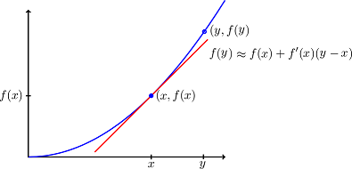

# Optimizasyon

Bu ders kapsamında ekstremum noktaların analizinden başlanarak, gradyan yöntemleri, doğrusal ve doğrusal olamayan en küçük karesel hata, koşullu optimizasyon ve eşdeğer problem üzerinde durulacaktır.

- [Global ve Yerel Ekstremum Noktalar](#global-ve-yerel-ekstremum-noktalar)
- [Doğrusal ve Kuadratik Yaklaşım](#doğrusal-ve-kuadratik-yaklaşım)
- [Ekstremum Noktaların Analizi](#ekstremum-noktaların-analizi)
- [En Küçük Kareler](#en-küçük-kareler)
  - [Doğrusal En Küçük Kareler](#doğrusal-en-küçük-kareler)
  - [Doğrusal Olmayan En Küçük Kareler](#doğrusal-olmayan-en-küçük-kareler)
- [Gradyan Yöntemleri](#gradyan-yöntemleri)
  - [Gradyan İniş Yöntemi (Gradient Descent)](#gradyan-i̇niş-yöntemi-gradient-descent)
  - [Gradyan Ölçekleme](#gradyan-ölçekleme)
  - [Gauss-Newton Yöntemi](#gauss-newton-yöntemi)
  - [Levenberg-Marquardt Yöntemi](#levenberg-marquardt-yöntemi)
  - [Newton Yöntemi](#newton-yöntemi)
  - [Yarı-Newton (Quasi Newton) Yöntemi](#yarı-newton-quasi-newton-yöntemi)
  - [Eşlenik Gradyan Yöntemi](#eşlenik-gradyan-yöntemi)
- [Kısıtlı Optimizasyon](#kısıtlı-optimizasyon)
- [Eşdeğer Problem (Duality)](#eşdeğer-problem-duality)
  - [KKT Koşulları](#kkt-koşulları)

## Global ve Yerel Ekstremum Noktalar

Bir fonksiyonun en küçük veya en büyük değerini aldığı noktalara **ekstremum** noktalar denir. $f: \mathbb{R}^n \to \mathbb{R}$ şeklinde tanımlı bir fonksiyonda, $f(\mathbf{x}^{\ast}) \leq f(\mathbf{x}), \forall \mathbf{x} \in \mathbb{R}^n$ şartını sağlayan $\mathbf{x}^{\ast}$ noktasına **global en küçük nokta** denir.

$f(\mathbf{x}^{\ast}) \leq f(\mathbf{x}), \exists r > 0 \text{ s.t } \forall \mathbf{x} \in B(\mathbf{x}^{\ast}, r)$ şartını sağlayan $\mathbf{x}^{\ast}$ noktasına **yerel en küçük nokta** denir. Yani bir noktanın yerel en küçük olabilmesi için, $f(\mathbf{x}^{\ast})$ noktanın bulunduğu bölgede tanımlanan $r$ yarıçaplı top $B(\mathbf{x}^{\ast}, r)$' nin içerisinde kalan tüm $f(\mathbf{x})$ değerlerinden küçük olmalıdır.

$\mathbf{x}^{\ast}$ değeri bir $f$ fonksiyonunun yerel ekstremum noktasıysa ve tanım kümesinin **içinde** yer alıyorsa, $\nabla f(\mathbf{x}^{\ast}) = 0$ olmalıdır. $\nabla f(\mathbf{x}^{\ast}) = 0$ şartını sağlayan vektör kümesine **durağan nokta** adı verilir. 

**NOT: Her durağan nokta bir yerel ekstremum nokta olmak zorunda değildir!**

## Doğrusal ve Kuadratik Yaklaşım

Sürekli ve türevlenebilir bir fonksiyonun $\mathbf{y}$ noktasındaki değerine $\mathbf{x}$ noktasındaki değer kullanılarak yaklaşım yapılabilir.

Bir fonksiyonun bir noktadaki değeri ve gradyanını kullanarak yapılan $f(\mathbf{y}) \approx f(\mathbf{x}) + \nabla f(\mathbf{x})^{\intercal} (\mathbf{y}-\mathbf{x})$ yaklaşımına **doğrusal yaklaşım** denir.

Fonksiyon nokta etrafında iki kez türevlenebilir ise, ikinci türev bilgisi de kullanılarak daha iyi bir yakınsama yapılabilir. Bu yaklaşıma **kuadratik yaklaşım** denir ve aşağıdaki şekilde hesaplanır.

$$
f(\mathbf{y}) \approx f(\mathbf{x}) + \nabla f(\mathbf{x})^{\intercal} (\mathbf{y}-\mathbf{x}) + \frac{1}{2}(\mathbf{y}-\mathbf{x})^{\intercal} \nabla^2 f(\mathbf{x}) (\mathbf{y}-\mathbf{x})
$$

## Ekstremum Noktaların Analizi

Doğrusal ve kuadratik yaklaşım eşitlikleri kullanılarak ekstremum noktalar hakkında iki önemli bilgiye ulaşabiliriz. $\mathbf{x}^{\ast}$ noktasının $f$ fonksiyonunun **en küçük** noktası olduğunu kabul edelim.

1. Doğrusal yaklaşım ile $\mathbf{x}^{\ast}$ noktasındaki değeri kullanarak $\mathbf{x}^{\ast} + \Delta \mathbf{x}$ noktasındaki değeri hesaplamak istersek; $f(\mathbf{x}^{\ast} + \Delta \mathbf{x}) \approx f(\mathbf{x}^{\ast}) + \nabla f(\mathbf{x}^{\ast})^{\intercal} \Delta \mathbf{x}$ yazılır. Bu ifadede $f$ terimleri sol tarafa alınarak ifade düzenlenirse; $f(\mathbf{x}^{\ast} + \Delta \mathbf{x}) - f(\mathbf{x}^{\ast}) \approx \nabla f(\mathbf{x}^{\ast})^{\intercal} \Delta \mathbf{x}$ elde edilir.
 Burada $\mathbf{x}^{\ast}$ en küçük nokta olduğundan $f(\mathbf{x}^{\ast} + \Delta \mathbf{x}) - f(\mathbf{x}^{\ast}) \geq 0$ olacaktır. 
 
 > Bu sonuç $\boxed{\nabla f(\mathbf{x}^{\ast})^{\intercal} \Delta \mathbf{x} \geq 0}$ anlamına gelmektedir.

2. Aynı işlemler $\nabla f(\mathbf{x}^{\ast}) = 0$ şartını sağlayan **iç noktalar** için kuadratik yaklaşım kullanılarak yapıldığında; $f(\mathbf{x}^{\ast} + \Delta \mathbf{x}) - f(\mathbf{x}^{\ast}) \approx \frac{1}{2} \Delta \mathbf{x}^{\intercal} \nabla^2 f(\mathbf{x}^{\ast})^{\intercal} \Delta \mathbf{x}$ elde edilir. Buradan da aşağıdaki çıkarım yapılır.

> Herhangi bir $\Delta \mathbf{x}$ vektörü için ifadenin sıfırdan büyük olabilmesi için $\boxed{\nabla^2 f(\mathbf{x}^{\ast}) \geq 0}$ pozitif yarı tanımlı olmalıdır.

**NOT:** Aynı işlemler $\mathbf{x}^{\ast}$ noktasının $f$ fonksiyonunun **en büyük** noktası olduğu kabul edilerek yapıldığı takdirde; $\boxed{\nabla f(\mathbf{x}^{\ast})^{\intercal} \Delta \mathbf{x} \leq 0}$ ve $\nabla^2 f(\mathbf{x}^{\ast}) \leq 0$ negatif yarı tanımlı olmalı sonucuna varılacaktır.

**DİKKAT!!:** Bir noktanın yerel ekstremum nokta olabilmesi için $\nabla^2 f(\mathbf{x}^{\ast})$ pozitif veya negatif yarı tanımlı olması gereklidir. $f(\mathbf{x}^{\ast}) = 0$ şartını sağlayan ve belirsiz Hessian matrisine sahip noktalara **eğer noktası** denir.

<blockquote>

 $f: \mathbb{R}^2 \to \mathbb{R}$ uzayında tanımlı $f(x_1,x_2) = 2 x_1^3 + 3 x_2^2 + 3 x_1^2 x_2 - 24 x_2$ fonksiyonunun durağan noktalarını bularak sınıflandırınız.

Durağan noktalar $\nabla f(x_1,x_2) = 0$ şartını sağlayan noktalardır.
$$
\nabla f = 
\begin{bmatrix}
    6 x_1^2 + 6 x_1 x_2\\
    6 x_2 + 3 x_1^2 - 24
\end{bmatrix}
= 0
$$

Elde edilen denklemin ilk satırından $x_1=0$ veya $x_1 = -x_2$ olması gerektiği görülür. Bu iki değer için ikinci denklem çözülürse, durağan nokta kümesi $S= \lbrace (0,4),(-2,2),(4,-4)  \rbrace$ olarak bulunur.

Noktaların analizi için Hessian matrisi hesaplanmalıdır.

$$
\nabla^2 f = 
\begin{bmatrix}
    12 x_1 + 6 x_2 & 6 x_1\\
    6 x_1 & 6
\end{bmatrix}
$$

$S_1 = (0,4)$ için $\nabla^2 f(0,4) > 0$ olduğundan bu nokta **yerel en küçük** noktadır.

$S_2 = (-2,2)$ için $\nabla^2 f(-2,2) \gtrless 0$ olduğundan bu nokta **eğer** noktasıdır.

$S_2 = (4,-4)$ için $\nabla^2 f(4,-4) \gtrless 0$ olduğundan bu nokta da **eğer** noktasıdır.

</blockquote>

## En Küçük Kareler

En küçük kareler problemlerinde bir hata fonksiyonu $r(\mathbf{x})$'in normunun karesininin $\lVert r(\mathbf{x}) \lVert^2$ en küçüklenmesi istenmektedir. Problem $r(\mathbf{x})$'in doğrusal veya doğrusal olmamasına bağlı olarak farklı şekillerde çözülür.

### Doğrusal En Küçük Kareler

Doğrusal en küçük kareler probleminde hata fonksiyonu $r(\mathbf{x}) = \mathbf{A}\mathbf{x} - \mathbf{b}$ şeklinde tanımlanmaktadır. Burada $\mathbf{A} \in \mathbb{R}^{m \times n}$, $m$ örnekten toplanan $n$ uzunluklu öznitelikleri, $\mathbf{b} \in \mathbb{R}^m$ ise her bir örneğin etiketini göstermektedir. Optimize edilmek istenen maliyet fonksiyonu aşağıdaki şekildedir.

$$
f(\mathbf{x}) = \lVert \mathbf{A}\mathbf{x} - \mathbf{b} \lVert^2 = \sum_{i=1}^m (\mathbf{A}_i\mathbf{x} - b_i)^2
$$

Bu ifadenin çözümü $\mathbf{x}_{LS} = \left(\mathbf{A}^{\intercal}\mathbf{A} \right)^{-1} \mathbf{A}^{\intercal} \mathbf{b}$ şeklinde elde edilecektir.

### Doğrusal Olmayan En Küçük Kareler

Doğrusal olmayan en küçük kareler probleminde hata fonksiyonu $r(\mathbf{x}) = \mathbf{t}(\mathbf{A},\mathbf{x}) - \mathbf{b}$ şeklinde tanımlanmaktadır. Burada $\mathbf{t}: \mathbb{R}^{m \times n} \to \mathbb{R}^m$ vektör değerli bir fonksiyondur. Optimize edilmek istenen maliyet fonksiyonu aşağıdaki şekildedir.

$$
f(\mathbf{x}) = \lVert \mathbf{t}(\mathbf{A},\mathbf{x}) - \mathbf{b} \lVert^2 = \sum_{i=1}^m (t_i(\mathbf{A}_i,\mathbf{x}) - b_i)^2
$$

Doğrusal en küçük karelerin aksine bu yöntem kolay bir şekilde çözülememektedir. Bu problemlerin çözümü için ileri bölümlerde Gauss-Newton ve Levenberg-Marquardt yöntemleri incelenecektir.

## Gradyan Yöntemleri

Gradyan yöntemleri bir fonksiyonun durağan noktalarını bulmayı amaçlayan yöntemlerdir. Bu yöntem iteratif olarak, $\mathbf{x}_k$ vektörünü durağan nokta olmaya yaklaştıracak şekilde seçilen $\mathbf{d}_k$ iniş yönünde güncelleyerek  fonksiyonun durağan noktasını bulmaya çalışır. Matematiksel olarak yöntem aşağıdaki şekilde gösterilir.

$$
\mathbf{x}_{k+1} = \mathbf{x}_k + \eta \mathbf{d}_k
$$

**ÖNEMLİ!!:** Bir $\mathbf{d}$ vektörünün iniş yönü olabilmesi için $\boxed{\nabla f(\mathbf{x})^{\intercal} \mathbf{d} < 0}$ olmalıdır.

**İSPAT:** $\mathbf{d}$ iniş yönünde bir vektör olsun. Bu durumda $\mathbf{d}$ iniş yönünü gösterdiğinden $f(\mathbf{x}+\epsilon \mathbf{d}) < f(\mathbf{x})$ olmalıdır.

$\epsilon \to 0^{+}$ çok küçük bir sayı olduğundan doğrusal yaklaşım kullanılarak $f(\mathbf{x}+\epsilon \mathbf{d}) = f(\mathbf{x}) + \epsilon\nabla f(\mathbf{x})^\intercal \mathbf{d}$ yazılabilir.

Buradan da görüldüğü üzere $f(\mathbf{x}+\epsilon \mathbf{d}) < f(\mathbf{x})$ olduğundan $\nabla f(\mathbf{x})^\intercal \mathbf{d} < 0$ olmalıdır. 

### Gradyan İniş Yöntemi (Gradient Descent)
Gradyan iniş yöntemi iniş doğrultusu $\mathbf{d}_k$ vektörünü, gradyanın tam tersi yönünde, $\mathbf{d}_k=-\nabla f(\mathbf{x})$ şeklinde seçmeyi önermektedir. Bu şekilde seçilen bir $\mathbf{d}_k$ için 

$$
\nabla^\intercal f(\mathbf{x}) d = - \nabla^\intercal f(\mathbf{x}) \nabla f(\mathbf{x}) = -\lVert \nabla f(\mathbf{x}) \lVert^2 < 0
$$ 

olduğundan iniş doğrultusu olma şartı sağlanmış olur. Önerilen iniş yönü denklemde yazılırsa gradyan iniş yöntemi iterasyon adımları aşağıdaki şekilde elde edilir.

$$
\boxed{\mathbf{x}_{k+1} = \mathbf{x}_k - \eta \nabla f(\mathbf{x})}
$$

Gradyan İniş yöntemi iniş adım boyutu $\eta$ nın seçimi için bir yöntem önermemektedir. 

### Gradyan Ölçekleme

Gradyan iniş yönteminde $\mathbf{x}_k$ vektörünün değişimi $\nabla f(\mathbf{x})$ gradyanına bağlı olduğundan, gradyanın yüksek olduğu yerlerde değişimde yüksek olacaktır. Burada $\mathbf{x}_k$ vektörünün satırları arasında bir ölçek farkı bulunduğunda büyük değerler gradyanın büyüklüğünü belirleyecek ve küçük değerler önemsiz kalacağından iterasyonların istenilen noktaya yakınsamaması söz konusu olacaktır.

Bunu engellemek için $\mathbf{y} = \mathbf{S}^{-1}\mathbf{x}$ şeklinde yeni bir değişken tanımlayalım ve en küçüklemeyi bu değişken üzerinden yapalım.

Bu durumda problem $f(\mathbf{x}) = f(\mathbf{S}\mathbf{y})$ şeklinde yeniden tanımlanabilecektir. Yazılan probleminin $\mathbf{y}$ üzerinden çözümü için $f$ fonksiyonununun gradyanı aşağıdaki şekilde hesaplanır.

$$
\nabla f(\mathbf{S}\mathbf{y}) =\mathbf{S}^\intercal \nabla f(\mathbf{S} \mathbf{y})
$$

Probleminin çözümü için gradyan iniş yöntemi aşağıdaki şekilde yazılır.

$$
\mathbf{y_{k+1}} = \mathbf{y_{k}} - \eta_k \nabla f(\mathbf{S}\mathbf{y_k}) = \mathbf{y_{k}} - \eta_k \mathbf{S}^\intercal \nabla f(S \mathbf{y_k})
$$

Eşitlikte her iki taraf $S$ ile çarpılırsa aşağıdaki eşitlik elde edilir.

$$
\begin{aligned}
\mathbf{S}\mathbf{y_{k+1}} &= \mathbf{S}\mathbf{y_{k}} - \eta_k \mathbf{S} \mathbf{S}^\intercal \nabla f(S \mathbf{y_k})\\
\mathbf{x_{k+1}} &= \mathbf{x_{k}} - \eta_k (\mathbf{S}\mathbf{S}^\intercal) \nabla f(\mathbf{x_k})
\end{aligned}
$$

Elde edilen bu eşitlik orjinal problemin çözümü için yazılacak olan iterasyonlar ile karşılaştırıldığında aradaki tek farkın $\mathbf{D}_k = \mathbf{S}\mathbf{S}^\intercal$ matrisi olduğu görülür. 

İleriki bölümlerde $\mathbf{D}_k = \left(\nabla^2 f(\mathbf{x})\right)^{-1}$ seçilmesi durumunda yazılan bu iterasyon Newton yöntemi olarak adlandırılacaktır.

### Gauss-Newton Yöntemi

Gauss-Newton yöntemi **doğrusal olmayan** maliyet fonksiyonlarınının ekstremum noktalarını, bu fonksiyonların doğrusal yaklaşımlarını kullanarak bulmayı çalışan bir yöntemdir. Doğrusal olmayan en küçük kareler problemini ele alalım.

$$
f(\mathbf{x}) = \sum_{i=1}^m \left(t_i(\mathbf{A}_i,\mathbf{x}) - b_i \right)^2
$$

Burada doğrusal olmayan $t_i(\mathbf{x})$ fonksiyonu (kolaylık olması için $\mathbf{A}$ yazılmamıştır) doğrusal yaklaşım ile $\mathbf{x}_k$ civarında aşağıdaki şekilde yazılabilir.

$$
t_i(\mathbf{x}) = t_i(\mathbf{x}_k) + \nabla t_i(\mathbf{x}_k)(\mathbf{x} - \mathbf{x}_k)
$$

Yazılan doğrusal yaklaşım orjinal denklemde yerine yazılırsa aşağıdaki problem elde edilir.

$$
\begin{aligned}
    f(\mathbf{x}) &= \sum_{i=1}^m \left(t_i(\mathbf{x}_k) + \nabla t_i(\mathbf{x}_k)(\mathbf{x} - \mathbf{x}_k) - b_i\right))^2\\
    &= \sum_{i=1}^m \left(t_i(\mathbf{x}_k) + \nabla t_i(\mathbf{x}_k)\mathbf{x} - \nabla t_i(\mathbf{x}_k)\mathbf{x}_k - b_i\right))^2\\
    &= \sum_{i=1}^m \left(\nabla t_i(\mathbf{x}_k)\mathbf{x} + t_i(\mathbf{x}_k) - \nabla t_i(\mathbf{x}_k)\mathbf{x}_k - b_i\right))^2\\
    &= \sum_{i=1}^m \left(\mathbf{\hat{A}}_i\mathbf{x} - \hat{b}_i\right)^2, \quad \mathbf{\hat{A}}_i = \nabla t_i(\mathbf{x}_k), \hat{b}_i = \nabla t_i(\mathbf{x}_k)\mathbf{x}_k - t_i(\mathbf{x}_k) + b_i\\
\end{aligned}
$$

Elde edilen problemden görüldüğü üzere, doğrusal olmayan bir fonksiyonun doğrusal yaklaşımı ile yapılan yakınsama sonucunda elde edilen problem de doğrusal en küçük kareler problemi olarak yazılabilmektedir.

Problemi vektörel biçimde elde etmek için;

$$
\mathbf{\hat{A}} = \mathbf{J}(\mathbf{x}_k) = 
\begin{bmatrix}
    \nabla t_1(\mathbf{x}_k)\\
    \nabla t_2(\mathbf{x}_k)\\
    \vdots\\
    \nabla t_m(\mathbf{x}_k)
\end{bmatrix}, \quad
\mathbf{\hat{b}} =
\begin{bmatrix}
    \nabla t_1(\mathbf{x}_k)\mathbf{x}_k - t_1(\mathbf{x}_k) + b_1\\
    \nabla t_2(\mathbf{x}_k)\mathbf{x}_k - t_2(\mathbf{x}_k) + b_2\\
    \vdots\\
    \nabla t_m(\mathbf{x}_k)\mathbf{x}_k - t_m(\mathbf{x}_k) + b_m
\end{bmatrix}
$$

tanımlanırsa doğrusal olmayan en küçük kareler iterasyonları aşağıdaki şekilde yazılır.

$$
\boxed{\mathbf{x}_{k+1} = \left(\mathbf{J}(\mathbf{x}_k)^{\intercal}\mathbf{J}(\mathbf{x}_k) \right)^{-1} \mathbf{J}(\mathbf{x}_k)^{\intercal} \mathbf{\hat{b}}}
$$

$\mathbf{\hat{b}}$ tanımına dikkatli bakılırsa bu ifadenin $\mathbf{\hat{b}} = \mathbf{J}(\mathbf{x}_k)\mathbf{x}_k - F(\mathbf{x}_k)$ şeklinde de yazılabileceği görülür. $\mathbf{\hat{b}}$' nin bu şekilde yazılımı yukarıdaki denklemde yerine yazıldığında elde edilen iteratif çözümün aşağıdaki şekilde de yazılabileceği görülür.

$$
\begin{aligned}
    \mathbf{x}_{k+1} &= \mathbf{x}_k - \left(\mathbf{J}(\mathbf{x}_k)^{\intercal}\mathbf{J}(\mathbf{x}_k) \right)^{-1} \mathbf{J}(\mathbf{x}_k)^{\intercal} F(\mathbf{x}_k)\\
    &= \mathbf{x}_k - \frac{1}{2}\left(\mathbf{J}(\mathbf{x}_k)^{\intercal}\mathbf{J}(\mathbf{x}_k) \right)^{-1} \nabla \mathbf{t}(\mathbf{x}_k)\\
\end{aligned}
$$

Bu eşitlik Gauss-Newton yönteminin de bir gradyan yöntemi olduğunu göstermektedir. Gradyan iniş yönteminden farklı olarak iniş adımı $\eta = \eta_k \mathbf{I}$ gibi tüm iniş yönlerinde bir sabit seçilmek yerine $\eta_k = \frac{1}{2}\left(\mathbf{J}(\mathbf{x}_k)^{\intercal}\mathbf{J}(\mathbf{x}_k) \right)^{-1}$ şeklinde bir matris işlemi ile hesaplanmaktadır.

### Levenberg-Marquardt Yöntemi

Levenberg-Marquardt yöntemi Gauss-Newton yönteminin gradyan iniş yöntemi ile arasındaki ilşikinin kullanılması üzerine kurulmuştur. Bu yöntemde iterasyonlar aşağıdaki şekilde hesaplanmakatadır.

$$
\boxed{\mathbf{x}_{k+1} = \left(\mathbf{J}(\mathbf{x}_k)^{\intercal}\mathbf{J}(\mathbf{x}_k) + \lambda \mathbf{I} \right)^{-1} \mathbf{J}(\mathbf{x}_k)^{\intercal} \mathbf{\hat{b}}}
$$

İfadeden görüldüğü üzere Gauss-Newton yöntemine eklenen $\lambda \mathbf{I}$ terimi ile Jacobian matris çarpımlarının tersini bulma işlemi daha stabil hale getirilmiştir.

### Newton Yöntemi

Newton yöntemi bir fonksiyonun köklerinin bulunması için kullanılan bir yöntemdir. Yöntemi optimizasyon metodu olarak kullanmak için $g(\mathbf{x}) = \nabla f(\mathbf{x})$ şeklinde bir fonksiyon tanımlarsak, $g$ fonksiyonunun kökleri $f$ fonksiyonunun ekstremum noktaları olacaktır.

$g(\mathbf{x})$ fonksiyonu, Taylor serisi kullanılarak aşağıdaki şekilde yazılabilir.

$$
g(\mathbf{x}+\mathbf{h}) \approx g(\mathbf{x}) + \nabla g(\mathbf{x}) \mathbf{h}
$$

Yazılan bu ifade $\mathbf{h}$ değişkenine bağlı doğrusal bir ifadedir. $g(\mathbf{x}+\mathbf{h}) = 0$ yapan $\mathbf{h}$ değeri çözülürse;

$$
\mathbf{h} = -\frac{g(\mathbf{x})}{\nabla g (\mathbf{x})} = -\frac{\nabla f(\mathbf{x})}{\nabla^2 f(\mathbf{x})} = -\left(\nabla^2 f(\mathbf{x}) \right)^{-1}\nabla f(\mathbf{x})
$$

olması gerektiği görülür. İfadenin sıfır olduğu nokta $\mathbf{x}^{\ast} = \mathbf{x}+\mathbf{h}$ noktası olduğundan; yerel ekstremum nokta aşağıdaki iterasyonlar ile hesaplanır.

$$
\boxed{\mathbf{x}_{k+1} = \mathbf{x}_k - \eta\left(\nabla^2 f(\mathbf{x})\right)^{-1}\nabla f(\mathbf{x})}
$$ 

Denklemde görülen $\eta$ öğrenme katsayısı Newton yönteminin yakınsamasını garanti etmek için eklenen skaler bir sayıdır. Türetimden de görüldüğü üzere saf Newton yönteminde $\eta=1$ dir. 

**DİKKAT:** Newton yönteminde fonksiyonun ikinci türevine ihtiyaç bulunduğundan, yöntemin kullanılabilmesi için önceki yöntemlerden farklı olarak, fonksiyonun iki kez türevlenebilir olması şartı vardır.

### Yarı-Newton (Quasi Newton) Yöntemi

Newton yönteminin en önemli dezavantajı her adımda $\mathbf{H} = \left(\nabla^2 f(\mathbf{x})\right)$ matrisinin tersinin hesaplanmasına ihtiyaç duymasıdır. Burada hem Hessian hesaplaması hem de matris tersi işlemleri oldukça maliyeli işlemlerdir. Bu nedenle yarı Newton yönteminde hem $\mathbf{H}$ hem de $\mathbf{H}^{-1}$ matrislerine bir yakınsama kullanılır.

Secant yöntemi hatırlanacak olursa bir fonksiyonun türevine aşağıdaki şekilde bir yakınsama yapılabilir.

$$
\nabla g(\mathbf{x}_k) \approx \frac{g(\mathbf{x}_k) - g(\mathbf{x}_{k-1})}{\mathbf{x}_k - \mathbf{x}_{k-1}}
$$

Burada $g(\mathbf{x}_k) = \nabla f(\mathbf{x}_k)$ olarak seçilirse; Hessian ifadesine aşağıdaki şekilde bir yaklaşım yazılabilir.

$$
\mathbf{H} = \nabla^2 f(\mathbf{x}_k) \approx \frac{\nabla f(\mathbf{x}_k) - \nabla f(\mathbf{x}_{k-1})}{\mathbf{x}_k - \mathbf{x}_{k-1}} \stackrel{\rm def}{=} \frac{\mathbf{y}_k}{\Delta \mathbf{x}_k}
$$

Bu yaklaşım farklı algoritmalar ile birlikte kullanılarak $\mathbf{H}$ ve Sherman–Morrison formülü kullanılarak tersi aşağıdaki şekilde yakınsanabilir.

**Broyden Yöntemi**'nde bilinen bir $\mathbf{B}_ {0} = \mathbf{H}_ {0}^{-1}$ değerinden başlanarak, Hessian matrisinin tersinin iteratif olarak hesaplanması için aşağıdaki işlemler önerilmiştir.

$$
\mathbf{B}_{k+1} = \mathbf{B}_{k}  + \frac{(\Delta \mathbf{x}_k- \mathbf{B}_{k} \mathbf{y}_k) \Delta \mathbf{x}_k^{\intercal} \mathbf{B}_{k}}{\Delta \mathbf{x}_k^{\intercal} \mathbf{B}_{k} \mathbf{y}_k}
$$

### Eşlenik Gradyan Yöntemi

Eşlenik gradyan yöntemi $\mathbf{A} \mathbf{x} = \mathbf{b}$ şeklinde ifade edilebilen problemleri sabit sayıda iterasyon sonucunda çözmemize yarayan bir yöntemdir. Herhangi bir kuadratik ifadenin $f(\mathbf{x}) = \mathbf{x}^{\intercal} \mathbf{A} \mathbf{x} - \mathbf{b}^{\intercal}\mathbf{x} + \mathbf{c}$  ekstremum ekstremum noktaları $\mathbf{A} \mathbf{x} = \mathbf{b}$ şartını sağlayan $\mathbf{x}$ noktaları olduğundan yöntem bir optimizasyon algoritması olarak ele alınmaktadır.

Eşlenik gradyan yönteminin çalışabilmesi için $\mathbf{A}$ matrisinin simetrik ve pozitif yarı tanımlı olması gereklidir. Bu şart sağlanması durumunda elimizde $\mathbf{P} = [\mathbf{p}_ 1, \mathbf{p}_ 2, \dots, \mathbf{p}_ n]$ şeklinde $\mathbf{A}$ ortogonal ( $\mathbf{p}_ k^{\intercal} \mathbf{A} \mathbf{p}_ i = 0, \forall k \neq i$ ) vektörler olduğunu varsayalım.

Bu vektörler $n$ boyutlu uzayı kapsadığından aranılan çözüm $\mathbf{x} = \sum_i \alpha_i \mathbf{p}_i$ şeklinde yazılabilecektir.

Bu bilgiyi $\mathbf{A} \mathbf{x} = \mathbf{b}$ denkleminde yerine yazar ve her iki tarafı $\mathbf{p}_ k^{\intercal}$ farklı gibi bir vektör ile çarparsak aşağıdaki bağıntı elde edilir.

$$
\begin{aligned}
  \mathbf{A} \mathbf{x} &= \mathbf{b}\\
  \mathbf{A} \sum_i \alpha_i \mathbf{p}_i &= \mathbf{b}\\
  \mathbf{p}_k^{\intercal} \mathbf{A} \sum_i \alpha_i \mathbf{p}_i &= \mathbf{p}_k^{\intercal}\mathbf{b}\\
  \sum_i \alpha_i \underbrace{\mathbf{p}_k^{\intercal} \mathbf{A} \mathbf{p}_i}_{0, \forall k \neq i} &= \mathbf{p}_k^{\intercal}\mathbf{b}\\
  \alpha_k \mathbf{p}_k^{\intercal} \mathbf{A} \mathbf{p}_k &= \mathbf{p}_k^{\intercal}\mathbf{b}\\
  & \Rightarrow \boxed{\alpha_k = \frac{\mathbf{p}_k^{\intercal}\mathbf{b}}{\mathbf{p}_k^{\intercal} \mathbf{A} \mathbf{p}_k}}
\end{aligned}
$$

Görüldüğü üzere elimizde $\mathbf{A}$ matrisi için ortogonal vektör seti $\mathbf{P}$ olması durumunda çözüm bu vektörlerin ağırlıklı toplamı ile elde edilebilmektedir.

$\mathbf{A}$ matrisi için ortogonal vektör seti matrisin özvektörleri şeklinde hesaplanarak bu işlemler yapılabilir. Ancak özdeğer-özvektör hesaplama işlem yükü olarak yüksek olduğundan bunun yerine iteratif yöntemler kullanılmaktadır.

## Kısıtlı Optimizasyon

Kısıtlı optimizasyon, hemen hemen tüm mühendislik çalışmalarında karşımıza çıkan bir en iyileme çalışmasıdır. Kısıtlı optimizasyonda $f(\mathbf{x})$ fonksiyonunun optimum noktası aranırken $g(\mathbf{x}) = 0$ gibi bir kısıt fonksiyonunun da sağlanması gereklidir.

Lagrange Çarpanları, verilen kısıtlı optimizasyon problemlerinin yardımcı değişkenler kullanılarak kısıtsız optimizasyon problemine dönüştürülerek çözülmesini sağlayan değişkenlerdir. Langrange fonksiyonları; $L(\mathbf{x},\lambda) = f(\mathbf{x}) + \lambda^\intercal g(\mathbf{x})$ şeklinde tanımlanır. Bu fonksiyonların kritik noktaları da benzer şekilde, $\nabla L(\mathbf{x},\lambda) = 0$ şartını sağlayan noktalar olacaktır.

Langrange fonksiyonlarının Hessian matrisleri hiç bir zaman pozitif definite olmadığından burada farklı bir yaklaşım izlenir. $H$ matrisi yerine $B(\mathbf{x},\lambda) = H_f + \lambda H_g$ matrisinin durumuna bakılarak kritik nokta sınıflandırılır.

$\nabla L(\mathbf{x},\lambda) = 0$ şartını sağlayan $\mathbf{x}^\ast,\lambda^\ast$ noktaları için; $B(\mathbf{x}^\ast, \lambda) > 0$ ise bu nokta yerel en küçük nokta olacaktır.

<blockquote>

 Birinci ve ikinci derece optimumluk koşullarını kullanarak $\mathbf{x}^\ast = [ 2.5,\quad -1.5,\quad -1 ]^\intercal$ çözümünün aşağıdaki fonksiyonun en küçük noktası olduğunu gösteriniz.

$$
\begin{aligned}
f(\mathbf{x}) &= x_1^2 - 2x_1 + x_2^2 - x_3^2 + 4x_3 &\\
&\text{ s.t } \quad g(x) = x_1-x_2 + 2x_3 - 2 = 0
\end{aligned}
$$

Langrange fonksiyonun gradyan vektörü ve toplam Hessian matrisi aşağıdaki şekilde hesaplanır.

$$
    \nabla L(\mathbf{x},\lambda) =
    \begin{bmatrix}
    2x_1 -2 + \lambda\\
    2x_2 - \lambda\\
    -2x_3 + 4 + 2\lambda
    x_1-x_2 + 2x_3 - 2
    \end{bmatrix}\quad,\quad
    B(\mathbf{x},\lambda)=
    \begin{bmatrix}
    2&0&0\\
    0&2&0\\
    0&0&-3
    \end{bmatrix} + \lambda
    \begin{bmatrix}
    0&0&0\\
    0&0&0\\
    0&0&0\\
    \end{bmatrix}
$$

$\nabla L(\mathbf{x},\lambda) = 0$ denkleminin birinci satırından; $x_1 = (\lambda-2)/2$, ikinci satırından $x_2 = \lambda/2$ ve üçüncü satırından $x_3 = \lambda+2$ elde edilir. Bu değişkenler son satırdaki denklemde yerine yazılırsa; $\lambda=-3$ bulunur. Bu durumda $\mathbf{x}^\ast=[ 2.5,\quad -1.5,\quad -1 ]^\intercal$ elde edilir.

$B(\mathbf{x}^\ast, \lambda)$ matrisinin özdeğerleri hesaplandığında değerlerin $0,2,2$ olduğu görülür. Buna göre $f(\mathbf{x}^\ast)$ iki değişken yönünde artarken, bir değişken yönünde sabit kaldığı yorumu yapılır.

Diğer iki değişkene göre en küçük nokta bulunan kritik nokta olduğundan, bu nokta aynı zamanda fonksiyonun da en küçük noktasıdır. Buna göre, $x_1=2.5, x_2=-1.5,x_3=-1$ noktaları  $f(x_1,x_2,x_3)$ fonksiyonunun verilen koşul altında en küçük noktası olduğu bulunur.

</blockquote>

## Eşdeğer Problem (Duality)

En geniş anlamda bir kısıtlı optimizasyon problemi aşağıdaki şekilde ifade edilebilir.

$$
\begin{aligned}
    \min f(\mathbf{x}) & \\
    \text{s.t } & \quad g_i(\mathbf{x}) \leq 0, \quad i=1,\dots,m \\
    & \quad h_j(\mathbf{x}) = 0, \quad j=1,\dots,p \\
\end{aligned}
$$

Burada $f,g_i,h_j$ türevlenebilir fonksiyonları sırasıyla **ana problemi**, **eşitsizlikleri** ve **eşitlikleri** göstermektedir.

Bu ifade Lagrange çarpanları kullanılarak aşağıdaki şekilde yazılabilir.

$$
L(\mathbf{x}, \lambda, \mu) = f(\mathbf{x}) + \sum_i \lambda_i g_i(\mathbf{x}) + \sum_j \mu_j h_j(\mathbf{x})
$$

Burada Lagrange maliyet fonksiyonunu en iyileyen $\mathbf{x}^{\ast} = \min_{\mathbf{x}} L(\mathbf{x}, \lambda, \mu)$ noktasını bulur ve yerine koyarsak; maliyet fonksiyonu aşağıdaki şekilde yazılabilir.

$$
L(\lambda, \mu) = f(\mathbf{x}^{\ast}) + \sum_i \lambda_i g_i(\mathbf{x}^{\ast}) + \sum_j \mu_j h_j(\mathbf{x}^{\ast})
$$

Yazılan bu optimizasyon problemi $\mathbf{x}$' e bağlı olmadığından **eşdeğer** problem olarak isimlendirilir.

### KKT Koşulları

$\mathbf{x}^{\ast}, \lambda^{\ast}, \mu^{\ast}$ birincil ve ikincil optimal noktalar olmak üzere Karush-Kuhn-Tucker koşulları aşağıdaki şekilde yazılır.

- **Durağanlık:** $\nabla f(\mathbf{x}^{\ast}) + \sum_i \lambda_i^{\ast} \nabla g_i(\mathbf{x}^{\ast}) + \sum_j \mu_j^{\ast} \nabla h_j(\mathbf{x}^{\ast}) = 0$
- **Birincil Şartlar:** 
  - $g_i(\mathbf{x}^{\ast}) \leq 0, \quad i=1,\dots,m$
  - $h_j(\mathbf{x}^{\ast}) = 0, \quad j=1,\dots,p$
- **İkincil Şartlar:** $\lambda_i^{\ast} \geq 0, \quad i=1,\dots,m$
- **Tamamlayıcı Gevşeklik:** $\lambda_i^{\ast} g_i(\mathbf{x}^{\ast}) = 0, \quad i=1,\dots,m$

