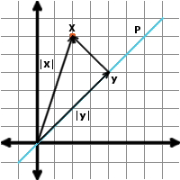
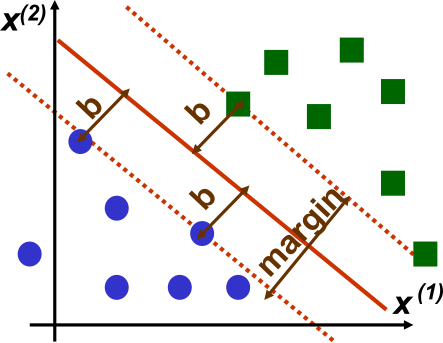

# Örüntü Tanıma

Örüntü Tanıma başlığında; Bayesçi karar verme, en büyük olabilirlikli kestirim, parametre kestirimi, boyut indirgeme ve öğrenme yöntemleri üzerinde durulacaktır.

- [Temel Kavramlar](#temel-kavramlar)
- [Bayesçi Karar Verme](#bayesçi-karar-verme)
  - [En Büyük Olabilirlikli Karar Verme (ML)](#en-büyük-olabilirlikli-karar-verme-ml)
  - [En Büyük Artçıl Karar Verme (MAP)](#en-büyük-artçıl-karar-verme-map)
- [Yoğunluk Kestirimi](#yoğunluk-kestirimi)
  - [Parametrik Yöntemler](#parametrik-yöntemler)
  - [Parametrik Olmayan Yöntemler](#parametrik-olmayan-yöntemler)
- [Boyut İndirgeme](#boyut-i̇ndirgeme)
  - [Temel Bileşen Analizi (TBA)](#temel-bileşen-analizi-tba)
  - [Fisher Ayırtaç Analizi (FDA)](#fisher-ayırtaç-analizi-fda)
- [Öğrenme Yöntemleri](#öğrenme-yöntemleri)
  - [Gradyan İniş Yöntemi](#gradyan-i̇niş-yöntemi)
  - [Doğrusal Ayırtaç](#doğrusal-ayırtaç)
- [Yapay Sinir Ağları](#yapay-sinir-ağları)
  - [Destek Vektör Makineleri](#destek-vektör-makineleri)

## Temel Kavramlar

Klasik bir örüntü tanıma problemi aşağıdaki adımlardan oluşmaktadır.

- Veri Toplama
- Ön İşleme
- Öznitelik Çıkarma
- Öğrenme Algoritması Tasarımı
- Test

**Yanlılık - Değişinti:** Bilinmeyen bir $\theta$ parametresinin bir makine öğrenmesi yöntemi ile $\hat{\theta}$ olarak kestirildiğini varsayalım. Bu kestirimdeki beklenen karesel hata aşağıdaki şekilde yazılabilir.

$$
\begin{aligned}
    E_{\hat{\theta}}[(\theta - \hat{\theta})^2] &= E[\theta^2] - 2 E[\theta \hat{\theta}] + E[\hat{\theta}^2]\\
    &= E[\theta^2] - 2 E[\theta \hat{\theta}] + E[\hat{\theta}^2] + \textcolor{red}{E[\hat{\theta}]^2} - \textcolor{red}{E[\hat{\theta}]^2}\\
    &= \underbrace{\theta^2 - 2 \theta E[\hat{\theta}] + \textcolor{red}{E[\hat{\theta}]^2}}_{\text{Bias: }(E[\hat{\theta}] - \theta)^2} + \underbrace{E[\hat{\theta}^2] - \textcolor{red}{E[\hat{\theta}]^2}}_{\text{Variance: } Var(\hat{\theta})}
\end{aligned}
$$

Görüldüğü üzere, standart bir kestirimin beklenen karesel hatası **Yanlılık** ve **Değişinti** değerlerinin toplamı olarak bulunmaktadır.

## Bayesçi Karar Verme

Bayes kuralına göre $B$ olayının olması durumunda $A$ olayının olasılığı aşağıdaki formüle göre hesaplanır.

$$
P(A \lvert B) = \frac{P(B \lvert A)P(A)}{P(B)}
$$

### En Büyük Olabilirlikli Karar Verme (ML)

Bir veri seti üzerinde hesaplanan ve verilen $P(A \lvert B)$ olasılıklarını kullanarak, $A$ olayının gözlenmesi durumunda $B$'nin ne olabileceğine dair kararı $P(A \lvert B)$ olasılığını en büyükleyen $B$ değeri olarak veren yönteme **En Büyük Olabilirlikli Karar Verme (ML)** denir. 

<blockquote>

 $p= \lbrace 0.3,0.6 \rbrace$ bir paranın **tura** gelme olasılığını göstersin. Bu para $3$ kere atıldığında $2$ yazı, $1$ tura geldiğine göre $p$' nin **En Büyük Olabilirlikli (ML)** kararı bulunuz?

Gözlemlenen olayın olasılığını $P(\text{2Y1T})$ her $p$ için hesaplayacak olursak; 

$$
\begin{aligned}
    P(\text{2Y1T} \lvert p=0.3) &= 3 \times p \times (1-p) \times (1-p) &= 3 \times 0.3 \times 0.7 \times 0.7 = 0.441\\
    P(\text{2Y1T} \lvert p=0.6) &= 3 \times p \times (1-p) \times (1-p) &= 3 \times 0.6 \times 0.4 \times 0.4 = 0.288\\
\end{aligned}
$$

Olasılıklar incelendiğinde; gözlemlenen olayın en büyük olabilirliği $p=0.3$ için olmaktadır. Bu nedenle En Büyük Olabilirlikli kararı $p=0.3$ olarak verilir.

</blockquote>

### En Büyük Artçıl Karar Verme (MAP)

$P(A \lvert B)$ olasılıklarına ek olarak; $P(A),P(B)$ olasılıkları da verildiğinde, $A$ olayının gözlenmesi durumunda $B$'nin ne olabileceğine dair kararı $P(B \lvert A) = \frac{P(A \lvert B)P(B)}{P(A)}$ olasılığını en büyükleyen $B$ değerine göre veren yönteme **En Büyük Artçıl Karar Verme (MAP)** adı verilir.

Burada paydada bulunan $P(A)$ ifadesi sabit bir ölçekleme katsayısı olarak görülebilir. Bu nedenle $P(A)$ ne olursa olsun MAP  değişmeyeceğinden hesaplamada genellikle ihmal edilir.

**!!ÖNEMLİ!!** En Büyük Artçıl Karar Verme denkleminden görüldüğü üzere $P(B)$ olasılıklarının eşit olması durumunda **MAP = ML** olmaktadır. 

<blockquote>

 Yukarıda verilen problem için; paranın **tura** gelme olasılıklarının olasılığı hakkında $P(p = 0.3) = 0.3$ and $P(p = 0.6) = 0.7$ gibi bir öncül bilgi bulunması durumunda **En Büyük Artçıl (MAP)** kararını bulunuz?

Bu kestirim için $P(p \lvert \text{2Y1T})$ olasılıklarının hesaplanması gereklidir. Bu olasılık Bayes kuralı kullanılarak aşağıdaki şekilde hesaplanır.

$$
    P(p \lvert \text{2Y1T}) = \frac{P(\text{2Y1T} \lvert p)P(p)}{P(\text{2Y1T})}
$$

Burada $P(\text{2Y1T}) = \frac{ Card  \lbrace TTH,THT,HTT \rbrace}{ Card  \lbrace TTT,TTH,THT,HTT,THH,HTH,HHT,HHH \rbrace} = \frac{3}{8}$ olduğundan ve diğer olasılıklar yukarıda verildiğinden, olasılıklar aşağıdaki şekilde hesaplanır.

$$
\begin{aligned}
    P(p = 0.3 \lvert \text{2Y1T}) &= \frac{P(\text{2Y1T} \lvert p = 0.3)P(p = 0.3)}{P(\text{2Y1T})} &= \frac{0.441 \times 0.3}{3/8} &= 0.353\\
    P(p = 0.6 \lvert \text{2Y1T}) &= \frac{P(\text{2Y1T} \lvert p = 0.3)P(p = 0.6)}{P(\text{2Y1T})} &= \frac{0.288 \times 0.7}{3/8} &= 0.538
\end{aligned}
$$

Elde edilen olasılıklardan görüldüğü üzere en büyük olasılık $P(p = 0.6 \lvert \text{2Y1T})$ için hesaplandığından **En Büyük Artçıl (MAP)** kestirimi $p=0.6$ olarak karar verilecektir.

</blockquote>

## Yoğunluk Kestirimi

Karar verme yöntemlerinde gerekli olasılıkların verilmesi durumunda optimum kararın nasıl verileceğini görmüştük. Yoğunluk Kestirimi probleminde; bu olasılıklar yerine doğrudan yapılan ölçümlerin $\mathbf{X} = [\mathbf{x}_1,\mathbf{x}_2,\dots,\mathbf{x}_n]$ verilmesi durumunda; olasılıkların hesaplanması ve sonunda kararın verilmesi konusu incelenecektir.

### Parametrik Yöntemler

 Parametrik yöntemler verinin bilinen bir dağılımdan geldiğini varsayarak bu dağılımın **parametreleri** kestirilmeye çalışmaktadır.

#### En Büyük Olabilirlikli Kestirim (MLE)

Bu yöntemde veri setindeki ölçümlere neden olan dağılım parametrelerinin sabit olduğu kabul edilir. $\mathbf{X}$ verilerinin üretilmesine neden olan $\theta$ paremetrelerinin olabilirliği $f(\mathbf{X} \lvert \theta)$ olasılık yoğunluk fonksiyonu ile gösterilir.

En Büyük Olabilirlikli Kestirim yöntemi parametreyi olabilirlik fonksiyonunu en büyükleyen $\theta^{\ast} = \arg\max_{\theta} f(\mathbf{X} \lvert \theta)$ değeri olarak kestirmektedir.

#### En Büyük Artçıl Kestirim

Ölçümlere neden olan parametrenin bir dağılımdan geldiğini varsayarak, MLE kestirimi de içerisine alacak şekilde parametre kestirim yöntemini genelleştirebiliriz. Bu dağılımın öncül bilgisi $f(\theta)$' nın bilinmesi durumunda, MAP kestirimine benzer şekilde $f(\mathbf{X} \lvert \theta) f(\theta)$ kullanılarak artçıl olasılık hesaplanabilir. Bu olasılık üzerinden yapılan parametre kestirimine **en büyük artçıl kestirim** denilmektedir.

#### Bayesçi Kestirim

En büyük artçıl kestirime ek olarak $\theta$ değişkeninin $C(\theta)$ maliyet fonksiyonun da bilinmesi durumunda, ortalamada en iyi kesitrim $\arg \max_{\theta}\int_{\theta} C(\theta) f(\mathbf{X} \lvert \theta) f(\theta) d \theta$ ile bulunur. Bu şekilde yapılan kestirime **Bayesçi Kestirim** denir.

#### En Küçük Ortalama Karesel Hata Kestirimi

Bayesçi kestirimde maliyet fonksiyonunun $C(\theta) = (\theta - \hat{\theta})^2$ şeklinde tanımlanması ile elde edilen en iyi kestirime $\hat{\theta} = \arg \max_{\hat{\theta}} \int (\theta - \hat{\theta})^2 f(\theta \lvert \mathbf{X}) d \theta$, **en küçük ortalama karesel hata kestirimi** (MMSE) denir. İfadenin türevi alınıp sıfıra eşitlenmesi ile en iyi kesitrim aşağıdaki şekilde hesaplanır.

$$
\begin{aligned}
  \hat{\theta} &= \arg \max_{\hat{\theta}} \int_{-\infty}^{\infty} (\theta - \hat{\theta})^2 f(\theta \lvert \mathbf{X}) d \theta\\
  &\Rightarrow \frac{d}{d \hat{\theta}} \int_{-\infty}^{\infty} (\theta - \hat{\theta})^2 f(\theta \lvert \mathbf{X}) d \theta &= 0\\
  &\Rightarrow \hat{\theta} \underbrace{\int_{-\infty}^{\infty} f(\theta \lvert \mathbf{X})d \theta}_{1} &= \int_{-\infty}^{\infty} \theta f(\theta \lvert \mathbf{X})d \theta\\
  &= \boxed{\int_{-\infty}^{\infty} \theta f(\theta \lvert \mathbf{X})d \theta} &= \boxed{E[f(\theta \lvert \mathbf{X})]}
\end{aligned}
$$

<blockquote>

 $\theta$ değişkenine bağlı bir ölçüm sisteminde $\mathbf{x}_n = \theta + v(n)$ şeklinde ölçümler toplanmaktadır. Burada $\theta \in [0,1]$ düzgün dağılımlı bir rastgele değişkendir ve $v(n)$ gürültü sürecini göstermektedir. $v(n)$ gürültüsü $\theta$ değişkeninden bağımsız olarak aşağıdaki yoğunluk fonksiyonuna sahiptir.

$$
f_v(v) = 
\begin{cases}
  0.5v, & 0 \leq v \leq 2\\
  0, & \text{otherwise}
\end{cases}
$$

Bu sistemden yapılan bir ölçümde $\mathbf{x}_0 = 2.5$ ölçüldüğüne göre $\theta$ rastgele değişkeninin MAP, ML ve MMS kestirimlerini bulunuz.

Sorunun çözümü için $f(\theta \lvert \mathbf{x}), f(\mathbf{x} \lvert \theta)$ ve $E[f(\theta \lvert \mathbf{x})]$ ifadelerinin hesaplanması gereklidir.

İlk olarak $\theta \in [0,1]$ düzgün dağılımlı olarak verildiğinden $f(\theta) = 1, \quad 0 \leq \theta \leq 1$ olacaktır.

Yapılan ölçüm bilgisinin $\theta$ değişkenine bağlı yoğunluk fonksiyonu $f(\mathbf{x}_0 = 2.5 \lvert \theta)$ aşağıdaki gibi olacaktır.

$$
f(\mathbf{x} \lvert \theta) = f_v(v = 2.5 - \theta) = 
\begin{cases}
  0.5 (2.5 - \theta), & 0 \leq 2.5 - \theta \leq 2, \quad 0 \leq \theta \leq 1\\
  0, & \text{otherwise}
\end{cases} = 
\begin{cases}
  \frac{5 - 2\theta}{4}, & 0.5 \leq \theta \leq  1\\
  0, & \text{otherwise}
\end{cases}
$$

$f(\theta, \mathbf{x}) = f(\mathbf{x} \lvert \theta) f(\theta)$ olduğundan ve istenilen aralıkta $f(\theta) = 1$ olduğundan; $f(\theta, \mathbf{x})$ için aşağıdaki eşitlik yazılır.

$$
f(\theta, \mathbf{x}) =
\begin{cases}
  \frac{5 - 2\theta}{4}, & 0.5 \leq \theta \leq  1\\
  0, & \text{otherwise}
\end{cases}
$$

$f(\theta, \mathbf{x})$ ifadesinin olası tüm $\theta$ değerleri üzerinden toplamı alınırsa $f(\mathbf{x}=2.5)$ değeri elde edilir.

$$
f(\mathbf{x}=2.5) = \int_{-\infty}^{\infty} f(\theta, \mathbf{x}) d \theta = \int_{0.5}^{1} \frac{5 - 2\theta}{4} d \theta = \frac{7}{16}
$$

Bayes formülü kullanılarak $f(\theta \lvert \mathbf{x})$ aşağıdaki şekilde yazılır.

$$
f(\theta \lvert \mathbf{x}) = \frac{f(\theta, \mathbf{x})}{f(\mathbf{x}=2.5)} = \frac{20 - 8\theta}{7}, \quad 0.5 \leq \theta \leq  1
$$

**MAP** kestirimi $\arg \max_{\theta}f(\theta \lvert \mathbf{x})$ olduğundan $\theta_{MAP} = 0.5$ olarak bulunur.

**ML** kestirimi için $\arg \max_{\theta} f(\mathbf{x} \lvert \theta)$ hesaplanmalıdır. Problemde $f(\theta \lvert \mathbf{x}) = f(\theta, \mathbf{x})$ bulunduğundan, ifadeyi en büyükleyen $\theta_{ML} = 0.5$ olarak bulunur.

**MMS** kestirim için $E[f(\theta \lvert \mathbf{x})]$ hesaplanmalıdır. Bu değer aşağıdaki şekilde hesaplanır.

$$
\theta_{MMS} = E[f(\theta \lvert \mathbf{x})] = \int_{0.5}^{1} \theta \frac{20 - 8\theta}{7} d\theta = 0.738
$$

</blockquote>

### Parametrik Olmayan Yöntemler

Bu yöntemler verinin bilinmeyen bir dağılımdan geldiğini varsayarak, dağılımın kendisini bulmayı amaçlamaktadır.

#### Parzen Penceresi

Parzen penceresi yönteminde sabit genişlikli bir pencere içerisindeki verinin olasılığı $P(\mathbf{x} \in W)$' ya bakılarak olasılık yoğunluk fonksiyonu kestirilir.

Belirli bir $W$ penceresi içerisindeki değerlerin gözlenme olasılığı $P(\mathbf{x} \in W) = \int_{W} f_x(\mathbf{x}) dx$ ile hesaplanır. Burada seçilen küçük bir $W$ penceresi içerisinde $f_x(\mathbf{x})$ sabit kabul edilirse;

$$
P(\mathbf{x} \in W) = \int_{W} f_x(\mathbf{x}) dx = f_x(\mathbf{x}) \text{Volume}(W)
$$

şeklinde yazılabileceğinden; dağılımın yoğunluk fonksiyonu aşağıdaki şekilde kestirilir.

$$
f_x(\mathbf{x}) = P(\mathbf{x} \in W) \frac{1}{\text{Volume}(W)}
$$

<blockquote>

 $D= \lbrace 2,3,4,6 \rbrace$ şeklinde verilen bir kümede $3$ genişlikli Parzen penceresi kullanarak $f_x(\mathbf{x} = 5)$ değerini kestiriniz.

Soruda örnekler bir boyutlu olduğundan $\text{Volume}(W) = 3$ olacaktır. Verilen kümede $x=5$ için $3$ genişlikli bir pencere seçilmesi durumunda $W= \lbrace 4,5,6 \rbrace$ olacaktır. Bu durumda $P(\mathbf{x} \in W) = P(\mathbf{x} \in  \lbrace 4,5,6 \rbrace ) = 2/4 = 0.5$ olarak hesaplanır.

Veriler birleştirilirse $f_x(\mathbf{x} = 5) = P(\mathbf{x} \in W) \frac{1}{\text{Volume}(W)} = 0.5 \frac{1}{3} = 1/6$ olarak hesaplanır.

</blockquote>

#### En Yakın Komşu

En yakın komşu yöntemi pencere hacmini sabit tutmak yerine, $P(\mathbf{x} \in W)$ olasılığını sabit tutacak genişlikteki değişken boyutlu pencereleri kullanarak  yoğunluk fonksiyonunu kestirmektedir.

$$
f_x(\mathbf{x}) = P(\mathbf{x} \in W) \frac{1}{\text{Volume}(W)}
$$

<blockquote>

 $D= \lbrace 2,3,4,6 \rbrace$ şeklinde verilen bir kümede $P(\mathbf{x} \in W) = 0.5$ olacak şekilde $f_x(\mathbf{x} = 5)$ değerini kestiriniz.

Öncelikle $x=5$ civarında $P(\mathbf{x} \in W) = 0.5$ şartını sağlayan pencere büyüklüğü bulunmalıdır. $w=1$ için $W= \lbrace 5 \rbrace , P(\mathbf{x} \in W) = 0$,  $w=2$ için $W= \lbrace 5 \rbrace , P(\mathbf{x} \in W) = 0$, $w=3$ için $W= \lbrace 4,5,6 \rbrace , P(\mathbf{x} \in W) = 0.5$ olduğundan $\text{Volume}(W) = 3$ olarak hesaplanır.

Veriler birleştirilirse $f_x(\mathbf{x} = 5) = P(\mathbf{x} \in W) \frac{1}{\text{Volume}(W)} = 0.5 \frac{1}{3} = 1/6$ olarak hesaplanır.

</blockquote>

## Boyut İndirgeme

Verideki özniteliklerin çok fazla olması; çalışma zamanınının artması, veriye aşırı uyum riski, daha fazla veri gerektirmesi gibi olumsuz etkileri de beraberinde getirmektedir. Boyut indirgeme algoritmaları veriyi genellemede en etkili öznitelikleri bularak, veriyi daha az sayıda öznitelik ile ifade etmeye yarayan yöntemlerdir.

### Temel Bileşen Analizi (TBA)

Verinin en küçük izdüşüm hatası ile yansıtılabileceği alt uzayı bulan bir algoritmadır. En küçük izdüşüm hatasını bulmak için yapılan bu dönüşüm, aynı zamanda verinin en büyük değişintiyi gösterdiği eksen ile aynı olmaktadır.

Sıfır ortalamalı $\mathbf{X} = [\mathbf{x}_1, \mathbf{x}_2, \dots, \mathbf{x}_N]$ aşağıdaki şekildeki gibi $\mathbf{x}_n \in \mathbb{R}^D$ uzayında tanımlı noktalardan oluşan bir matris olsun. Bu matrisin herhangi bir elemanı $\mathbf{x}_n$, $D$ boyutlu uzayda aşağıdaki gibi bir nokta olarak gösterilsin.

Bu noktanın $P$ doğrusu üzerindeki izdüşüm vektörü, $P$ doğrultusundaki birim vektör $\mathbf{p}$ kullanılarak $\mathbf{y}=\mathbf{p}\mathbf{x}^\intercal \mathbf{p}$ işlemi ile bulunur. Bu durumda Pisagor teoremi yardımı ile izdüşüm hatasının karesi aşağıdaki formül ile hesaplanabilir.

$$
\left\lVert\mathbf{y}-\mathbf{x}\right\lVert ^2 =\left\lVert\mathbf{x}\right\lVert ^2-\left\lVert\mathbf{y}\right\lVert ^2 = \mathbf{x}^\intercal\mathbf{x}-\mathbf{p}^\intercal \mathbf{x}\mathbf{x}^\intercal\mathbf{p}
$$ 

Elimizde $\mathbf{x}$ noktalarından $N$ tane olması durumunda ortalama karesel hata $\mathcal{L}\left (\mathbf{p} \right )$ aşağıdaki şekilde yazılabilir: 

$$
\mathcal{L}\left (\mathbf{p} \right )=\frac{1}{N}\sum_{n=1}^{N}\left\lVert\mathbf{y}_n-\mathbf{x}_n\right\lVert ^2 = \underbrace{\frac{1}{N}\sum_{n=1}^{N}{\mathbf{x}_n^\intercal\mathbf{x}_n}}_{a} - \underbrace{\frac{1}{N}\sum_{n=1}^{N}{\mathbf{p}^\intercal \mathbf{x}_n\mathbf{x}_n^\intercal\mathbf{p}}}_{\text{b}}
$$

Amacımız hatanın en küçük olduğu $P$ doğrusunu bulmak olduğundan, $\mathcal{L}\left (\mathbf{p} \right )$ maliyet fonksiyonu $\mathbf{p}$ değişkeni üzerinden optimize edilmelidir. 

$\mathbf{S} = \frac{1}{N}\sum_{n}{\mathbf{x_n}\mathbf{x_n}^\intercal}$ tanımlarsak ifade için Lagrange maliyet fonksiyonu aşağıdaki şekilde yazılır.

$$\mathcal{L}\left (\mathbf{p},\lambda \right ) = \mathbf{S} - \mathbf{p}^\intercal \mathbf{S} \mathbf{p} + \lambda \left ( \mathbf{p}^\intercal \mathbf{p} - 1 \right )$$ 

Bu denklemin $\mathbf{p}$' ye göre türevi alınıp sıfıra eşitlenirsek çözüm aşağıdaki şekilde bulunur.

$$
\frac{\partial{\mathcal{L}\left (\mathbf{p},\lambda \right ) }}{\partial{\mathbf{p}}}=-2\mathbf{S}\mathbf{p}+2\lambda \mathbf{p} = 0 \implies \mathbf{S}\mathbf{p} = \lambda \mathbf{p}
$$ 

Elde edilen denklemin çözümünü sağlayan $\mathbf{p}$ vektörleri $\mathbf{S}$ kovaryans matrisinin özvektörleri, $\lambda$ değerleri ise $\mathbf{S}$ matrisinin özdeğerleri olarak bilinir. 

Yani **verinin kovaryans matrisinin özvektör ve özdeğerleri, $\mathbf{X}\in \mathcal{R}^{D\times N}$ matrisinin temel bileşenlerini oluşturmaktadır**.

<blockquote>

 İki boyutlu uzayda verilen $\mathbf{X} =  \lbrace (1,1), (2,2), (3,3) \rbrace$ noktalarının;

- ilk temel bileşenini bulunuz
- ilk temel bileşen yönündeki varyansı hesaplayınız

Veriden görüldüğü üzere tüm veri $y=x$ doğrusu üzerindedir. Bu nedenle en büyük değişintinin $\mathbf{v}=[1,1]$ yönünde olacağı aşikardır. Matematiksel olarak gösterilmek istenirse;

$\mu = [2,2]$ olduğundan merkezileştirilen veri $\mathbf{X}_c =  \lbrace (-1,-1), (0,0), (1,1) \rbrace$ şeklinde olacaktır. Bu verinin kovaryansı 

$$
\mathbf{S} = \mathbf{X}_c^\intercal \mathbf{X}_c = 
\begin{bmatrix} 
2&2\\
2&2
\end{bmatrix}
$$

şeklinde hesaplanacaktır. Bu matrisin özdeğerleri karakteristik denklem sıfıra eşitlenerek bulunabilir.

$$
\lvert \mathbf{S} - \lambda \mathbf{I} \lvert = 0 \Rightarrow \lambda_1 = 4, \lambda_2=0
$$

$\mathbf{S}\mathbf{v} = \lambda \mathbf{v}$ olduğundan ve soruda ilk temel bileşen sorulduğundan $\lambda = 4$ seçilerek;

$$
\begin{bmatrix} 
2&2\\
2&2
\end{bmatrix} \mathbf{v} = 
4 \mathbf{v} \Rightarrow \mathbf{v} = 
\begin{bmatrix}
1\\
1
\end{bmatrix}
$$

olarak bulunur. İlk temel bileşen yönündeki varyans, bu temel bileşene karşı gelen özdeğerdir. Bu nedenle verinin bu eksene izdüşümü sonrası varyansı $\lambda = 4$ olacaktır.

</blockquote>

### Fisher Ayırtaç Analizi (FDA)

TBA veriyi en büyük değişinti eksenleri doğrultusunda yansıtmaktadır. Ancak veri sınıflandırılmak istendiğinde, iki sınıf birbirinden her zaman en büyük değişinti ekseninde ayrılmayabilir. FDA **veri etiketlerini de** dikkate alarak, verinin sınıflandırılabilmesi için en uygun izdüşümü hesaplamaktadır.

Fisher analizin izdüşümün varyansı yerine, $\mathbf{S}_b{\mathbf{S}_w}^{-1}$ değerini en büyüklemeye çalışmaktadır. Burada $\mathbf{S}_b = \sum_i (\mu_i - \mu)$ sınıflar arası varyansı (sınıf ortalamalarının varyansı), $\mathbf{S}_w = \sum_i E[(x_i - \mu_i)^2]$ sınıfların kendi içerisindeki varyanslarının toplamını göstermektedir.

Bu en büyükleme işlemi TBA'ne benzer şekilde $\mathbf{S}_b\mathbf{p} = \lambda {\mathbf{S}_w}\mathbf{p}$ eşitliğinin çözülmesi ile yapılır.

**FDA yönteminin bilinen zayıflıkları aşağıda verilmiştir.**
  
  - Sınıfların ortalaması aynı ise $\mathbf{S}_b = 0$ olacağından, bulunan sonuçlar anlamsız olacaktır.
  - Sınıflar büyük oranda örtüştüğünde $\mathbf{S}_b{\mathbf{S}_w}^{-1}$ küçük olacağından karasızlıklar oluşacaktır.
  - Sadece $C-1$ boyulu bir alt uzaya izdüşüm yapılabilecektir.

## Öğrenme Yöntemleri

Bayesçi karar verme yöntemlerinde sınıfların olasılık yoğunluk fonksiyonları kullanılarak bir ölçümün hangi sınıfa ait olduğu bulunmaktadır. 

Ancak FDA başlığında gördüğümüz gibi verinin dağılımı bulunmadan, doğrudan ayırtaç fonksiyonları da bulunabilir. $g(\mathbf{x})$ şeklinde tanımlanan bu fonksiyonun;

$$
g(\mathbf{x}) =
\begin{cases}
    +, & \mathbf{x} \in C_1\\
    -, & \mathbf{x} \in C_2
\end{cases}
$$

şeklinde bir değer üretmesi istenmektedir.

### Gradyan İniş Yöntemi

$f(\mathbf{w})$ gibi bir fonksiyonun en küçük veya en büyük noktalarını bulmak analitik olarak her zaman kolay olmayabilir. $f(\mathbf{w})$ fonksiyonunun bir noktadaki gradyanı $\nabla g(\mathbf{w})$ o fonksiyonun o noktadaki yükseliş miktarını vermektedir. Bu nedenle gradyanın tersi yönünde gidildiğinde fonksiyonun azalması beklenmektedir.

$$
\mathbf{w}_{k+1} = \mathbf{w}_{k} - \eta \nabla f(\mathbf{w})
$$

### Doğrusal Ayırtaç

Doğrusal ayırtaç fonksiyonları $g(\mathbf{x}) = \mathbf{w}^{\intercal}\mathbf{x}$ şeklinde yazılabilen fonksiyonlardır. Burada $\mathbf{x} = [1, \mathbf{x}], \mathbf{w} = [\mathbf{w}_0, \mathbf{w}]$ şeklinde artırılmış vektörlerdir.

Ayırtaç $C_2$ sınıfındaki örnekler $\mathbf{y}_i$ için negatif $(\mathbf{w}^{\intercal}\mathbf{x}_i < 0)$ değerler üreteceğinden $\mathbf{w}^{\intercal}(-\mathbf{x}_i) > 0$ olacaktır. 

Yani $\mathbf{x}_i = -\mathbf{x}_i,\phantom{+} \mathbf{x}_i \in C_2$ tanımı yapıldığında doğru sınıflandırılan her örnek için $g(\mathbf{x}) = \mathbf{w}^{\intercal}\mathbf{x} > 0$ olacaktır.

#### Perceptron Öğrenme
Bu durumda bir ağırlık vektörünün hata miktarı $M$ yanlış sınıflandırılan örnekler üzerinden $f(\mathbf{w}) = \sum_{\mathbf{x}_i \in M} -\mathbf{w}^{\intercal}\mathbf{x}_i$ hata fonksiyonu tanımlanabilir. Bu ifade gradyan iniş yöntemi kullanılarak en küçük seviyeye indirilebilir. 

$$
\mathbf{w}_{k+1} = \mathbf{w}_{k} - \eta \nabla f(\mathbf{w}) = \mathbf{w}_{k} + \eta \sum_{\mathbf{x}_i \in M} \mathbf{x}_{i}
$$

**DİKKAT:** Bu yöntem veri doğrusal ayrıştırılabilir olmadığı durumda yakınsamamaktadır.

#### En Küçük Karesel Hata ile Öğrenme

Çözülmek istenilen $g(\mathbf{x}) = \mathbf{w}^{\intercal}\mathbf{x} > 0$ problemi $\mathbf{b}$ tamamı pozitif bir vektör olmak üzere  $g(\mathbf{x}) = \mathbf{w}^{\intercal}\mathbf{x} = \mathbf{b}$ şeklinde yazılır. Bu durumda hata $f(\mathbf{w}) = \sum_{i} (\mathbf{w}^{\intercal}\mathbf{x}_i - \mathbf{b}_i)^2$ şeklinde tanımlanabilir.

**NOT:** Burada $\mathbf{b} \lVert \mathbf{w} \lVert$ değerinin ayrıştırıcı düzlem ile $\mathbf{x}_i$ arasındaki uzaklık olduğuna dikkat edilemelidir.

Bu hata $\mathbf{w}^{\intercal}\mathbf{x}_i$ çarpımının negatif olmasına da izin verdiğinden doğrusal ayrıştırılabilir olmayan problemlerde de yakınsak olacaktır.

$f(\mathbf{w})$ fonksiyonunun gradyanı sıfıra eşitlenerek $\mathbf{w}$ çözülebilir.

$$
\begin{aligned}
    \nabla f(\mathbf{w}) &= \nabla\sum_{i} (\mathbf{w}^{\intercal}\mathbf{x}_i - \mathbf{b}_i)^2 &= 2 (\mathbf{w}^{\intercal}\mathbf{x}_i - \mathbf{b}_i)\mathbf{x}_i &= 0\\
\end{aligned}
$$

**Doğrudan Çözüm:** Elde edilen gradyan ifadesi matris biçinde yazıldığında $\mathbf{X}^\intercal \mathbf{X} \mathbf{w} - \mathbf{b} \Rightarrow \mathbf{w} = (\mathbf{X}^\intercal \mathbf{X})^{-1}\mathbf{b}$ çözümü elde edilir. $(\mathbf{X}^\intercal \mathbf{X})^{-1}$ sözde matris tersi işlemi stabil olmayabilir veya çok işlem gücü gerektirebilir.

**Widrow-Hoff Çözümü:** Bu yaklaşım elde edilen gradyan ifadesi gradyan iniş yönteminde kullanılır. $\mathbf{w}_ {k+1} = \mathbf{w}_ {k} - \eta (\mathbf{w}^{\intercal}\mathbf{x}_ i - \mathbf{b}_ i)\mathbf{x}_ i$

**Ho-Kashyap Çözümü:** Bu yaklaşım $\mathbf{w}$ değişkenine ek olarak $\mathbf{b}$ için de gradyan iniş yöntemi kullanmayı önerir. Diğer iki yöntemde $\mathbf{b}$ rastgele bir pozitif vektör seçildiğinden bu yaklaşım uzun sürede çalışmakta ancak daha iyi sonuçlar üretmektedir.

**DİKKAT:** Bu yöntem büyük hatalara daha çok ceza yüklediğinden, aykırı değerlere daha duyarlı olmakta ve sonucu aykırı değere doğru yaklaştırmaktadır. 

## Yapay Sinir Ağları

Yapay Sinir Ağları, sinir hücrelerinin çalışma ilkelerinden ilham alınarak geliştirilmiş bir makine öğrenmesi ve veri analizi yöntemidir. Bu yöntemin detayları [Yapay Sinir Ağları](../ArtificialNeuralNetworks/notes.md) dersinde anlatılmaktadır.

### Destek Vektör Makineleri

En küçük karesel hata probleminde ayrıştırıcı düzlem ile $\mathbf{x}_i$ arasındaki uzaklık en küçüklenmeye çalışıldığından, algoritma aykırı değerlere daha duyarlı bir hale gelmekteydi.

Destek vektör makinelerinde ise **sadece ayrıştırıcı düzleme en yakın örneklerin (destek vektörleri) mesafeleri belirli bir $\mathbf{b}$ değerine zorlanmaktadır.**

Çözümün tekil olması için $\mathbf{b} = 1 / \lVert \mathbf{w} \lVert$ seçelim. Bu durumda destek vektörlerinin ayrıştırıcı düzleme uzaklığı $\lvert \mathbf{w}^{\intercal}\mathbf{x}_i + \mathbf{w}_0\lvert = 1$ olacaktır. Destek vektörleri düzleme en yakın noktalar olduğundan $\lvert \mathbf{w}^{\intercal}\mathbf{x} + \mathbf{w}_0\lvert \geq 1$ olacaktır. Verinin $\mathbf{x}_i \in C_1$ için $z_i = +1$,  $\mathbf{x}_i \in C_2$ için $z_i = -1$ şeklinde etikenlendiğini varsayarsak, $\lvert \mathbf{w}^{\intercal}\mathbf{x} + \mathbf{w}_0\lvert \geq 1$ ifadesi $\mathbf{z} (\mathbf{w}^{\intercal}\mathbf{x} + \mathbf{w}_0) \geq 1$ şeklinde de yazılabilir.

Bu iki bilinen bir optimizasyon problemi olarak yazıldığında, destek vektör makineleri yönteminin maliyet fonksiyonu elde edilir.

$$
f(\mathbf{w}) = \frac{1}{2} \lVert \mathbf{w}\lVert^2 - \sum_i \alpha_i \left( z_i (\mathbf{w}^{\intercal}\mathbf{x}_i + \mathbf{w}_0) - 1 \right)
$$

Burada $\alpha_i > 0$ koşulun sağlanmadığı durumdaki ceza katsayısını göstermektedir. Bu ifadenin $\mathbf{w}$ ve $\mathbf{w}_0$ değerlerine göre gradyanları alınıp sıfıra eşitlendiğinde, $\mathbf{w}^\ast = \sum_i \alpha_i z_i \mathbf{x}_i$ ve $\sum_i \alpha_i z_i = 0$ eşitlikleri elde edilir. Bu eşitlikler yukarıda verilen denklemde yerine konulduğunda, destek vektör makinelerinin sadece $\alpha_i$ değişkenine bağlı eşlenik biçimi (dual form) elde edilir.

$$
\begin{aligned}
    f(\mathbf{\alpha}) &= \frac{1}{2} \sum_i\sum_j \alpha_i \alpha_j z_i z_j \mathbf{x}_i^\intercal \mathbf{x}_j - \sum_i \alpha_i \left(z_i(\sum_j \alpha_j z_j \mathbf{x}_j^\intercal \mathbf{x}_i + \mathbf{w}_0) - 1 \right)\\
    &= \frac{1}{2} \sum_i\sum_j \alpha_i \alpha_j z_i z_j \mathbf{x}_i^\intercal \mathbf{x}_j - \sum_i \sum_j \alpha_i z_i \alpha_j z_j \mathbf{x}_j^\intercal \mathbf{x}_i - \underbrace{\sum_i \sum_j \alpha_i z_i\mathbf{w}_0}_{0} + \sum_i \alpha_i \\
    &= \boxed{\sum_i \alpha_i -\frac{1}{2} \sum_i\sum_j \alpha_i \alpha_j z_i z_j \mathbf{x}_i^\intercal \mathbf{x}_j, \quad \alpha_i > 0}
\end{aligned}
$$

**NOT:** KKT koşulları gereği $\alpha_i \left( z_i (\mathbf{w}^{\intercal}\mathbf{x}_i + \mathbf{w}_0) - 1 \right)=0$ olması gerektiğinden, elde edilen $\alpha_i$ çözümlerinde; $\mathbf{x}_i$ destek vektörü değilse $\alpha_i=0$, destek vektörü ise $\alpha_i > 0$ olacaktır.

