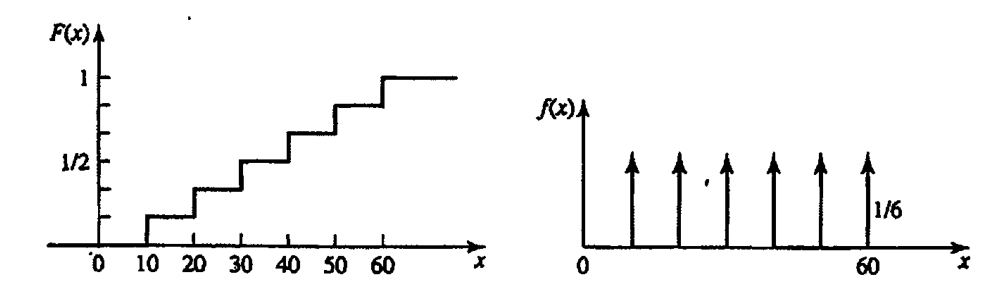
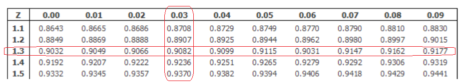
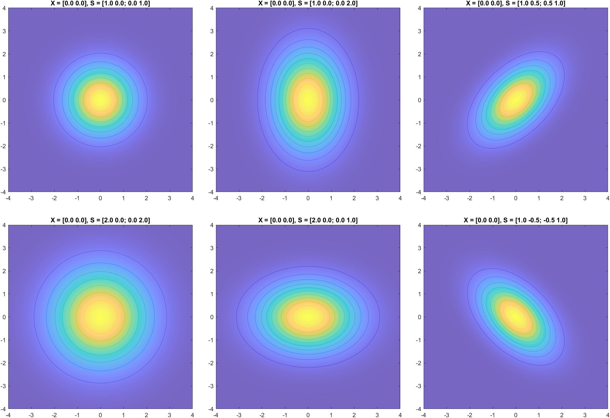

# Olasılık ve Rastgele Süreçler

Olasılık ve rastgele süreçler başlığında; olasılığın temel aksiyomlarından başlanarak, istatistiksel işaret işlemenin de temellerini oluşturan rastgele değişken ve rastgele süreçler kavramı üzerinde durulacaktır.

- [Olasılığın Temelleri](#olasılığın-temelleri)
  - [Olasılık Aksiyomları](#olasılık-aksiyomları)
  - [Koşullu Olasılık ve Bayes](#koşullu-olasılık-ve-bayes)
  - [Permutasyon \& Kombinasyon](#permutasyon--kombinasyon)
  - [Bağımsızlık ve Bernolli Denemeleri](#bağımsızlık-ve-bernolli-denemeleri)
- [Rastgele Değişken Kavramı](#rastgele-değişken-kavramı)
  - [Kümülatif Dağılım ve Olasılık Yoğunluk Fonksiyonu](#kümülatif-dağılım-ve-olasılık-yoğunluk-fonksiyonu)
  - [Ortalama, Değişinti, Momentler](#ortalama-değişinti-momentler)
  - [Önemli Rastgele Değişkenler](#önemli-rastgele-değişkenler)
  - [Rastgele Değişkenlerin Fonksiyonları](#rastgele-değişkenlerin-fonksiyonları)
- [Çok Boyutlu Rastgele Değişkenler](#çok-boyutlu-rastgele-değişkenler)
  - [Kümülatif Dağılım ve Olasılık Yoğunluk Fonksiyonu](#kümülatif-dağılım-ve-olasılık-yoğunluk-fonksiyonu-1)
  - [Marjinalleştirme](#marjinalleştirme)
  - [Koşullu Olasılık Dağılım Fonksiyonu](#koşullu-olasılık-dağılım-fonksiyonu)
  - [Kovaryans ve Korelasyon](#kovaryans-ve-korelasyon)
  - [İlişkisizlik, Ortogonallik (Diklik) ve Bağımsızlık](#i̇lişkisizlik-ortogonallik-diklik-ve-bağımsızlık)
- [Merkezi Limit Teoremi](#merkezi-limit-teoremi)
- [Rastgele Süreçler](#rastgele-süreçler)
  - [Beklenen Değer](#beklenen-değer)
  - [Oto-Kovaryans ve Oto-Korelasyon Matrisi](#oto-kovaryans-ve-oto-korelasyon-matrisi)
  - [Durağanlık](#durağanlık)
  - [Gaussian Süreçler](#gaussian-süreçler)
  - [Markov Süreçler](#markov-süreçler)
- [Çok Boyutlu Normal Dağılım](#çok-boyutlu-normal-dağılım)

## Olasılığın Temelleri

**Örnek Uzay:** Bir deneyin olası tüm sonuçlarını içeren uzaydır. Bu uzay $S$ ile gösterilir.

**Kesin Olay:** Bir olay deneyin her tekrarında oluşuyorsa, buna kesin olay denir. Bu durumda olayı ifade eden küme $A=S$ örnek uzaydır.

**İmkansız Olay:** Bir deneyin tekrarlanması sırasında asla ortaya çıkmayan olaya imkansız olay denir. Örnek uzayın hiçbir noktası imkansız olay olamayacağından, $A=\emptyset$ boş kümedir. 

**Bağdaşmaz Olay:** Bir deneyin $S$ örnek uzayında tanımalanan $A$ ve $B$ olaylarının hiçbir ortak noktası yoksa, $A$ ve $B$ olayları bağdaşmaz olaylar  denir. Bu durumda $P(A\cap B)$ imkansız olay olur.

**Bağımsız Olay:** Bir olayın ortaya çıkma olasılığı diğer olayın oluşmasına veya oluşmamasına bağlı değilse, bu iki olaya istatistiksel olarak bağımsız olaylar denir. $A$ ve $B$ nin bağımsız olabilmesi için gerek ve yeter koşul $P(A\cap B)=P(A)P(B)$ dir.

### Olasılık Aksiyomları

Olasılık teorisi 3 temel aksiyom üzerinde kuruludur.

- $P(A) \geq 0$
- $P(S) = 1$
- $P(A \cap B)=0 \Leftrightarrow P(A \cup B) = P(A) + P(B)$

### Koşullu Olasılık ve Bayes

Bir $B$ olayının olması durumunda, $A$ olayının olasılığı aşağıdaki şekilde tanımlıdır.

$$
P(A \lvert B) = \frac{P(A \cap B)}{P(B)} = \frac{P(B \lvert A)P(A)}{P(B)}
$$

Bu ifade farklı $A,B$ nin farklı ilişkileri için incelenirse;

$A,B$ **bağımsız** olaylarsa; $P(A\cap B)=P(A)P(B)$ olacağından $P(A \lvert B) = P(A)$ olur.

$A,B$ **bağdaşmaz** olaylarsa; $P(A\cap B)=0$ olacağından $P(A \lvert B) = 0$ olur.

$B \subset A$ ise  $P(A\cap B) = P(B)$ olcağından $P(A \lvert B) = 1$ olur.

### Permutasyon & Kombinasyon

$n$ farklı nesnenin, farklı sıralarda dizilerek oluşturabileceği kümeye $n$'nin **permutasyonları** denir. Birinci sıra için $n$, ikinci sıra için $(n-1)$, üçüncü sıra için $(n-2)$, ... eleman seçilebileceğinden; toplam permutasyon $P_n = n!$ ile bulunur.

$n$ farklı nesneden, $k$ farklı seçim yapılmak istendiğinde oluşan uzaya ise $n$'nin $k$'li **kombinasyonu** denir. Birinci sıra için $n$, ikinci sıra için $(n-1)$, $k$'ninci sıra için $(n-k+1)$ tercih yapılabileceğinden; toplam seçim $P = \frac{n!}{(n-k)!}$ farklı şekilde yapılabilir. 

Yapılan her $k$ elemanlı küme kendi içerisinde $k!$ şekilde sıralanabileceğinden; **kombinasyon** sayısı $C{n \choose k} = \frac{n!}{(n-k)! k!}$ şeklinde bulunur.

<blockquote>

**ÖRNEK:** $H= \lbrace a,b,c,d \rbrace$ ile verilen kümeden 2 eleman kaç farklı şekilde seçilir?

Sorulan soru bir kombinasyon sorusu olduğundan cevap $C{n \choose k} = \frac{4!}{(4-2)! 2!} = 6$ şeklinde hesaplanır. 

Adım adım bu seçimi göstermek istersek;

- $P{4 \choose 2} = \frac{n!}{(n-k)!} = \frac{4!}{(4-2)!} = 12$ farklı ikili eleman seçimi yapılır.
- $S= \lbrace (a,b),(a,c),(a,d),(b,a),(b,c),(b,d),(c,a),(c,b),(c,d),(d,a),(d,b),(d,c) \rbrace$
- Listede yer alan $(a,b) = (b,a)$ gibi seçimler birbirinin aynı olduğundan, bu seçimler kaldırlırsa; ${n \choose k} = \frac{4!}{(4-2)! 2!} = 6$ kombinasyonu bulunur.- 
- $C= \lbrace (a,b),(a,c),(a,d),(b,c),(b,d),(c,d) \rbrace$ kümesi elde edilir.

</blockquote>

### Bağımsızlık ve Bernolli Denemeleri

$p$ olasılıkla oluşan bir olayın, $n$ kez tekrarlanan bir deneyde $k$ kere görülmesi olasılığı aşağıdaki şekilde hesaplanır.

Olayın tam olarak $k$ kez görülmesi gerektiğinden; olay $k$ kez olmalı ve $(n-k)$ kez olmamalıdır. Olayların olma olasılıkları birbirinden bağımsızsa; ilk $k$ denemede olayın olma, sonrasında olmama olasılığı $o =p^k (1-p)^{(n-k)}$ ile hesaplanır.

Olaylar farklı sıralarda gözlense dahi olayın olma sayısı $k$ değişmeyeceğinden, sıra da hesaba katılarak toplam olasılık aşağıdaki şekilde hesaplanır.

$$
P_n(k) = {n \choose k}p^k (1-p)^{(n-k)}
$$

<blockquote>

**ÖRNEK:** $p=0.1$ olasılıkla bozuk olarak üretilen ampüller $n=5$ parçadan oluşan bir kutuda satılmaktadır. Bu kutudaki ampüllerin çoğunun bozuk olma olasılığı nedir?

Kutuda $n=5$ parça bulunduğundan bozuk ampüllerin sayısının $k=3,4,5$ olması gerekmektedir.

Bu olasılık aşağıdaki şekilde hesaplanır.

$$
\begin{aligned}
    P(k \geq 3) &= \sum_{k=3}^{5} {n \choose k}p^k (1-p)^{(n-k)}\\
    &= \sum_{k=3}^{5} {5 \choose k}0.1^k 0.9^{(5-k)}\\
    &= 0.0081 + 0.00045 + 0.00001 = 0.00856
\end{aligned}
$$

</blockquote>

## Rastgele Değişken Kavramı

Bir rastgele değişken, örnek uzayda bulunan her olasılık için atanan bir değeri göstermektedir. Tanımdan yola çıkarak, rastgele değişkeni $\mathbf{x}(\xi): \mathbb{S} \to \mathbb{C}$ şeklinde tanımlanan bir fonksiyon olarak da ele alabiliriz.

Örnek olarak zarın tek gelmesi durumunda 0, çift gelmesi durumunda 1 üreten bir sistemin çıktıları rastgele değişkendir.

Notasyon olarak $\lbrace  \mathbf{x} \leq x \rbrace$ gösterimi, $\mathbf{x}(\xi) \leq x$ şartını sağlayan $\xi \subseteq S$ elemanlarından oluşan kümeyi göstermektedir.

### Kümülatif Dağılım ve Olasılık Yoğunluk Fonksiyonu

Bir $\lbrace  \mathbf{x} \leq w \rbrace$ kümesinin olasılığını tanımlayan $F_{\mathbf{x}}(x) = P \lbrace  \mathbf{x} \leq w \rbrace$ ifadesine **kümülatif dağılım fonksiyonu** denir.

$F_{\mathbf{x}}(x) = P \lbrace  \mathbf{x} \leq w \rbrace$ ifadesinin türevine, $f_{\mathbf{x}}(x) = \frac{d F_{\mathbf{x}}(x)}{dx}$ **olasılık yoğunluk fonksiyonu** denir.  $F_{\mathbf{x}}(x)$ monoton artan bir fonksiyon olduğundan, **olasılık yoğunluk fonksiyonu her zaman pozitiftir**.

**ÖNEMLİ:** Sürekli değişkenler için $\mathbf{x}$'in alabileceği sonsuz sayıda değer olduğundan, $\mathbf{x}$'in spesifik bir değere sahip olma olasılığı $P \lbrace \mathbf{x} = x \rbrace  = 0$' dır. Bu nedenle $f_{\mathbf{x}}(x)$, $\lbrace \mathbf{x} = w \rbrace$ kümesinin olasılığı olarak görülmemelidir.

Ancak **ayrık değişkenler için $f_{\mathbf{x}}(x)$ olasılık yoğunluk fonksiyonun değeri, $\lbrace \mathbf{x} = w \rbrace$ kümesinin olasılığına eşittir**. 

<blockquote>

**ÖRNEK:** Bir zar deneyinde rastgele değişken $\mathbf{x}(z) = 10z$ olarak tanımlanıyor. Buna göre olasılık yoğunluk ve dağılım fonksiyonlarını bulunuz.

Bu şekilde tanımlanan bir rastgele değişkenin farklı noktalardaki dağılım fonksiyonu değerini hesaplayalım.

$$
\begin{aligned}
     \lbrace  \mathbf{x} \leq 25 \rbrace  &=  \lbrace 1,2 \rbrace  \Rightarrow F(\mathbf{x} \leq 25) = \frac{2}{6}\\
     \lbrace  \mathbf{x} \leq 45 \rbrace  &=  \lbrace 1,2,3,4 \rbrace  \Rightarrow F(\mathbf{x} \leq 45) = \frac{4}{6}\\
     \lbrace  \mathbf{x} \leq 5 \rbrace  &= \emptyset \Rightarrow F(\mathbf{x} \leq 5) = 0\\
\end{aligned}
$$

İfade farklı noktalarda hesaplandığında aşağıda verilen grafik elde edilir.

</blockquote>

<blockquote>

**ÖRNEK:** $P \lbrace  x_1 < \mathbf{x} \leq x_2  \rbrace$ şeklinde tanımlanan bir olasılığı dağılım ve yoğunluk fonksiyonları cinsinden ifade ediniz.

$F_{\mathbf{x}}(x) = P \lbrace  \mathbf{x} \leq w \rbrace$ şeklinde tanımlandığından; dağılım fonksiyonları $F_{\mathbf{x}}(x_1) = P \lbrace  \mathbf{x} \leq x_1 \rbrace$ ve $F_{\mathbf{x}}(x_2) = P \lbrace  \mathbf{x} \leq x_2 \rbrace$ şeklinde yazılır. Buradan da $P \lbrace  x_1 < \mathbf{x} \leq x_2  \rbrace  = F_{\mathbf{x}}(x_2) - F_{\mathbf{x}}(x_1)$ olarak bulunur.

$f_{\mathbf{x}}(x) = \frac{d F_{\mathbf{x}}(x)}{dx}$ şeklinde tanımlandığından; $P \lbrace  \mathbf{x} \leq x_1 \rbrace  = \int_{-\infty}^{x_1} f_{\mathbf{x}}(x)dx$ ve $P \lbrace  \mathbf{x} \leq x_2 \rbrace  = \int_{-\infty}^{x_2} f_{\mathbf{x}}(x)dx$ şeklinde yazılır. Buradan da $P \lbrace  x_1 < \mathbf{x} \leq x_2  \rbrace  = \int_{x_1}^{x_2} f_{\mathbf{x}}(x)dx$ olarak bulunur.

</blockquote>

### Ortalama, Değişinti, Momentler

**Ortalama:** Bir rastgele değişkenin ortalaması veya beklenen değeri aşağıdaki ifade ile tanımlanır.

$$
E[\mathbf{x}] = \int_{-\infty}^{\infty} x f_{\mathbf{x}}(x) dx
$$

Bu ifade, $\mathbf{x}$'in olası tüm değerlerinin, o değerleri alma olasılığı ile ağırlıklandırılarak toplanması olarak da okunabilir.

**Değişinti:** Bir rastgele değişkenin, $\mu=E[\mathbf{x}]$ ortalaması etrafındaki yayılımına değişinti veya varyans denir ve aşağıdaki ifade ile gösterilir.

$$
\sigma^2_\mathbf{x} = \int_{-\infty}^{\infty} (x-\mu)^2 f_{\mathbf{x}}(x) dx = E[(x-\mu)^2]
$$

$(x-\mu)^2$ ve  $f_{\mathbf{x}}(x)$ her zaman pozitif olduğundan; **değişinti her zaman pozitiftir**. Verilen ifadede $\sigma^2$ varyans veya değişinti, $\sigma$ ise standart sapma olarak isimlendirilmektedir.

**Moment:** Bir rastgele değişkenin, aldığı değerin farklı kuvvetlerine bağlı istatistiklerini incelemek üzere geliştirilen bir işleçtir ve $m_n = E[x^n]$ şeklinde hesaplanır.

**Merkezi Moment:** Rastgele değişkenin, ortalaması etrafında, aldığı değerin farklı kuvvetlerine bağlı istatistiklerini incelemek üzere geliştirilen bir işleçtir ve $m_n = E[(x-\mu)^n]$ şeklinde hesaplanır.

**Karakteristik Fonksiyon:** Bir rastgele değişkenin olasılığık yoğunluk fonksiyonunun Fourier dönüşümüne denir.

### Önemli Rastgele Değişkenler

Bu bölümde sürekli ve ayrık uzayda tanımlanan ve sıklıkla karşılaşılan rastgele değişkenlerin tanımı yapılacaktır.

#### Normal (Gaussian) Dağılım

Normal dağılım günlük hayatta en sık karşılaşılan olasılık dağılım fonksiyonudur. Ortalama $\mu$ ve varyans $\sigma^2$ gibi iki parametre ile ifade edilen dağılımın yoğunluk fonksiyonu aşağıdaki şekilde tanımlıdır.

$$
f_{\mathbf{x}}(x) = \mathcal{N}(\mu, \sigma^2) = \frac{1}{\sqrt{2\pi \sigma^2}}e^{-\frac{(x-\mu)^2}{2\sigma^2}}
$$

Dağılımın kümülatif dağılım fonksiyonun hesaplanması ise aşağıdaki formül ile yapılır.

$$
F_{\mathbf{x}}(x) = \int_{-\infty}^{x}\frac{1}{\sqrt{2\pi \sigma^2}}e^{-\frac{(w-\mu)^2}{2\sigma^2}} dx \triangleq G\left( \frac{x-\mu}{\sigma}\right)
$$

İfadede yazılan integralin hesaplanması karmaşık olduğundan bu değer genellikle $G$ standartlaştırılmış ( $\mu=0, \sigma=1$ ) dağılım fonksiyonu tablosu kullanılarak hesaplanır.

<blockquote>

**ÖRNEK:** Bir kuru hücreli bataryanın ömrü $600$ gün ortalamalı ve $60$ gün standart sapmalı bir normal dağılım olarak veriliyor. Bu bataryalardan bir tanesinin $680$ günden uzun çalışma olasılığı kaçtır?

Bir rastgele değişkenin $680$ den fazla olma olasılığı $1-F_{\mathbf{x}}(680)$ şeklinde hesaplanır. Cihaz normal dağılımlı olduğundan; $F_{\mathbf{x}}(680)$ standartlaştırılmış dağılım tablosu $G$ kullanılarak aşağıdaki şekilde bulunur.

$$
F_{\mathbf{x}}(680) = G\left( \frac{680-\mu}{\sigma}\right) = G\left( \frac{680-600}{60}\right) = G(1.333)
$$

Bu değer $G(Z)$ tablosundan okunarak, $1-F_{\mathbf{x}}(680)$ aşağıdaki şekilde hesaplanır.

$$
P \lbrace \mathbf{x} > 680 \rbrace  = 1-F_{\mathbf{x}}(680) = 1 - G(1.33) = 0.0918
$$

</blockquote>

#### Exponansiyel Dağılım

Bu dağılım günlük hayatta birbirinden bağımsız şekilde olan olayların, birbirini bekletme süresinin dağılımı incelendiğinde görülmektedir. 

Exponansiyel dağılım pozitif sayılar için tanımlanan, tek parametreli bir dağılımdır ve aşağıdaki yoğunluk fonksiyonu ile hesaplanır.

$$
f_{\mathbf{x}}(x) = \lambda e^{-\lambda x}, \quad x \geq 0
$$

**Exponansiyel dağılımın ortalaması** aşağıdaki şekilde hesaplanır.

$$
E[\mathbf{x}] = \int_{-\infty}^{\infty} x f_{\mathbf{x}}(x) dx = \int_{0}^{\infty} x \lambda e^{-\lambda x} dx = \frac{1}{\lambda}
$$

<blockquote>

**ÖRNEK:** Bir kişinin ortalama olarak 5dk telefonla konuştuğu bir kulübede, kulübe doluyken sıraya giren birinin 3 dakikadan fazla bekleme ihtimali nedir?

Kulübede yapılan konuşmaların exponansiyel dağılımlı varsayılırsa, dağılımın beklenen değeri 5 dk olarak verildiğinden $\lambda=0.2$ bulunur. Bu durumda $P \lbrace  \mathbf{x} > 3 \rbrace$ olasılığı aşağıdaki şekilde hesaplanabilir.

$$
\begin{aligned}
    P \lbrace  \mathbf{x} > 3 \rbrace  &= 1 - P \lbrace  \mathbf{x} \leq 3 \rbrace  = 1 - \int_{0}^{3} 0.2 e^{-0.2 x} dx = 1 - (-e^{-0.2 x}) \lvert_0^3 = e^{-0.6} \simeq 0.55
\end{aligned}
$$

</blockquote>

Örnekten görüleceği üzere; **exponansiyel dağılımlı bir rastgele değişken için** $P \lbrace  \mathbf{x} > t \rbrace  = e^{-\lambda t}$ **şeklinde tanımlıdır**.

#### Binom Dağılımı

Bernoulli denemelerinde $n$ kez tekrarlanan deneyde $k$ kez görülme olasılığını hesaplamıştık. Burada $k$ değerini rastgele değişken olarak belirlersek, $n$ kez tekrarlanan bir deneyde $p$ olasılıklı bir olayın $k=0, k=1, \dots, k=n$ kez olması bir dağılım oluşturacaktır. Bu dağılıma **binom dağılımı** denir ve aşağıdaki yoğunluk fonksiyonu ile tanımlanır.

$$
f_{\mathbf{k}}(k) = {n \choose k}p^k (1-p)^{(n-k)}
$$

#### Poisson Dağılımı

$p$ çok küçük olasılıklı bir olayın, **sonsuz sayıda** deneme sonrasında $k$ kez görülme olasılığını ifade etmek için **Poisson dağılımı** kullanılır. Dikkat edilecek olursa bu olasılık binom dağılımı kullanılarak; $\lim_{n \to \infty}f_{\mathbf{k}}(k)$ şeklinde de hesaplanabilir. Ancak $\lambda = np$ tanımı yaparsak, yukarıda yazılı olan limit işlemi, daha kolay hesaplanabilen aşağıdaki ifadeye eşit olmaktadır.

$$
f_{\mathbf{k}}(k) = e^{-\lambda}\frac{\lambda^k}{k!}
$$

<blockquote>

**ÖRNEK:** $n=1000$ parçadan oluşan bir sistemde, her bir parçanın bağımsız olarak arızalı olma olasılığı $p=10^{-3}$ olarak verilmiştir. Bu sistemin çalışma olasılığı nedir?

Problem bir binom dağılımı sorusudur. Sistemin çalışması için hatasız $k=0$ olması gerektiğinden, çalışma olasılığı aşağıdaki şekilde hesaplanır.

$$
f_{\mathbf{k}}(0) = {1000 \choose 0}(10^{-3})^0 (1-10^{-3})^{(n-0)} = 0.999^{1000}
$$

Soruda $n \gg 1, p \ll 1$ olduğundan $\lambda = np = 1000 \times  10^{-3} = 1$ olan bir Poisson dağılımı kullanılarak da çözülebilir. Bu durumda çözüm aşağıdaki şekilde hesaplanacaktır.

$$
f_{\mathbf{k}}(0) = e^{-1}\frac{1^0}{0!} = 0.368
$$

</blockquote>

#### Ayrık ve Sürekli Önemli Dağılımların Tablosu
| Dağılım Adı          | Matematiksel Gösterim                                            | Ortalama            | Varyans               |
| -------------------- | ---------------------------------------------------------------- | ------------------- | --------------------- |
| Normal Dağılım       | $\frac{1}{\sqrt{2\pi \sigma^2}}e^{-\frac{(x-\mu)^2}{2\sigma^2}}$ | $\mu$               | $\sigma^2$            |
| Exponansiyel Dağılım | $\lambda e^{-\lambda x}, \quad x \geq 0$                            | $\frac{1}{\lambda}$ | $\frac{1}{\lambda^2}$ |
| Düzgün Dağılım       | $\frac{1}{b-a}, \quad a < x < b$                                    | $\frac{a+b}{2}$     | $\frac{(b-a)^2}{12}$  |
| Binom Dağılımı       | ${n \choose k}p^k (1-p)^{(n-k)}$                                 | $np$                | $np(1-p)$             |
| Poisson Dağılımı     | $e^{-\lambda}\frac{\lambda^k}{k!}$                               | $\lambda$           | $\lambda$             |
| Düzgün Dağılım       | $\frac{1}{N}$                                                    | $\frac{N+1}{2}$     | $\frac{N^2-1}{12}$    |

### Rastgele Değişkenlerin Fonksiyonları

Bu bölümde $\mathbf{y}=g(\mathbf{x})$ şeklinde tanımlanan bir rastgele değişkenin davranışı incelenecektir.

#### Doğrusal Dönüşüm Fonksiyonu
$\mathbf{y} = a \mathbf{x} + b$ şeklinde bir ifadeyi ele alalım ve bu rastgele değişkenin dağılım fonksiyonunu $F_{\mathbf{x}}(x)$ cinsinden elde etmeye çalışalım.

$F_{\mathbf{y}}(y) = P \lbrace \mathbf{y} \leq y \rbrace  = P \lbrace a \mathbf{x} + b \leq y \rbrace$ olduğundan ifade aşağıdaki şekilde yazılır.

$$
F_{\mathbf{y}}(y) = P \lbrace a \mathbf{x} + b \leq y \rbrace  = 
\begin{cases}
  F_{\mathbf{x}}(\frac{y-b}{a}), & a > 0\\
  1-F_{\mathbf{x}}(\frac{y-b}{a}), & a < 0
\end{cases}
$$

#### Eşikleme Fonksiyonu

Aşağıdaki şekilde tanımlanan bir eşikleme fonksiyonun dağılım fonksiyonunu $F_{\mathbf{x}}(x)$ cinsinden elde etmeye çalışalım.

$$
g(x) = \begin{cases}
  1, & x > 0\\
  0, & x \leq 0
\end{cases}
$$

Burada $\mathbf{y} \in  \lbrace 0,1 \rbrace$ aralığında değerler almaktadır. $y=0$ olması için $x \leq 0$, $y=1$ olması için $x > 0$ olması gerektiğinden dağılım fonksiyonu aşağıdaki şekilde yazılır.

$$
F_{\mathbf{y}}(y) =
\begin{cases}
  F_{\mathbf{x}}(0), & y = 0\\
  1-F_{\mathbf{x}}(0), & y = 1
\end{cases}
$$

#### Genel Formülasyon

 $\mathbf{y}=g(\mathbf{x})$ şeklinde verilen iki rastgele değişken için $g$ ve $g^{-1}$ fonskiyonlarının sürekli türevlenebilir olması durumunda iki rastgele değişkenin olasılık yoğunluk fonksiyonu arasındaki ilişki aşağıdaki şekilde tanımlıdır.

$$
f_\mathbf{y}(y) = f_\mathbf{x}(g^{-1}(x)) \left \lVert \frac{\partial g^{-1}(y)}{\partial y} \right \lVert
$$

Burada $\lVert.\lVert$ ifadesi Jacobian matrisinin mutlak değerini göstermeketdir.

<blockquote>

**ÖRNEK:** $f_x(\mathbf{x})$ ve $f_y(\mathbf{y})$ sırasıyla $\mathbf{x}$ ve $\mathbf{y}$ **bağımsız** rastgele değişkenlerine ait olasılık yoğunluk fonksiyonları olsun. Bu iki rastgele değişkenin toplamı ile elde edilen $\mathbf{z}$ rastgele değişkeninin olasılık yoğunluk fonksiyonunu bulunuz.

İlk olarak $F_z(\mathbf{z} < z)$ dağılım fonksiyonunu bulmaya çalışalım. $\mathbf{z} < z$ olabilmesi için $\mathbf{x} = x$ değerini aldığı durumda $\mathbf{y} < z-x$ değerini almalıdır. 

$$
F_z(z) = \int_{-\infty}^{\infty} f_x(x) F_y(z-x) dx
$$

Yoğunluk fonksiyonunu bulmak için ifadenin türevi alınırsa aşağıdaki eşitlik elde edilir.

$$
f_z(\mathbf{z}) = \frac{d}{dz}F_z(z) = \int_{-\infty}^{\infty} f_x(x) f_y(z-x) dx = f_x(\mathbf{z}) \ast f_y(\mathbf{z})
$$

</blockquote>

## Çok Boyutlu Rastgele Değişkenler

Bu bölümde birden fazla değişkene bağlı olasılık yoğunluk ve dağılım fonksiyonları incelenecektir. İncelemeler kolaylık olması açısından $\mathbf{x}$ ve $\mathbf{y}$ gibi iki değişken üzerinde yapılacaktır.

### Kümülatif Dağılım ve Olasılık Yoğunluk Fonksiyonu

Bir $\lbrace  \mathbf{x} \leq x \rbrace$ kümesinin olasılığını tanımlayan $F_{\mathbf{x}}(x)$ ve $\lbrace  \mathbf{y} \leq y \rbrace$ kümesinin olasılığını tanımlayan $F_{\mathbf{y}}(y)$ fonksiyonları $\mathbf{x}$ ve $\mathbf{y}$ değişkenlerinin **marjinal** dağılım fonksiyonlarıdır. İki değişkenin **ortak dağılım fonksiyonu** $F_{\mathbf{xy}}(x,y) = P \lbrace \mathbf{x} \leq x,\mathbf{y} \leq y \rbrace$ olasılığını göstermektedir.

Tek değişkenli fonksiyonlarda olduğu gibi, $F_{\mathbf{xy}}(x,y)$ ifadesinin türevine, $f_{\mathbf{xy}}(x,y) = \frac{\partial^2 F_{\mathbf{xy}}(x,y)}{\partial x \partial y}$ **ortak olasılık yoğunluk fonksiyonu** denir.  

### Marjinalleştirme

Ortak dağılım fonksiyonu $F_{\mathbf{xy}}(x,y)$ kullanılarak marjinal dağılım ( $F_{\mathbf{x}}(x), F_{\mathbf{y}}(y)$ ) ve yoğunluk fonksiyonlarının ( $f_{\mathbf{x}}(x), f_{\mathbf{y}}(y)$ ) elde edilmesi işlemine **marjinalleştirme** denir.

$F_{\mathbf{xy}}(x,y) = P \lbrace \mathbf{x} \leq x,\mathbf{y} \leq y \rbrace$ şeklinde tanımlandığından marjinal dağılım fonksiyonları aşağıdaki şekilde yazılabilir.

$$
F_{\mathbf{x}}(x) = F_{\mathbf{xy}}(x,\infty), \quad F_{\mathbf{x}}(y) = F_{\mathbf{xy}}(\infty, y)
$$

Benzer yaklaşımla yoğunluk fonksiyonları da aşağıdaki şekilde elde edilir.

$$
f_{\mathbf{x}}(x) = \int_{-\infty}^{\infty} f_{\mathbf{xy}}(x,y) dy, \phantom{dd} f_{\mathbf{x}}(y) = \int_{-\infty}^{\infty} f_{\mathbf{xy}}(x,y) dx
$$

### Koşullu Olasılık Dağılım Fonksiyonu

$F_{\mathbf{xy}}(x,y \lvert M)$ şeklinde değişkenler üzerinde koşul ile verilen dağılım fonksiyonlarına **koşullu dağılım fonksiyonu** denir. Bu tipteki fonksiyonlar Bayes teoremi yardımıyla çözülür.

### Kovaryans ve Korelasyon

İki rastgele değişkenin çarpımlarının beklenen değerine $R_{\mathbf{xy}} = E[\mathbf{x}\mathbf{y}]$ **korelasyon** denir. 

$E[\mathbf{x}]=\mu_\mathbf{x}, E[\mathbf{y}]=\mu_\mathbf{y}$ olmak üzere iki rastgele değişkenin **kovaryansı** da aşağıdaki şekilde tanımlanmaktadır.

$$
C_{\mathbf{xy}} = E[(\mathbf{x}-\mu_\mathbf{x})(\mathbf{y}-\mu_\mathbf{y})]
$$

Burada çarpımlar yapılıp, beklenen değer işleci parantezin içerisine dağıtılırsa; kovaryans işleminin 

$$
C_{\mathbf{xy}} = E[\mathbf{x}\mathbf{y}] - E[\mathbf{x}]E[\mathbf{y}]
$$

şeklinde de yazılabildiği görülür.

Kovaryans değerinin, değişkenlerin standart sapması ile normalize edilmesi sonucunda çıkan değere ise **korelasyon katsayısı** adı verilir.

$$
\rho_{\mathbf{xy}} = \frac{C_{\mathbf{xy}}}{\sigma_\mathbf{x} \sigma_\mathbf{y}}
$$

$\lvert C_{\mathbf{xy}} \lvert \leq \sigma_\mathbf{x} \sigma_\mathbf{y}$ olduğundan, korelasyon katsayısı $-1 \leq \rho_{\mathbf{xy}} \leq 1$ aralığındadır.

**Koşullu Kovaryans Matrisi** $C_{\mathbf{x \lvert y}} = E\left[ (\mathbf{x}-\mu_\mathbf{x \lvert y})(\mathbf{x}-\mu_\mathbf{x \lvert y}) \lvert\mathbf{y} \right]$ şeklinde tanımlanmaktadır.

<blockquote>

**ÖRNEK:** Herhangi bir kovaryans matrisi  $\mathbf{C}_x$'in pozitif yarı-tanımlı olduğunu gösteriniz.

Pozitif yarı-tanımlı tanımına göre de rastgele seçilen her $\mathbf{y}$ vektörü için $\mathbf{y}^\intercal \mathbf{C_x} \mathbf{y} \geq 0$ olmalıdır. Burada $\mathbf{C_x}$ tanımı ikinci denklemde yerine yazılırsa;

$$
\begin{aligned}
    \mathbf{y}^\intercal \mathbf{C_x} \mathbf{y} &= \mathbf{y}^\intercal E\left[ (\mathbf{x} - \mu_x) (\mathbf{x} - \mu_x)^\intercal  \right] \mathbf{y} \\
    &=E\left[ \mathbf{y}^\intercal(\mathbf{x} - \mu_x) (\mathbf{x} - \mu_x)^\intercal \mathbf{y} \right]\\
    &=E\left[ \left(\mathbf{y}^\intercal(\mathbf{x} - \mu_x) \right) \left(\mathbf{y}^\intercal (\mathbf{x} - \mu_x) \right)^\intercal \right]\\
    &=E \left[ s s^\intercal \right], \; s = \mathbf{y}^\intercal(\mathbf{x} - \mu_x)
\end{aligned}
$$

elde edilir. Son adımda bulunan $E \left[ s s^\intercal \right]$ ifadesinde bulunan $s = \mathbf{y}^\intercal(\mathbf{x} - \mu_x)$ çarpımı bir skaler olduğundan, $E \left[s^2 \right]$ karesel beklendik değerini göstermektedir. 

Bir rastgele değişkenin karesel beklendik değeri varyansına eşit olduğundan $E \left[ s s^\intercal \right] = \sigma_s^2 \geq 0$ olacaktır. Bu da $\mathbf{y}^\intercal \mathbf{C_x} \mathbf{y}$ ifadesinin her zaman sıfırdan büyük veya eşit olduğunu gösterdiğinden, $\mathbf{C_x}$ matrisinin pozitif yarı-tanımlı olduğu sonucu çıkarılır.

</blockquote>

### İlişkisizlik, Ortogonallik (Diklik) ve Bağımsızlık

Korelasyon katsayısı iki rastgele değişken arasındaki doğrusal ilişkiyi göstermeketdir. **Korelasyon katsayısı sıfır olan iki rastgele değişkene ilişkisiz** denir. Bu katsayının sıfır olabilmesi için $C_{\mathbf{xy}} = 0$ yani $E[\mathbf{x}\mathbf{y}] = E[\mathbf{x}]E[\mathbf{y}]$ olmalıdır.

İki rastgele değişkenin **korelasyonu $E[\mathbf{x}\mathbf{y}]=0$ ise bu değişkenler ortogonaldir** veya **birbirlerine diktir** denir.

İki rastgele değişken **bağımsız** ise ortak olasılık fonksiyonları, marjinal olasılık fonksiyonlarının çarpımına $P \lbrace x,y \rbrace  = P \lbrace x \rbrace P \lbrace y \rbrace$ eşittir. Bu tanım gereği **bağımsız rastgele değişkenler aynı zamanda ilişkisizdir**. Bu nedenle bağımsız rastgele değişkenlerin de kovaryansı $C_{\mathbf{xy}} = 0$ dır.

<blockquote>

**ÖRNEK:** $\mathbf{x}$ ve $\mathbf{y}$ değişkenlerinin ortak olasılıklarını gösteren tablo aşağıda verilmiştir.

$$
\begin{array}{c|ccc}
P_{\mathbf{x},\mathbf{y}}(x,y) & \mathbf{y}=0 & \mathbf{y}=1 & \mathbf{y} = 2\\
\hline
\mathbf{x}=0 & 0.01 & 0 & 0\\
\mathbf{x}=1 & 0.09 & 0.09 & 0\\
\mathbf{x}=2 & 0 & 0 & 0.81
\end{array}
$$

- $\mathbf{x}$ ve $\mathbf{y}$ değişkenlerinin marjinal olasılık fonksiyonlarını bulunuz.

Marjinal olasılık fonksiyonlarının bulunması için bir rastgele değişkenin olası tüm değerleri üzerinden toplam alınmalıdır.

$$
P_\mathbf{x}(x)=\sum_{y \in S_y}P_{\mathbf{x},\mathbf{y}}(x,y) \Rightarrow
\begin{cases}
  \sum_{y=0}^2P_{\mathbf{x},\mathbf{y}}(0,y)=0.01, & \mathbf{x}=0\\
  \sum_{y=0}^2P_{\mathbf{x},\mathbf{y}}(1,y)=0.18, & \mathbf{x}=1\\
  \sum_{y=0}^2P_{\mathbf{x},\mathbf{y}}(2,y)=0.81, & \mathbf{x}=2\\
  0,& \text{otherwise}
\end{cases}
$$

$$
P_\mathbf{y}(y)=\sum_{x \in S_x}P_{\mathbf{x},\mathbf{y}}(x,y) \Rightarrow
\begin{cases}
  \sum_{x=0}^2P_{\mathbf{x},\mathbf{y}}(x,0)=0.10, & \mathbf{y}=0\\
  \sum_{x=0}^2P_{\mathbf{x},\mathbf{y}}(x,1)=0.09, & \mathbf{y}=1\\
  \sum_{x=0}^2P_{\mathbf{x},\mathbf{y}}(x,2)=0.81, & \mathbf{y}=2\\
  0,& \text{otherwise}
\end{cases}
$$

- $E[{\mathbf{x}}]$ and $E[{\mathbf{y}}]$ değerlerini bulunuz.

$$
E[{\mathbf{x}}]=\sum_{x\in S_x} x P_{\mathbf{x}}(x) = 0 \times 0.01 + 1 \times 0.18 + 2 \times 0.81 = 1.80
$$

$$
E[{\mathbf{y}}]=\sum_{y\in S_y} x P_{\mathbf{y}}(y) = 0 \times 0.10 + 1 \times 0.09 + 2 \times 0.81 = 1.71
$$

- ${\mathbf{x}}$ ve ${\mathbf{y}}$ değişkenlerinin varyansını bulunuz.

$$
\sigma^2_{{\mathbf{x}}} = E[{\mathbf{x}}^2]-E[{\mathbf{x}}]^2 = 3.42 - 1.80^2 = 0.18
$$

$$
\sigma^2_{{\mathbf{y}}} = E[{\mathbf{y}}^2]-E[{\mathbf{y}}]^2 = 3.33 - 1.71^2 = 0.41
$$

- İki rastgele değişkenin korelasyonunu bulunuz.

$$
E[{\mathbf{x}}{\mathbf{y}}]=\sum_{x=0}^2\sum_{y=0}^2 xyP_{{\mathbf{x}},{\mathbf{y}}}(x,y) = 1\times 1\times 0.09 + 2\times 2 \times 0.81=3.33
$$

- İki rastgele değişkenin kovaryansını bulunuz.

Korelasyon ve kovaryans arasındaki ilşkiyi kullanarak;

$$C_{{\mathbf{x}}{\mathbf{y}}} = E[{\mathbf{x}}{\mathbf{y}}] - E[{\mathbf{x}}]E[{\mathbf{y}}] = 3.33-1.80 \times 1.71=0.252$$

- İki rastgele değişkenin ilişkisizlik, ortogonallik ve bağımsızlık analizini yapınız.

$C_{{\mathbf{x}}{\mathbf{y}}} > 0$ olduğundan iki rastgele değişken **ilişkilidir**.

$E[{\mathbf{x}}{\mathbf{y}}] > 0$ olduğundan iki rastgele değişken **ortogonal değildir**.

Bağımsızlık için $P_{{\mathbf{x}},{\mathbf{y}}}(x,y) = P_\mathbf{x}(x)P_\mathbf{y}(y)$ olmalıdır. Ancak $P_{{\mathbf{x}},{\mathbf{y}}}(0,0) \neq P_\mathbf{x}(0)P_\mathbf{y}(0)$ olduğundan iki değişken **bağımlıdır**.

- ${\mathbf{x}}+{\mathbf{y}} \leq 1$ ile tanımlanan bir $B$ koşulu için, $P_{{\mathbf{x}},{\mathbf{y}}|B}(x,y)$ koşullu olasılık fonksiyonunu bulunuz.

Bayes kuralı kullanılarak problem aşağıdaki şekilde ifade edilebilir.

$$
P_{{\mathbf{x}},{\mathbf{y}}|B}=\frac{P({\mathbf{x}},{\mathbf{y}},B)}{P(B)}=\frac{P_{{\mathbf{x}},{\mathbf{y}}}(x,y)}{P(B)},\;(x,y) \in B,$$

İlk olarak $P(B)=P_{{\mathbf{x}},{\mathbf{y}}}(0,0)+P_{{\mathbf{x}},{\mathbf{y}}}(1,0)+P_{{\mathbf{x}},{\mathbf{y}}}(0,1)=0.01+0+0.09=0.1$ hesaplanır.  Bu değer kullanılarak koşullu olasılık fonksiyonu aşağıdaki şekilde yazılır.

$$
P_{{\mathbf{x}},{\mathbf{y}}|B}=
\begin{cases}
0.1,& x=0,y=0\\
0.9,& x=1,y=0\\
0.0,& x=0,y=1\\
0,& \text{otherwise}
\end{cases}
$$

</blockquote>

## Merkezi Limit Teoremi

Merkezi Limit teoremine göre bağımsız ve aynı dağılımdan gelen rastgele değişkenlerin aritmetik ortalamaları Normal dağılıma yakınsamaktadır. Toplam $n$ örnek $(\mu, \sigma^2)$ ile karakterize edilen bir dağılımdan alınmaktaysa yakınsanan Normal dağılım $\mathcal{N}(\mu, \sigma^2/n)$ şeklinde olacaktır. Yakınsamanın geçerli olabilmesi için genel bir kabul olarak $n > 29$ örnek toplanması gereklidir.

<blockquote>

**ÖRNEK:** Bir sınavın notları $75$ ortalama ve $20$ standart sapma ile dağılmıştır. Bu sınava katılan öğrencilerden rastgele $50$ tanesinin seçilmesi durumunda, örneklem ortalamasının $80$'den az olma olasılığını bulunuz.

Merkezi limit teoremine göre rastgele seçilen $50$ kişinin notları $\mathcal{N}(75, 20^2/50)$ ile Normal dağılımlı olacaktır. O zaman soru; $\mathcal{N}(75, 4)$ ile dağılan notların $80$'den küçük olma olasılığına dönüşür. 

Elde edilen notlar normal dağılımlı olduğundan; $F_{\mathbf{x}}(80)$ standartlaştırılmış dağılım tablosu $G$ kullanılarak aşağıdaki şekilde bulunur.

$$
F_{\mathbf{x}}(80) = G\left( \frac{80-\mu}{\sigma}\right) = G\left( \frac{80-75}{2}\right) = G(2.5) = 0.9938
$$

</blockquote>

## Rastgele Süreçler

Bir rastgele süreç $\mathbf{X}=[\mathbf{x}_1,\mathbf{x}_2,\dots, \mathbf{x}_n]$ elemanları rastgele sayılardan oluşan, zamana göre indislenmiş bir vektördür. Sürekli zamanda rastgele süreçler zamanın bir fonksiyonu $\mathbf{X}(t)$ olarak ifade edilir. Rastgele süreçler için tanımlanan dağılım fonksiyonu;

$$
F_{\mathbf{X}}(X) = P(\mathbf{x}_1 < x_1, \mathbf{x}_2 < x_2, \dots, \mathbf{x}_n < x_n)
$$

olasılığını göstermektedir.

**Burada ölçümler bağımsız ise** olayların birlikte olma olasılıkları, olayların olma olasılıklarının çarpımına eşit olacaktır.

### Beklenen Değer

Bir rastgele sürecin beklenen değeri, rastgele değişkenlerin beklenen değerlerine benzer şekilde hesaplanır. Burada farklı olarak beklenen değer zamana bağlı bir fonksiyon olacaktır.

### Oto-Kovaryans ve Oto-Korelasyon Matrisi

Otokorelasyon ve otokovaryans bir rastgele sürecin iki farklı zamanındaki verilerin istatistiklerini ölçmek için kullanılır.

İki rastgele sürecin farklı zamanlardaki rastgele değişkenlerinin korelasyonuna $R_{ij}=E[\mathbf{x}_i\mathbf{x}_j]$ **otokorelasyon** denir.

İki rastgele sürecin farklı zamanlardaki rastgele değişkenlerinin kovaryansına $C_ {ij} = E[(\mathbf{x}_ i - \mu_{\mathbf{x}_ i})(\mathbf{x}_ j - \mu_{\mathbf{x}_ j})]$ **otokovaryans** denir.

<blockquote>

**ÖRNEK:** $\mathbf{X}(t) = \mathbf{a} + \mathbf{b}t$ şeklinde tanımlanan bir rastgele süreçte, $\mathbf{a}$ ve $\mathbf{b}$ bağımsız $N(1,1)$ normal dağılımlı rastgele değişkenlerdir. Bu rastgele değişkenin beklenen değerini, otokorelasyon ve otokovaryans matrislerini bulunuz.

$\mathbf{X}(t)$ bir rastgele süreç olduğundan, beklenen değer ifadesi de bir süreç olacaktır.

$$
E[\mathbf{X}(t)] = E[\mathbf{a} + \mathbf{b}t] = E[\mathbf{a}] + E[\mathbf{b}]t = 1 + t
$$

Seçilen bir $t_1,t_2$ zamanı için otokorelasyon aşağıdaki şekilde tanımlanır.

$$
R_{t_1 t_2}=E[(\mathbf{a} + \mathbf{b}t_1)(\mathbf{a} + \mathbf{b}t_2)] = E[\mathbf{a}^2] + E[\mathbf{a}\mathbf{b}]t_2 + E[\mathbf{a}\mathbf{b}]t_1 + E[\mathbf{b}^2]t_1 t_2
$$

Burada $\mathbf{a}$ ve $\mathbf{b}$ bağımsız olduklarından $E[\mathbf{a}\mathbf{b}] = E[\mathbf{a}]E[\mathbf{b}] = 1$ olur.

$E[\mathbf{x}\mathbf{x}] = \mu_{\mathbf{x}}^2 + \sigma_{\mathbf{x}}^2$ olduğundan $E[\mathbf{a}\mathbf{a}] = E[\mathbf{b}\mathbf{b}] = 2$ olacaktır. Bu durumda $R_{t_1 t_2}$ aşağıdaki şekilde bulunur.

$$
R_{t_1 t_2}= 2 + t_2 + t_1 + 2t_1 t_2
$$

Otokorelasyon matrisi ile arasındaki ilişki kullanılarak otokovaryans matrisi aşağıdaki şekilde bulunur.

$$
C_{t_1 t_2} = R_{t_1 t_2} - E[\mathbf{x}_{t_1}]E[\mathbf{x}_{t_2}] = 2 + t_2 + t_1 + 2t_1 t_2 - (1+t_1)(1+t_2) = 1 + t_1 t_2
$$

</blockquote>

### Durağanlık

Bir rastgele sürecin istatistikleri zamana bağlı değişmiyorsa o sürece **sıkı durağan süreç** denir.

Eğer sürecin sadece birinci ve ikinci derece istatistikleri (**ortalama** ve **kovaryans**) zamana bağlı değişmiyorsa, bu tip süreçler **geniş anlamda durağan süreç** olarak isimlendirilir.

Bir başka deyişle **geniş anlamda durağan** sistemlerde $\mathbf{\bar{X}}(t)$ sabit, $C_{t_1 t_2} = C_{t_1 - t_2}$ şartı sağlanmalıdır.

### Gaussian Süreçler

Bir rastgele sürecin olasılık dağılım ve yoğunluk fonksiyonları Gaussian dağılımlı ise Gaussian süreç olarak isimlendirilir.

### Markov Süreçler

Deterministik sistemlerde diferansiyel denklemler ile gösterilen sistemlerin herhangi bir andaki değeri, ilk değerin bilinmesi durumunda hesaplanabilir. Bu sistem yapısının stokastik karşılığ Markov süreçleri olarak söylenebilir. Markov süreçlerde, sistemin bir sonraki durumu yalnızca güncel durumuna bağlıdır.

Matematiksel olarak bu durum aşağıdaki gibi gösterilir.

$$
f_{\mathbf{x}}(x_{n+1} \lvert x_{1},x_{2},\dots,x_{n}) = f_{\mathbf{x}}( x_{n+1} \lvert x_{n})
$$

## Çok Boyutlu Normal Dağılım

Normal dağılım olasılık problemlerinde sıklıkla karşılaşılan bir dağılım fonksiyonu olduğundan, bu bölümde çok boyutlu normal dağılımın özellikleri incelenecektir. $\mathbf{X} = [ \mathbf{x}_ 1, \mathbf{x}_ 2, \dots, \mathbf{x}_ n ]$ şeklinde $n$ boyutlu bir vektör olsun. Bu vektördeki $\mathbf{x}_ i \sim N(\mu _{x_i}, \sigma _{x_i}^2)$ rastgele değişkenleri normal dağılıma sahipse $\mathbf{X}$'in olasılık yoğunluk fonksiyonu aşağıdaki şekilde yazılır. 

$$
f_{\mathbf{X}}(X) = \frac{1}{(2\pi)^{n/2} \lvert \Sigma \lvert^{1/2}} \exp \left(-\frac{1}{2}(X - \mu_X) \Sigma^{-1} (X - \mu_X) \right)
$$

Burada $\Sigma$ $\mathbf{X}$'in kovaryans matirisini, $\lvert \Sigma \lvert$ kovaryans matirisinin determinantını, $\mu_X$ ise beklenen değerini göstermektedir.

Verilen vektörde $\mathbf{x}_i$' ler **bağımsız** ise **kovaryans matrisi diyagonal** olacağından işlem aşağıdaki sade biçimde yazılabilir.

$$
f_{\mathbf{X}}(X) = \prod_{i=1}^{n} \frac{1}{\sqrt{2\pi \sigma_i^2}} \exp \left(-\frac{(x_i - \mu_{x_i})^2}{2\sigma_i^2} \right)
$$

Aşağıda 2 boyutlu Normal dağılılı bir rastgele değişkenin farklı $\Sigma$ değerleri için görünümü paylaşılmıştır.

