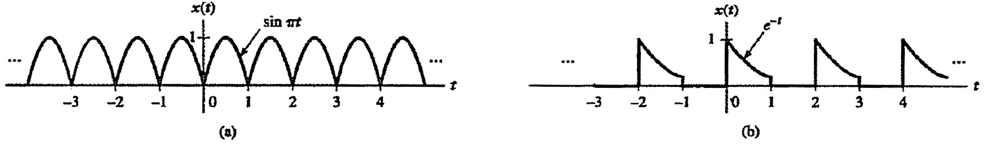
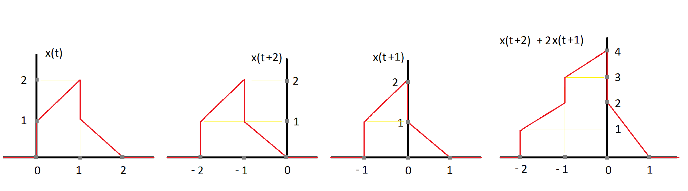
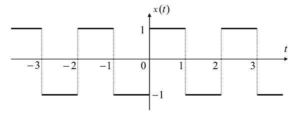
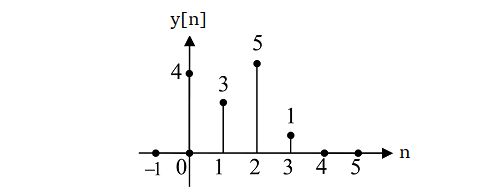

# Sorular

Bu bölümde tüm derslerden hazırlanan sorular çözülecektir.

<blockquote>

**SORU:** Aşağıda verilen periyodik sinyallerin Fourier serisi gösterimini bulunuz.

</blockquote>

Verilen sinyal sürekli zamanlı bir işarettir. Bu nedenle Fourier serisi katsayıları aşağıdaki formül ile hesaplanır.

$$
a_k = \frac{1}{T} \int_T x(t) e^{-jk(2 \pi / T)t} dt
$$

- İlk işaret için $T=1$, $x(t) = \sin(\pi t)$ olduğundan seri gösterimi aşağıdaki şekilde yapılır.

$$
\begin{aligned}
    a_k &= \frac{1}{T} \int_T x(t) e^{-jk(2 \pi / T)t} dt\\
    &= \int_{0}^{1} \sin(\pi t) e^{-jk(2 \pi )t} dt\\
    &= \int_{0}^{1} \frac{1}{2j} \left(e^{j\pi t}-e^{-j\pi t}\right) e^{-j2k \pi t} dt\\
    &= \frac{1}{2j} \int_{0}^{1} \left(e^{j\pi t (1-2k)}-e^{-j\pi t(1+2k)}\right) dt\\
    &= \frac{1}{2j} \left[ \frac{1}{j\pi (1-2k)} e^{j\pi t (1-2k)} \big \lvert_0^1 - \frac{1}{j\pi (1+2k)} e^{j\pi t (1+2k)} \big \lvert_0^1 \right]\\
    &= \frac{1}{2j} \left[ \frac{-2}{j\pi (1-2k)} - \frac{-2}{j\pi (1+2k)} \right]\\
    &= \frac{4k}{\pi (1 - 4k)}
\end{aligned}
$$

- İkinci işaret için $T=2$, $x(t) = e^{-t}, \quad 0 \leq t < 1$ olduğundan seri gösterimi aşağıdaki şekilde yapılır.

$$
\begin{aligned}
    a_k &= \frac{1}{T} \int_T x(t) e^{-jk(2 \pi / T)t} dt\\
    &= \frac{1}{2} \int_0^1 e^{-t} e^{-jk(2 \pi / 2)t} dt\\
    &= \frac{1}{2} \int_0^1 e^{-(j \pi k + 1)t} dt\\
    &= -\frac{1}{2(j \pi k + 1)} e^{-(j \pi k + 1)t} \big \lvert_0^1\\
    &= \frac{1 - e^{-(j \pi k + 1)}}{2(j \pi k + 1)}
\end{aligned}
$$

<blockquote>

**SORU:** Aşağıda verilen iki sinyalin konvolüsyonunu hesaplayıp, sonuçları çiziniz.

$$
x(t)=
\begin{cases}
    t+1,& 0\leq t \leq 1 \\
    2-t, & 1< t \leq 2 \\
    0, & \text{diğer}
\end{cases}
$$

$$ 
h(t)=\delta(t+2)+2\delta(t+1) 
$$

</blockquote>

Verilen soruda, $x(t) \ast h(t)$ sürekli zamanlı konvolüsyonun sonucu sorulmaktadır. Bu sürekli zamanlı konvolüsyonu şu şekilde hesaplayabiliriz. 

$$
x(t) \ast h(t)=\int_{-\infty}^{\infty} x(\tau)h(t-\tau)d\tau=\int_{-\infty}^{\infty} h(\tau)x(t-\tau)d\tau
$$

Burada $h(t)=\delta(t+2)+2\delta(t+1)$ ifadesi yerine konarak integral sonucu şu şekilde hesaplanabilir: 

$$
x(t) \ast h(t)=x(t+2)+2x(t+1)
$$

Verilen $x(t)$ ve bulunan sonuca ilişkin grafik aşağıdaki şekilde verilmiştir.

<blockquote>

**SORU:** Aşağıda verilen sistem için frekans ve birim dürtü yanıtını bulunuz.

$$
y[n] - \frac{1}{4} y[n-1] - \frac{1}{8} y[n-2] = 3 x[n] - \frac{3}{4} x[n-1]
$$

</blockquote>

Verilen ifadenin Fourier dönüşümü alınırsa, frekans yanıtı $H(e^{jw})$ aşağıdaki şekilde elde edilir.

$$
\begin{aligned}
&Y(e^{jw}) - \frac{1}{4} Y(e^{jw})e^{-jw} - \frac{1}{8} Y(e^{jw})e^{-2jw} = 3 X(e^{jw}) - \frac{3}{4} X(e^{jw}) e^{-jw}\\
\Rightarrow H(e^{jw}) &= \frac{Y(e^{jw})}{X(e^{jw})} = \frac{3 - \frac{3}{4}e^{-jw}}{1 - \frac{1}{4}e^{-jw} - \frac{1}{8}e^{-2jw}} = \frac{1}{1 - \frac{1}{2}e^{-jw}} + \frac{2}{1 + \frac{1}{4}e^{-jw}}\\
\end{aligned}
$$

Bu ifadenin Ters Fourier dönüşümü alınarak da birim dürtü yanıtı aşağıdaki şekilde hesaplanır.

$$
h [n] = \left [ \left(\frac{1}{2} \right)^n + 2 \left(-\frac{1}{4} \right)^n \right ] u[n]
$$

<blockquote>

**SORU:** $2 y'(t) + 3 y(t) = x'(t)$ denklemi ile tanımlanan sistemin frekans ve birim dürtü yanıtını bulunuz.

</blockquote>

Verilen ifadenin Laplace dönüşümü alınırsa, frekans yanıtı $H(s)$ aşağıdaki şekilde elde edilir.

$$
\begin{aligned}
2 s Y(s) + 3 Y(s) &= s X(s)\\
\Rightarrow H(s) &= \frac{Y(s)}{X(s)} = \frac{s}{2s + 3} 
\end{aligned}
$$

İfadenin Ters Laplace dönüşümü alınarak da birim dürtü yanıtı aşağıdaki biçimde hesaplanır.

$$
\begin{aligned}
h(t) &= \mathcal{S}^{-1} \Bigl \lbrace H(s) \Bigl \rbrace\\
&= \mathcal{S}^{-1} \Bigl \lbrace \frac{s}{2s + 3} \Bigl \rbrace\\
&= \mathcal{S}^{-1} \biggl \lbrace \frac{1}{2} \left( 1 - \frac{3/2}{s + 3/2}\right)  \biggl \rbrace\\
&= \mathcal{S}^{-1} \biggl \lbrace \frac{1}{2} - \frac{3}{4}\frac{1}{s + 3/2} \biggl \rbrace\\
&= \frac{1}{2} \delta (t) - \frac{3}{4} e^{-3/2t} u(t)
\end{aligned}
$$

<blockquote>

**SORU:** Doğrusal Zamanla Değişmeyen bir sistemin girdisi $x[n]=\left (\frac{1}{2}\right )^nu[n]+2^nu[-n-1]$ iken, çıktısı $y[n]=6\left (\frac{1}{2}\right )^nu[n]-6\left (\frac{3}{4}\right )^nu[n]$ şeklinde olmaktadır.

- Sistem transfer fonksiyonu $H(z)$'i bulunuz. ROC, kutup ve sıfır noktalarını belirtiniz.

- Sistemin birim dürtü yanıtını belirleyiniz.

- Sistemi fark denklemleri ile gösteriniz.

- Sistem nedensel ve kararlı mıdır?

</blockquote>

Sistemin transfer fonksiyonu $H(z) = Y(z)/X(z)$ ile bulunur. Bu durumda öncelikle $Y(z)$ ve $X(z)$ ifadelerini bulmamız gereklidir.

$$
\begin{aligned}
    x[n]&=\left (\frac{1}{2}\right )^nu[n]+2^nu[-n-1] & \Leftrightarrow &X(z) = \frac{1}{1-0.5z^{-1}} - \frac{1}{1-2 z^{-1}}, \quad 0.5 < \lvert z \lvert < 2\\
    y[n]&=6\left (\frac{1}{2}\right )^nu[n]-6\left (\frac{3}{4}\right )^nu[n] & \Leftrightarrow &Y(z) = \frac{6}{1-0.5z^{-1}} - \frac{6}{1-0.75z^{-1}}, \quad  \lvert z \lvert > 0.75\\
\end{aligned}
$$

Bu iki ifade önce toplanır ardından bölüm şeklinde yazılırsa, transfer fonksiyonu aşağıdaki şekilde elde edilir.

$$
\begin{aligned}
H(z) &= \frac{Y(z)}{X(z)} = \frac{\frac{6}{1-0.5z^{-1}} - \frac{6}{1-0.75z^{-1}}}{\frac{1}{1-0.5z^{-1}} - \frac{1}{1-2 z^{-1}}} = \frac{z-2}{z-0.75} = \frac{1-2z^{-1}}{1-0.75z^{-1}}, \quad \lvert z \lvert > 0.75
\end{aligned}
$$

Görüldüğü üzere fonksiyonun sıfır noktası $z=2$, kutup noktası ise $z=0.75$ değerindedir.

İfadenin zaman karşılığı aşağıdaki şekilde hesaplanır.

$$
\begin{aligned}
h[n] &= Z^{-1} \Bigl \lbrace H(z) \Bigl \rbrace\\
&= Z^{-1} \biggl \lbrace \frac{1-2z^{-1}}{1-0.75z^{-1}} \biggl \rbrace\\
&= Z^{-1} \biggl \lbrace \frac{1}{1-0.75z^{-1}} + 2\frac{z^{-1}}{1-0.75z^{-1}} \biggl \rbrace\\
&= (0.75)^n u[n] + 2(0.75)^{n-1} u[n-1]
\end{aligned}
$$

$\frac{Y(z)}{X(z)}$'nin ters z dönüşümü kullanılarak fark denklemi aşağıdaki şekilde yazılır.

$$
y[n] - 0.75 y[n-1] = x[n] - 2 x[n-1]
$$

Sistemin kararlılık analizi için ROC incelenmelidir. Sistemin yakınsama bölgesi $\lvert z \lvert > 0.75$ olduğundan birim çemberi içermektedir ve dolayısıyla **kararlıdır**.

$\lvert z \lvert > 0.75$ sonsuzu içerdiğinden sistem **nedenseldir**. Bu durum bulunan $h[n]$ üzerinden de gösterilebilir. Dikkat edilirse $h[n+k] = 0, \forall k > 0$ şartı sağlanmaktadır.

<blockquote>

**SORU:** Giriş-Çıkış ilişkisi $y[n+2]-y[n] = 3x[n+2] - x[n+1]$ ile verilen sistemin $x[n] = \delta[n-2]$ girdisine tepkisini bulunuz.

</blockquote>

Bir sistemin $x[n]=\delta[n]$ girdisine karşılık çıktısı $y[n]=h[n]$ olduğundan, soruda $h[n-2]$ değeri sorulmaktadır.

Verilen ifadenin z dönüşümü alınırsa $H(z)$ aşağıdaki şekilde elde edilir.

$$
\begin{aligned}
    y[n+2]-y[n] = 3x[n+2] - x[n+1] & \Leftrightarrow z^2 Y(z) - Y(z) = 3 z^2 X(z) - z X(z)\\
    & \Rightarrow H(z) = \frac{Y(z)}{X(z)} = \frac{3 z^2-z}{z^2-1} = \frac{z}{z-1} + 2 \frac{z}{z+1}, \quad \lvert z \lvert > 1
\end{aligned}
$$

Bu ifadenin de ters z dönüşümü alındığında $h[n] = u[n] + 2(-1)^n u[n]$ olarak bulunur. Soruda istenilen değer $h[n-2]$ olduğundan sonuç aşağıdaki şekilde yazılır.

$$
y[n] = h[n-2] = u[n-2] + 2(-1)^{(n-2)} u[n-2]
$$

<blockquote>

**SORU:** Aşağıdaki işaretlere Fourier dönüşümü uygulayarak frekans gösterimlerini bulunuz.

- $x(t)=e^{-2t} u(t-3)$
- $x(t)=e^{-4 \lvert t \lvert}$

</blockquote>

Sürekli zamanlı işaretler için Fourier dönüşümü aşağıdaki şekilde tanımlanır.

$$
X(jw) = \int_{-\infty}^{\infty} x(t) e^{-jwt} dt
$$

Bu durumda frekans gösterimleri aşağıdaki şekilde elde edilir.

$$
\begin{aligned}
    X(jw) &= \int_{-\infty}^{\infty} e^{-2t} u(t-3) e^{-jwt} dt\\
    &= \int_{3}^{\infty} e^{-(2+jw)t} dt\\
    &= -\frac{1}{2 + jw} e^{-(2+jw)t} \big \lvert_3^{\infty}\\
    &= \frac{e^{-3(2+jw)}}{2 + jw}
\end{aligned}
$$

$$
\begin{aligned}
    X(jw) &= \int_{-\infty}^{\infty} e^{-4 \lvert t \lvert} e^{-jwt} dt\\
    &= \int_{-\infty}^{0} e^{+4t} e^{-jwt} dt + \int_{0}^{\infty} e^{-4t} e^{-jwt} dt\\
    &= \int_{-\infty}^{0} e^{(4-jw)t} dt + \int_{0}^{\infty} e^{-(4+jw)t} dt\\
    &= \frac{1}{4-jw} e^{(4-jw)t} \big \lvert_{-\infty}^{0} - \frac{1}{4+jw} e^{-(4+jw)t} \big \lvert_{0}^{\infty}\\
    &= \frac{1}{4-jw} + \frac{1}{4+jw}\\
    &= \frac{8}{16 + w^2}
\end{aligned}
$$

<blockquote>

**SORU:** Aşağıda verilen periyodik işaretin Fourier serisi göstermini bulunuz.

</blockquote>

Verilen işaret $T=2$ ile periyodik bir sinyaldir. Bu nedenle açısal frekans $w=2 \pi / T = \pi$ olacaktır. Sürekli zamanlı işaretin Fourier serisi gösterimi aşağıdaki şekilde yapılır.

$$
\begin{aligned}
    a_k &= \frac{1}{T}\int_{T} x(t) e^{-j k w t} dt\\
    &= \frac{1}{2}\int_{-1}^0 (-1) e^{-j k w t} dt + \frac{1}{2}\int_{0}^1 (1) e^{-j k w t} dt\\
    &= \frac{1}{2jkw} e^{-j k w t} \big \lvert_{-1}^0 - \frac{1}{2jkw} e^{-j k w t} \big \lvert_{0}^1\\
    &= \frac{1}{2jk \pi} \left ( 2 - e^{j k \pi} - e^{-j k \pi}\right )\\
    &= \frac{1 - \cos(k \pi)}{jk \pi}
\end{aligned}
$$

Sinyalin ortalaması sıfır olduğundan $a_0=0$ olacaktır. Ek olarak $k$ çift seçilmesi durumunda $\cos(k \pi)=1$ olacağından $a_k=0$ olacaktır. Tek terimler için de seri katsayıları aşağıdaki şekilde yazılır.

$$
a_k = \frac{2}{j\pi} \left [ \dots , -\frac{1}{5 \pi}, -\frac{1}{3 \pi} , -\frac{1}{\pi}, \frac{1}{ \pi}, \frac{1}{3 \pi}, \frac{1}{5 \pi}, \dots \right ]
$$

Elde edilen katsayılar kullanılarak zaman domeninde işaret geri çatılırsa aşağıdaki eşitlik elde edilir.

$$
y(t) = \frac{4}{\pi} \left [\frac{\sin(\pi)}{1} + \frac{\sin(3\pi)}{3} + \frac{\sin(5\pi)}{5} + \dots \right ]
$$

<blockquote>

**SORU:** ) Birim basamak tepkisi aşağıdaki $y[n]$ sinyali olan doğrusal
zamanla değişmez bir sistemin girişine de $x[n] = y[n]$ sinyali
uygulanırsa çıkışı ne olur?

</blockquote>

Sistem doğrusal ve zamanla değişmeyen olduğundan, $\delta[n] = u[n]-u[n-1]$ ilişkisi yardımıyla, $u[n]$ için verdiği $y[n]$ tepkisi kullanılarak $h[n] = y[n]-y[n-1]$ şeklinde hesaplanabilir. 

Bu durumda $h[n] = [\dots,0,\overset{\downarrow}{4},-1,2,-4,-1,0, \dots]$ şeklinde hesaplanacaktır.

$x[n]=[\dots,0,\overset{\downarrow}{4},3,5,1,0, \dots]$ şeklinde verildiğinden; istenilen çıktı $z[n] = x[n] \ast h[n]$ işlemi ile aşağıdaki şekilde hesaplanır.

$$
\begin{aligned}
    z[0] &= \sum_{k=-\infty}^{\infty} x[k] h[0-k] =& 4 \cdot 4 &= 16\\
    z[1] &= \sum_{k=-\infty}^{\infty} x[k] h[1-k] =& 4 \cdot -1 + 3 \cdot 4 &= 8\\
    z[2] &= \sum_{k=-\infty}^{\infty} x[k] h[2-k] =& 4 \cdot 2 + 3 \cdot -1 + 5 \cdot 4 &= 25\\
    z[3] &= \sum_{k=-\infty}^{\infty} x[k] h[3-k] =& 4 \cdot -4 + 3 \cdot 2 + 5 \cdot -1 + 1 \cdot 4 &= -11\\
    z[4] &= \sum_{k=-\infty}^{\infty} x[k] h[4-k] =& 4 \cdot -1 + 3 \cdot -4 + 5 \cdot 2 + 1 \cdot -1 &= -7\\
    z[5] &= \sum_{k=-\infty}^{\infty} x[k] h[5-k] =& 3 \cdot -1 + 5 \cdot -4 + 1 \cdot 2 &= -21\\
    z[6] &= \sum_{k=-\infty}^{\infty} x[k] h[6-k] =& 5 \cdot -1 + 1 \cdot -4 &= -9\\
    z[7] &= \sum_{k=-\infty}^{\infty} x[k] h[7-k] =& 1 \cdot -1 &= -1\\
\end{aligned}
$$

<blockquote>

**SORU:** $x[n] = 4 (-0.3)^{-n}u[-n]$ ifadesinin $z$ dönüşümünü bulunuz.

</blockquote>

$X(z) = \sum_{n=-\infty}^{\infty} x[n] z^{-n}$ şeklinde tanımlanmaktadır. O zaman verilen ifadenin $z$ dönüşümü aşağıdaki şekilde yazılır.

$$
\begin{aligned}
    X(x) &= \sum_{n=-\infty}^{\infty} 4 (-0.3)^{-n}u[-n] z^{-n}\\
    &= \sum_{n=-\infty}^{0} 4 (-0.3)^{-n} z^{-n}\\
    &= -4\sum_{m=0}^{\infty} (-0.3z)^m\\
    &= -\frac{4}{1+0.3z}, \quad \lvert z \lvert < \frac{10}{3}
\end{aligned}
$$

<blockquote>

**SORU:** $x''(t)+7x'(t)+12x(t) = 0$ ile verilen diferansiyel denklemin çözümünü $x(0)=2$ ve $x'(0)=-4$ ilk koşulları altında çözünüz. 

</blockquote>

Verilen problem Laplace dönüşümü ile kolaylıkla çözülebilir. Eşitliğin Laplace dönüşümü aşağıdaki şekilde yazılır.

$$
s^2 X(s) - s x(0) - x'(0) + 7sX(s) - 7x(0) + 12 X(s) = 0
$$

Burada $x(0)=2$ ve $x'(0)=-4$ değerleri yerine yazılır ve $X(s)$ çekilirse aşağıdaki ifade elde edilir.

$$
X(s) = \frac{s x(0) + x'(0) + 7 x(0)}{s^2 + 7s + 12} = \frac{2s + 10}{s^2 + 7s + 12} = \frac{4}{s+3} - \frac{2}{s+4}
$$

Bulunan ifadenin ters Laplace dönüşümü $x(t) = 4 e^{-3t}u(t) - 2e^{-4t}u(t)$ şeklinde hesaplanır. Doğrulama için $t=0$ yazıldığından $x(0) = 4 - 2 = 2$, $x'(0) = -12 - (-8) = -4$ olduğu da görülür.

<blockquote>

**SORU:** Bir sentetik kumaşın dayanıklılığı $\mathbf{x}\sim \mathcal{N}(600,64)$ ile modellenmektedir. Bu kumaşın yüzde kaçı $600 \pm 18$ basınca dayanabilir.

</blockquote>

İstenilen olasılık değeri, kümülatif dağılım fonksiyonu kullanılarak aşağıdaki şekilde gösterilir.

$$
P \lbrace  582 \leq \mathbf{x} \leq 618 \rbrace  = F_{\mathbf{x}}(x < 618) - F_{\mathbf{x}}(x < 582)
$$

Normalize edilmiş Gaussian dağılım fonksiyonu kullanılarak bu olasılıklar aşağıdaki şekilde hesaplanır.

$$
\begin{aligned}
    P \lbrace  582 \leq \mathbf{x} \leq 618 \rbrace  &= G_{\mathbf{x}}(\frac{618 - 600}{8}) - G_{\mathbf{x}}(\frac{582 - 600}{8})\\
    &= G_{\mathbf{x}}(2.25) - G_{\mathbf{x}}(-2.25)\\
    &= G_{\mathbf{x}}(2.25) - (1 - G_{\mathbf{x}}(2.25))\\
    &= 0.97
\end{aligned}
$$

<blockquote>

**SORU:** $x_i \in  \lbrace 0.5, 2 \rbrace$ kümesinden, düzgün dağılımla rastgele değerler alan bir rastgele değişken olsun. $\mathbf{x} = \prod_{i=1}^n x_i$ ile tanımlanan rastgele değişken için $x_i$ değişkenlerinin bağımsız olduğu bilgisini kullanarak aşağıdaki soruları cevaplayınız.

- $\mathbf{x}$'in beklenen değeri nedir?
- $n=100$ olması durumunda $P \lbrace \mathbf{x} > 1000 \rbrace$ olasılığını hesaplayınız.

</blockquote>

Soruda rastgele değişkenler bağımsız verildiğinden $E[\mathbf{x}] = \prod_{i=1}^n E[x_i]$ şeklinde yazılabilecektir. $E[x_i] = \frac{1}{2}0.5 + \frac{1}{2}2 = 1.25$ olduğundan $E[\mathbf{x}] = 1.25^n$ olacaktır.

Rastgele yapılan seçimler sonucunda $m$ kez $x_i=2$, $100-m$ kez $x_i=0.5$ çıktığını varsayalım. $\mathbf{x} > 1000$ olabilmesi için $m$ sayısı $100-m$ sayısından $10$ ( $2^{10} = 1024$ ) fazla olmalıdır yani ${m \geq 55}$ olmalıdır.

O zaman soru $100$ kez tekrarlanan bir deneyde bir olayın $\lbrace m \geq 55 \rbrace$ kez görülmesi şeklinde binom dağılıma sahip bir problem olarak ele alınabilir.

Elde edilen binom dağılımın standart sapması $\sqrt{npq} = \sqrt{1000 \cdot 0.5 \cdot 0.5} = 5$ olacaktır. Ortalama değer de $\mu=50$ olduğundan soruda $m$ değişkeninin 1 standart sapmadan büyük olma olasılığı sorulmaktadır. Bu olasılık da $P \lbrace \mathbf{x} > 1000 \rbrace  = 1 - G(1)=0.16$ olarak yazılır. 

<blockquote>

**SORU:** Bir web sayfasının ortalama tıklanma sayısı $\lambda=2$ olan bir Poisson dağılım ile modellenebilmektedir. Bu sitede bir saniyelik sürede ikiden daha fazla tıklanma olmamama olasılığı nedir?

</blockquote>

Poisson dağılımlı bir rastgele değişkenin olasılık yoğunluk fonksiyonu $f(k) = e^{-\lambda}\frac{\lambda^k}{k!}$ ile hesaplanmaktadır. Bir saniyelik bir süre verildiğinden $\lambda=2 \times 1 = 2$ alınmalıdır.

Soruda ikiden fazla tıklama **olmama** olaılığı sorulduğundan; $P \lbrace k\leq 2 \rbrace  = f(0)+f(1)+f(2)$ olasılığı aşağıdaki şekilde hesaplanır.

$$
P \lbrace k \leq 2 \rbrace =\sum_{k=0}^2 f(k) = e^{-2}(\frac{2^0}{0!}+\frac{2^1}{1!}+\frac{2^2}{2!})=5e^{-2}=0.676
$$

<blockquote>

**SORU:** Saat 06:00 da göreve başlayan bir metro istasyona her 15 dakikada bir gelmektedir. Saat 7:10 ile 7:30 saatleri arasında düzgün dağılımlı olarak istasyona gelen birinin treni bekleme süresine ait olasılık yoğunluk fonksiyonunu ve ortalama bekleme süresini bulunuz.

</blockquote>

Saat 07:10 dan sonra istasyona ilk gelen tren saat 07:15 de, bu trenin kaçırılması durumunda ise bir sonraki tren 07:30 da gelmektedir. Verilenlere göre zaman referansını 07:10 kabul edersek kişi $\mathbf{x} \sim U(0,20)$ dağılımla istasyona gelmektedir ve ilk tren $\mathbf{x}=5$, ikinci trense $\mathbf{x}=20$ anlarında kalkmaktadır.

Kişinin ilk trene binme olasılığı, $P \lbrace \mathbf{x} < 5 \rbrace  = 0.25$, ikinci trene binme olasılığı ise $P \lbrace 5 < \mathbf{x} < 20 \rbrace  = P \lbrace \mathbf{x} < 20 \rbrace  - P \lbrace \mathbf{x} < 5 \rbrace  = 1 - 0.25 = 0.75$ olarak bulunur.

Bekleme süresi ise ilk trene yetişilmesi durumunda $\mathbf{w}=5-\mathbf{x}$, diğer durumda ise ilk treni kaçıracak kadar geç geldiği için bekleme süresi $\mathbf{w}=15-\mathbf{x}$ olacaktır. Burada $\mathbf{x}$ düzgün dağılımlı olduğundan $\mathbf{w}$ da düzgün dağılımlı olacaktır.

$P \lbrace \mathbf{x} < 5 \rbrace  = 0.25$ durumu için $\mathbf{w}$'nin koşullu olasılık yoğunluk fonksiyonu $f_{ \lbrace  \mathbf{w} \lvert \mathbf{x} < 5  \rbrace}(w) = 1/5$, $P \lbrace \mathbf{x} > 5 \rbrace  = 0.75$ durumu için $\mathbf{w}$'nin koşullu olasılık yoğunluk fonksiyonu $f_{ \lbrace  \mathbf{w} \lvert \mathbf{x} > 5  \rbrace}(w) = 1/15$ olacaktır.

Bu durumda olasılık yoğunluk fonksiyonu aşağıdaki şekilde yazılabilir.

$$
f_{\mathbf{w}}(w) =
\begin{cases}
    0.1 = 0.25 \times \frac{1}{5} + 0.75 \times \frac{1}{15}, & w < 5\\
    0.05 = 0.75 \times \frac{1}{15}, & 5 < w < 15
\end{cases}
$$

Ortalama bekleme süresi ise aşağıdaki şekilde hesaplanır.

$$
E[\mathbf{w}] = \int_{-\infty}^{\infty} w f_{\mathbf{w}}(w) dw = \int_{0}^{5} 0.1 w dw + \int_{5}^{15} 0.05 w dw = 6.25
$$

<blockquote>

**SORU:** $\mathbf{y}=\mathbf{x}^2, \mathbf{x} \sim U(-1,1)$ şeklinde tanımlanan bir rastgele değişkenin olasılık yoğunluk fonksiyonunu bulunuz.

</blockquote>

Olasılık yoğunluk fonksiyonu dağılım fonksiyonu yardımıyla bulunabilir. Dağılım fonksiyonu kullanılarak iki rastgele değişken arasındaki ilişki aşağıdaki şekilde yazılır.

$$
F_{\mathbf{y}}(\mathbf{y} < y) = F_{\mathbf{x}}(-\sqrt{y} < \mathbf{x} < \sqrt{y}) = F_{\mathbf{x}}(\sqrt{y}) - F_{\mathbf{x}}(-\sqrt{y})
$$

İfadenin türevi alınarak yoğunluk fonksiyonu aşağıdaki şekilde bulunur.

$$
f_{\mathbf{y}}(y) = \frac{1}{2\sqrt{y}}\left (f_{\mathbf{x}}(\sqrt{y}) +  f_{\mathbf{x}}(-\sqrt{y})\right )
$$

Burada $\mathbf{x} \sim U(-1,1)$ şeklinde verildiğinden, $-1 < x < 1$ aralığında seçilen bir rastgele değer için $f_{\mathbf{x}}(x) = 0.5$ olacaktır. Tanım gereği $0 < y < 1$ olacağından $f_{\mathbf{x}}(\sqrt{y}) = f_{\mathbf{x}}(-\sqrt{y}) = 0.5$ olacaktır. Bu durumda yoğunluk fonksiyonu aşağıdaki şekilde yazılacaktır.

$$
f_{\mathbf{y}}(y) = 
\begin{cases}
    \frac{1}{2\sqrt{y}},& 0 < \mathbf{y} < 1\\
    0,& \text{otherwise}
\end{cases}
$$

<blockquote>

**SORU:** $X,Y,Z$ sırasıyla $\lambda_x=1, \lambda_y=2,\lambda_z=3$ parametreleri ile Poisson dağılımlı bağımsız değişkenlerdir.

- $P \lbrace X+Y+Z = 8 \rbrace$ olasılığını bulunuz.
- $C(X+2Y, 2Y+3Z)$ kovaryansını hesaplayınız.

</blockquote>

Verilen üç değişken de Poisson dağılımlı olduğundan $P \lbrace X+Y+Z \rbrace$ olasılığı da $\lambda=\lambda_x+\lambda_y+\lambda_z=6$ ile Poisson dağılımlı olacaktır. Bu durumda $P \lbrace X+Y+Z = 8 \rbrace$ olasılığı aşağıdaki şekilde hesaplanır.

$$
P \lbrace X+Y+Z = 8 \rbrace  = e^{-\lambda} \frac{\lambda^k}{k!} = e^{-6} \frac{6^8}{8!}
$$

Kovaryans işlemi doğrusal bir işlem olduğundan $C(X+2Y, 2Y+3Z) = C(X,2Y) + C(X,3Z) + C(2Y,2Y) + C(2Y,3Z)$ şeklinde yazılır. Soruda rastgele değişkenler bağımsız verildiğinden çapraz kovaryanslar sıfır olacaktır. Bu durumda $C(X+2Y, 2Y+3Z) = C(2Y,2Y)$ olacaktır.

Poisson dağılımlı rastgele değişkenlerin beklenen değeri ve varyansı $\lambda$ paremetresine eşit olduğundan $C(X+2Y, 2Y+3Z) = C(2Y,2Y) = 4 C(Y,Y) = 4 \lambda_y = 8$ olarak hesaplanacaktır.

