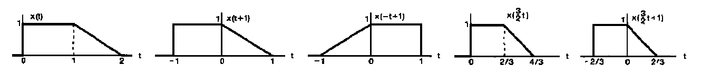
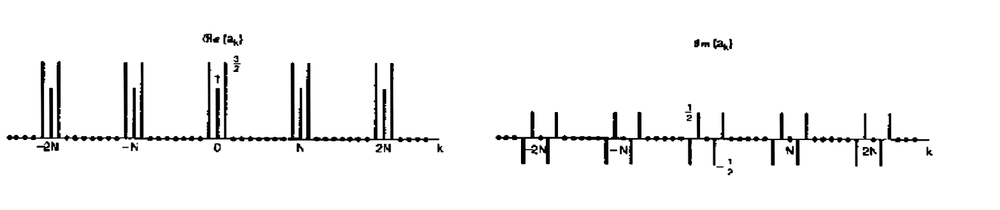
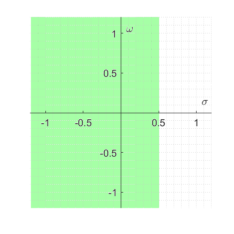
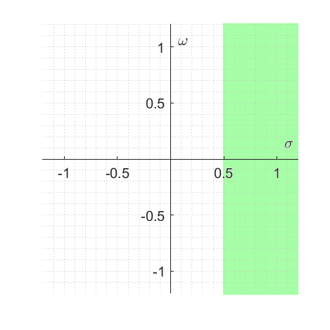
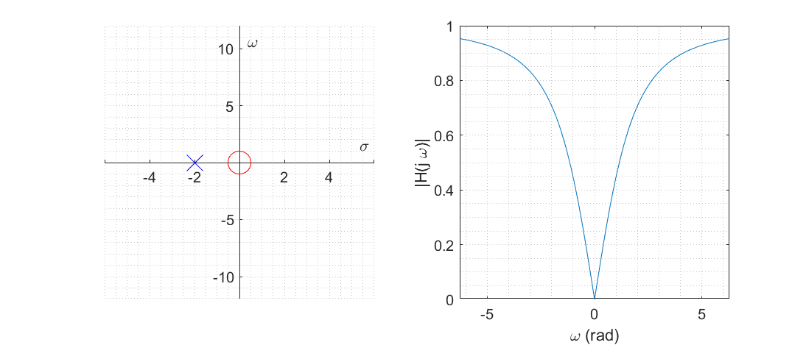
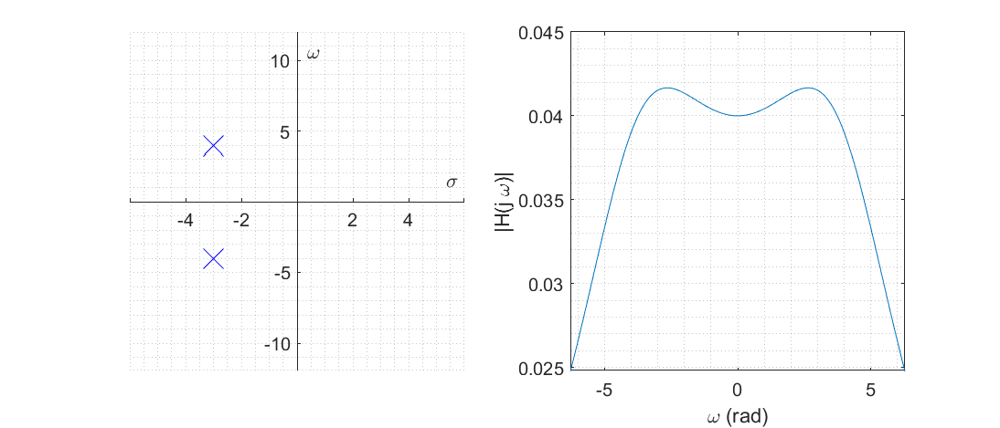

# Sinyaller ve Sistemler

Bir veya birden fazla **bağımsız** değişkenin fonksiyonu olan sinyaller; bir fenomenin davranışı veya doğası hakkında bilgi taşıyan işaretlerdir. Sistemler ise belirli bir sinyale karşı farklı bir sinyal üreten yapılardır.

Bir elektrik devresindeki voltaj ve akım değerleri zamanın bir fonksiyonu olduğundan sinyal örneğidir. Bu voltaj ve akımın oluştuğu elektrik devresi ise bir sistem örneğidir. 

Bu özet kapsamında ele alınacak Sinyaller ve Sistemler başlıkları aşağıdaki şekilde olacaktır.

- [Sinyallerin ve Sistemlerin Genel Özellikleri](#sinyallerin-ve-sistemlerin-genel-özellikleri)
  - [Enerji ve Güç](#enerji-ve-güç)
  - [Sinyallerin Dönüşümleri](#sinyallerin-dönüşümleri)
  - [Sinyallerin Özellikleri](#sinyallerin-özellikleri)
  - [Sistemlerin Özellikleri](#sistemlerin-özellikleri)
- [Doğrusal Zamanla Değişmeyen Sistemlerin Özellikleri](#doğrusal-zamanla-değişmeyen-sistemlerin-özellikleri)
  - [Evrişim](#evrişim)
- [Fourier Serisi ve Dönüşümleri](#fourier-serisi-ve-dönüşümleri)
  - [LTI Sistemlerin Öz Fonksiyonları](#lti-sistemlerin-öz-fonksiyonları)
  - [Sürekli Zamanlı Periyodik Sinyalin Fourier Serisi Gösterimi](#sürekli-zamanlı-periyodik-sinyalin-fourier-serisi-gösterimi)
  - [Parseval Teoremi](#parseval-teoremi)
  - [Ayrık Zamanlı Periyodik Sinyalin Fourier Serisi Gösterimi](#ayrık-zamanlı-periyodik-sinyalin-fourier-serisi-gösterimi)
  - [DFT: Ayrık Fourier Dönüşümü](#dft-ayrık-fourier-dönüşümü)
  - [Fark Denklemleri ve Fourier Serisi Analizi](#fark-denklemleri-ve-fourier-serisi-analizi)
  - [Sürekli Zamanlı Sinyallerin Fourier Dönüşümü](#sürekli-zamanlı-sinyallerin-fourier-dönüşümü)
  - [Parseval Teoremi](#parseval-teoremi-1)
  - [Evrişim ve Fourier Dönüşümü](#evrişim-ve-fourier-dönüşümü)
  - [DTFT: Ayrık Zamanlı Fourier Dönüşümü](#dtft-ayrık-zamanlı-fourier-dönüşümü)
  - [Fourier Serileri ve Dönüşümleri Özellikleri](#fourier-serileri-ve-dönüşümleri-özellikleri)
- [Laplace Dönüşümü](#laplace-dönüşümü)
  - [ROC Özellikleri](#roc-özellikleri)
  - [ROC Analizi](#roc-analizi)
  - [Ters Laplace Dönüşümü](#ters-laplace-dönüşümü)
  - [Kutup-Sıfır Grafiği Yorumlama](#kutup-sıfır-grafiği-yorumlama)
- [Hilbert Dönüşümü](#hilbert-dönüşümü)

## Sinyallerin ve Sistemlerin Genel Özellikleri

Sinyaller sürekli ve ayrık zamanlı olarak ikiye ayrılır. Sürekli zamanlı sinyallerde bağımsız değişken sürekli, ayrık zamanlı sinyallerde ise bağımsız değişken ayrıktır.

### Enerji ve Güç

Verilen bir zaman aralığı $t_1 \leq t \leq t_2$ veya $n_1 \leq n \leq n_2$ için bir sinyalin enerjisi ve ortalama gücü aşağıdaki şekilde hesaplanır.

|              | Sürekli Zamanlı Sinyaller                      | Ayrık Zamanlı Sinyaller                       |
| ------------ | ---------------------------------------------- | --------------------------------------------- |
| Enerji       | $E = \int_{t_1}^{t_2} \lvert x(t) \lvert^2 dt$ | $E = \sum_{n=n_1}^{n_2} \lvert x[n] \lvert^2$ |
| Ortalama Güç | $P(x) = \frac{E}{t_2-t_1}$                     | $P[n] = \frac{E}{n_2-n_1+1}$                  |

Bir sinyalin toplam gücü veya enerjisi söz konusu olduğunda; toplam işleminin limitleri tüm sinyali kapsayacak şekilde $(-\infty < t,n < \infty)$ seçilir. 

|                     | Sürekli Zamanlı Sinyaller                                                | Ayrık Zamanlı Sinyaller                                                 |
| ------------------- | ------------------------------------------------------------------------ | ----------------------------------------------------------------------- |
| Toplam Enerji       | $E_{\infty} = \lim_{T \to \infty} \int_{-T}^{T} \lvert x(t) \lvert^2 dt$ | $E_{\infty} = \lim_{N \to \infty} \sum_{n=-N}^{N} \lvert x[n] \lvert^2$ |
| Toplam Ortalama Güç | $P_{\infty}(x) = \lim\limits_{T \to \infty} \frac{E_{\infty}}{2T}$       | $P_{\infty}[n] = \lim\limits_{N \to \infty} \frac{E_{\infty}}{2N+1}$    |

Burada $x$ sinyali sonlu bir aralık dışında sıfır değerini almıyorsa $E_{\infty}$ toplamı ıraksak olacak ve sinyal sonsuz enerjili olacaktır.

Tablodan görüleceği üzere;

- $E_{\infty}$ sonlu bir değer ise, $P_{\infty} = 0$ olacaktır. Sonlu enerjili sistemlerin ortalama gücü **sıfırdır**.

- $P_{\infty} > 0$ ise $E_{\infty} = \infty$ olur. Sonlu ortalama gücü olan sinyallerin enerjisi sonsuzdur.

### Sinyallerin Dönüşümleri

### Sinyallerin Özellikleri

- Herhangi bir sinyal $x(t) = x(t + T)$ veya $x[n] = x[n + N]$ şeklinde ifade edilebiliyorsa bu sinyallere **periyodik** sinyal denir. Burada $N$ tamsayıdır.

- Bir sinyalin periyodik olmasını sağlayan **en küçük $T$ veya $N$ değerine temel periyot**, $w_0=2\pi/T$ veya $\Omega_0=2\pi/N$ değerlerine ise **temel frekans** denir.

- Sürekli zamanlı sinyallerde frekans arttıkça periyot azalmaktadır. Ancak, **ayrık sinyallerde frekansı artırmak her zaman periyodun azalacağı anlamına gelmemektedir**.

- Bir sinyal $x(-t) = x(t)$ veya $x[-n] = x[n]$ şartını sağlıyor ise **çift**, $x(-t) = -x(t)$ veya $x[-n] = -x[n]$ şartını sağlıyor ise **tek** sinyaldir.

- Tüm sinyaller tek ve çift iki sinyalin toplamı şeklinde yazılabilir.

<blockquote>

 $x[n] = \cos(\frac{1}{4}n)$ işareti periyodik midir?

$x[n]$ işaretinin periyodik olabilmesi için $x[n] = x[n + N]$ şeklinde yazılabilmelidir. Bu durumda $x[n] = \cos(\frac{1}{4}n + \frac{N}{4})$ olur. $\cos$ sinyali $2\pi$ ile periyodik olduğundan; $\frac{N}{4} = 2\pi k \to N = 8\pi k$ olmalıdır. **Ayrık sinyaller için periyodun da tamsayı olması gerektiğinden sinyal periyodik değildir.**

</blockquote>

### Sistemlerin Özellikleri

- **Belleksiz** sistemlerde çıktı sadece o anki girdiye bağlıdır.

- **Terslenebilir** sistemlerde farklı girdi farklı bir çıktıya neden olmaktadır. 

- **Nedensel** sistemlerde çıktı girdinin o anki veya daha önceki değerlerine bağlıdır.

- **Kararlı** sistemlerde küçük bir girdi, çıkışta sonlu bir etkiye neden olur.

- **Zamanla Değişmeyen** sistemlerde belirli bir girdiye verilen çıktı, zamanla değişmez. Hangi zamanda olursa olsun aynı girdiye, aynı çıktı verilir. Yani girişte $n$ birim ötelenen sinyalin çıktısı da $n$ birim ötelenir.

- **Doğrusal** bir sistem $x_1(t) \to y_1(t), x_2(t) \to y_2(t)$ şeklinde bir girdi çıktı ilişkisine sahipse, $a x_1(t) + b x_2(t)$ girdisi için $a y_1(t) + b y_2(t)$ şeklinde çıktı üretmelidir.  Burada $a,b$ **karmaşık sayı olabilir!!**

Akümülatör sistemi $y[n] = \sum_{k=-\infty}^{n-1} x[n]$;

- Eski girdilere ihtiyaç duyduğundan **bellekli**,

- $x[n] = y[n] - y[n-1]$ şeklinde yazılabildiğinden **terslenebilir**,

- Sadece eski girdilere ihtiyaç duyduğundan **nedensel**,

- $x[n]$ ler sonlu olmasına rağmen, çıktı sonsuza gittiğinden **kararsız**,

- $y[n+m] = \sum_{k=-\infty}^{n+m-1} x[n] = \sum_{k=-\infty}^{n-1} x[n+m]$ olduğundan **zamanla değişmeyen**,

- $\sum_{k=-\infty}^{n-1} ax[n] = a \sum_{k=-\infty}^{n-1} x[n] = ay[n]$ olduğundan **doğrusaldır**.

## Doğrusal Zamanla Değişmeyen Sistemlerin Özellikleri

Doğadaki pekçok fiziksel sistem doğrusal zamanla değişmeyen sistem tanımına uymaktadır. Bu sistemler süperpozisyon ilkesine uyum sağladığından; karmaşık girdi işaretlerinin basit işaretlerin toplamı şeklinde yazılmasına olanak sağlar ve sistem analizi daha kolay yapılabilir.

Örnek olarak herhangi bir $x[n]$ ayrık sinyali, zamanda ötelenmiş birim dürtü fonksiyonları $\delta[n-k]$ yardımıyla yazılabilir.

$$
x[n] = \cdots + x[1]\delta[n-1] + x[0]\delta[n] + x[-1]\delta[n+1] + \cdots = \sum_{k=-\infty}^{\infty} x[k] \delta[n-k]
$$

### Evrişim
Doğrusal ve zamanla değişmeyen bir sistemin $\delta[n]$ girdisi için $h[n]$ çıktısı ürettiğini varsayalım. Sistem zamanla değişmeyen olduğundan; $\delta[n-k] \to h[n-k]$, sistem doğrusal olduğundan; $x[k]\delta[n-k] \to x[k]h[n-k]$ olacaktır. Bu durumda sistemin çıktısı;

$$
y[n] = \sum_{k=-\infty}^{\infty} x[k] h[n-k]
$$

**evrişim** işlemi ile bulunabilecektir. Sürekli zamanda bu işlem benzer şekilde hesaplanır.

$$
y(t) = \int_{-\infty}^{\infty} x(\tau) h(t - \tau) d\tau
$$

Evrişim İşlemi, **yer değiştirme**, **dağılma** ve **birleşme** özelliklerine sahiptir.

**Nedensel** bir sistemin impuls yanıtı $h[n] = 0, n < 0$ şartını sağlamalıdır. Aksi durumda $y[0] = \sum_{k}x[k]h[-k]$ olduğundan, $y[0]$ çıktısı $x[1],x[2],\cdots$ gibi gelecek değerlere bağlı olacaktır.

$\delta[n] \to h[n]$ olduğundan **belleksiz** bir sistemde $n \neq 0$ durumunda $h[n] = 0$ olmalıdır.

Sistemin **kararlı** olabilmesi için $\sum_n \lvert h[n] \lvert$ **mutlak toplamı sonlu** olmalıdır.

## Fourier Serisi ve Dönüşümleri

Önceki bölümde LTI bir sinyalin birim dürtü fonksiyonlarının toplamı şeklinde yazılabildiğini gösterdik. Bu bölümde ise sinyalin karmaşık exponansiyel fonksiyonlar cinsinden nasıl yazılabileceğini konu alacağız.

### LTI Sistemlerin Öz Fonksiyonları
Karmaşık exponansiyel fonksiyonlar ( $e^{st}, z^n$ ) LTI sistemler için özel bir girdidir. Sürekli ve ayrık zamanda girdi ile çıktı arasındaki ilişki aşağıdaki şekilde yazılabilir.

$$
e^{st} \to H(s) e^{st} \quad\quad\quad\quad\quad\quad z^n \to H(z) z^n
$$

Görüldüğü üzere karmaşık exponansiyel sinyaller LTI sisteme girdi olarak verildiğinde sadece genliklerinde bir değişim görürülür.

**İSPAT:** $x(t) = e^{st}$ olsun;

$$
\begin{aligned}
    y(t) &= \int_{-\infty}^{\infty} h(\tau) x(t - \tau) d\tau
    &= \int_{-\infty}^{\infty} h(\tau) e^{s(t - \tau)} d\tau 
    &= \int_{-\infty}^{\infty} h(\tau) e^{st} e^{-s\tau} d\tau
    &= e^{st} \int_{-\infty}^{\infty} h(\tau)  e^{-s\tau} d\tau\\
    &= x(t) H(s)
\end{aligned}
$$

### Sürekli Zamanlı Periyodik Sinyalin Fourier Serisi Gösterimi

Periyodik bir girdi fonksiyonu karmaşık exponansiyel sinyallerin toplamı olarak ifade edilebilir.

$$x(t) = \sum_{k=-\infty}^{\infty} a_k e^{jk(2\pi / T) t}$$

Burada $a_k$ katsayılarına **Fourier serisi katsayıları** denir. Bu katsayılar aşağıdaki işlem ile hesaplanır.

$$
a_k = \frac{1}{T} \int_{T} x(t) e^{-jk(2\pi / T) t} dt
$$

Fourier seri katsayılarının bulunabilmesi için **Dirichlet Koşulları** 

- Sinyalin mutlak toplamı sonlu olmalıdır
- Sonlu sayıda maksima/minima içermelidir
- Sonlu sayıda kesiklik olmalı ve kesiklikler sonlu olmalıdır

$x(t)$ sinyali $t_0$ kadar ötelendiğinde oluşan $x(t-t_0)$ sinyalinin Fourier seri katsayıları;

$$
\begin{aligned}
   b_k &= \frac{1}{T} \int_{T} x(t-t_0) e^{-jk(2\pi / T) t} dt &= \frac{1}{T} \int_{T} x(\tau) e^{-jk(2\pi / T) (t_0+\tau)} d\tau &=
   &= e^{-jk(2\pi / T) t_0}  \frac{1}{T} \int_{T} x(\tau) e^{-jk(2\pi / T) \tau} d\tau\\
   &= e^{-jk(2\pi / T) t_0} a_k
\end{aligned}
$$

şeklinde bulunur. Görüldüğü üzere; **zamanda öteleme Fourier serisi katsayılarının genliğini değiştirmez**.

$x(t)$ sinyali $x(-t)$ şeklinde **zamanda aynalandığında Fourier serisi katsayıları da $a_k = a_{-k}$ şeklinde aynalanır**.

### Parseval Teoremi

Fourier serisi gösterimi sinyalin enerjisini değiştirmediğinden; sinyalin bir periyodundaki ortalama gücü, Fourier serisinde yer alan harmoniklerin ortalama güçlerinin toplamına eşittir. Bu durum aşağıdaki şekilde gösterilir.

$$
\frac{1}{T} \int_{T} \lvert x(t) \lvert^2 dt = \sum_k \lvert a_k e^{jkw_0 t}\lvert^2 = \sum_k \lvert a_k \lvert^2
$$

### Ayrık Zamanlı Periyodik Sinyalin Fourier Serisi Gösterimi

Ayrık zamanlı periyodik bir girdi de karmaşık exponansiyel sinyallerin toplamı olarak ifade edilebilir. Yalnız burada sinyal ayrık olduğundan ve $N$ örnek içerdiğinden, harmonik sayısı $N$ ile sınırlıdır.

$$x[n] = \sum_{k \in N} a_k e^{jk (2\pi / N) n}$$

Burada $a_k$ katsayılarına **Fourier serisi katsayıları** denir. Bu katsayılar aşağıdaki işlem ile hesaplanır.

$$
a_k = \frac{1}{N} \sum_{n \in N} x[n] e^{-jk (2\pi / N) n}
$$

### DFT: Ayrık Fourier Dönüşümü

Ayrık Zamanlı Periyodik Sinyalin Fourier Serisi Gösterimi aynı zamanda Ayrık Fourier Dönüşümü olarak da bilinir. Dönüşüm sonucu elde edilecek olan $X[k] = a_k$ şeklinde hesaplanır.

<blockquote>

 Aşağıda verilen ayrık zamanlı $x[n]$ sinyali için Fourier seri katsayılarını bulunuz. 

$$
x[n]=1+\sin\left (\frac{2\pi}{N}\right )n+3\cos\left (\frac{2\pi}{N}\right )n+\cos\left (\frac{4\pi}{N}n+\frac{\pi}{2}\right )
$$

Verilen işaret $N_0=N$ ile periyodik bir işarettir. Verilen işaret karmaşık exponansiyellerin toplamı şeklinde yeniden yazılırsa: 

$$
x[n]=1+\frac{1}{2j}\left [e^{j(2\pi/N)n}-e^{-j(2\pi/N)n}\right ]+3\frac{1}{2}\left [e^{j(2\pi/N)n}+e^{-j(2\pi/N)n}\right ]+\frac{1}{2}\left [e^{j(4\pi n/N+\pi/2)}-e^{-j(4\pi n/N+\pi/2)}\right ]
$$

Aynı terimlerin katsayıları bir araya getirilirse: 

$$x[n]=1+\left (\frac{3}{2}+\frac{1}{2j}\right )e^{j(2\pi/N)n}  + \left (\frac{3}{2}-\frac{1}{2j}\right )e^{-j(2\pi/N)n} + \left (\frac{1}{2}e^{j\pi/2}\right )e^{j2(2\pi/N)n} + \left (\frac{1}{2}e^{-j\pi/2}\right )e^{-j2(2\pi/N)n}
$$

Buradan Fourier serisi katsayıları aşağıdaki şekilde bulunur.

$$
\begin{aligned}
a_0&=&1\\
a_1&=&\frac{3}{2}+\frac{1}{2j}=\frac{3}{2}-\frac{j}{2}\\
a_{-1}&=&\frac{3}{2}-\frac{1}{2j}=\frac{3}{2}+\frac{j}{2}\\
a_2&=&\frac{1}{2}j\\
a_{-2}&=&-\frac{1}{2}j
\end{aligned}
$$

Fourier uzayında bu katsayıların $N_0=N$ periyodu ile periyodik olduğu bilindiğinden sinyalin frekans uzayındaki gösterim şu şekilde olacaktır.

</blockquote>

### Fark Denklemleri ve Fourier Serisi Analizi

$y[n] = 0.5 x[n] + 0.5 y[n-1]$ şeklinde bir fark denklemi ile verilen sistemin frekans analizini yapalım. Sistem LTI olduğundan, $x[n] = e^{jwn}$ şeklinde bir girdi verdiğimizi düşünelim. Bu durumda fark denklemi aşağıdaki şekilde yazılır.

$$
H(e^{jw}) e^{jwn} = 0.5 e^{jwn} + 0.5 H(e^{jw}) e^{jwn} e^{-jw}
$$

Buradan da sistemin transfer fonksiyonu $H(e^{jw})$ çekilerek aşağıdaki denklem elde edilir.

$$
H(e^{jw}) = \frac{0.5}{1 - 0.5e^{-jw}}
$$

Sistem yanıtına göre, $w=0$ olan bir sinyal $H(e^{jw})=1$ ile ölçeklenirken, $w=\pi$ olan bir sinyal $H(e^{jw})=\frac{0.5}{1.5}$ ile ölçeklenecektir. Görüldüğü üzere bu fark denklemi alçak geçiren bir süzgeç yapısını göstermektedir.

### Sürekli Zamanlı Sinyallerin Fourier Dönüşümü

Fourier serilerini periyodik olamayan bir sinyale uygulamak istediğimizde, sinyali sonsuz periyotlu olarak düşünerek Fourier serisi katsayılarını bulabiliriz. $T \to \infty$ durumunda $w_0 = \frac{2\pi}{T} \to 0$ olacağından, $k$ seri katsayılarının sayısı da sonsuza gidecek ve dönüşüm sürekli bir fonksiyon ile gösterilebilecektir.

$$
x(t) = \frac{1}{2 \pi} \int_{-\infty}^{\infty} X(jw) e^{jwt} dw
$$

Fourier dönüşüm sonucu $X(jw)$ ise aşağıdaki şekilde hesaplanacaktır.

$$
X(jw) = \int_{-\infty}^{\infty} x(t) e^{-jwt} dt
$$

<blockquote>

 Kare Dalganın Fourier Dönüşümü

$$
x(t) =
\begin{cases}
1, & -T_1 \leq t \leq T_1\\
0, & \text{otherwise}
\end{cases}
$$

şeklinde tanımlanan bir sinyalin Fourier dönüşümü;

$$
\begin{aligned}
    X(jw) &= \int_{-\infty}^{\infty} x(t) e^{-jwt} dt &= \int_{-T_1}^{T_1} e^{-jwt} dt\\
    &= -\frac{e^{-jwt}}{jw} \Big\lvert_{-T_1}^{T_1} &= \frac{e^{jwT_1}-e^{-jwT_1}}{jw}     &= 2\frac{\sin(wT_1)}{w}
\end{aligned}
$$

</blockquote>

### Parseval Teoremi

Fourier dönüşümü için de ortalama güç değişmediğinden, eşitlik aşağıdaki şekilde yazılır.

$$
\int_{-\infty}^{\infty} \lvert x(t) \lvert^2 dt = \frac{1}{2 \pi} \int_{-\infty}^{\infty} \lvert X(jw) \lvert^2 dw
$$

### Evrişim ve Fourier Dönüşümü

$$
y(t) = x(t) \ast h(t) \overset{\mathcal{F}}{\longleftrightarrow} Y(jw) = X(jw) H(jw)
$$

### DTFT: Ayrık Zamanlı Fourier Dönüşümü

$$
x[n] = \frac{1}{2 \pi} \int_{2\pi} X(e^{jw}) e^{jwn} dw
$$

Fourier dönüşüm sonucu $X(e^{jw})$ ise aşağıdaki şekilde hesaplanacaktır.

$$
X(e^{jw}) = \sum_{n=-\infty}^{\infty} x[n] e^{-jwn}
$$

Burada elde edilen ifade sürekli bir fonksiyondur ve $w=2\pi$ ile periyodiktir.

<blockquote>

 $x[n] = 1$ sinyalinin ayrık zamanlı Fourier dönüşümünü bulunuz.

Verilen ifade ne mutlak anlamda ne de karesel anlamda toplanabilir değildir. Yine de hesaplama amacıyla ifadenin Fourier dönüşümü aşağıdaki şekilde yazılabilir. 

$$
\begin{aligned}
X(e^{jw}) &= \sum_{n=-\infty}^{\infty} e^{-jwn}\\
\end{aligned}
$$

Yazılan ifadede herhangi bir $w \neq 0$ değeri için, birim çember etrafında $n$ ile örneklenen noktaların toplamından oluşmaktadır. Birim çemberin simetrik yapısından dolayı bu toplam sıfır olduğundan dönüşüm $w \neq 0$ için sıfıra eşittir. 

$w = 0$ değeri içinse toplam sonsuza gitmektedir. Bu şartları sağlayan fonksiyon $X(e^{jw}) = 2 \pi \delta{(w)}$ olarak tanımlanabilir. Ancak bu ifadenin $2\pi$ ile periyodik olduğu unutulmamalıdır.

</blockquote>

### Fourier Serileri ve Dönüşümleri Özellikleri

*Fourier Serileri* **periyodik** bir sinyali, **ayrık** kompleks exponansiyellerin toplamı şeklinde ifade eder.

*Fourier Dönüşümü* **aperiyodik** bir sinyali, **sürekli** bir fonksiyon ile ağırlıklandırılmış komplex exponansiyellerin integrali şeklinde ifade eder.

**Sürekli** sinyallerin frekans bileşenleri **Aperiyodik**, **Ayrık** sinyallerin frekans bileşenleri **Periyodiktir**.

|                      | Zaman                 | Frekans                   |
| -------------------- | --------------------- | ------------------------- |
| Fourier Serisi       | Sürekli -- Periyodik  | **Ayrık** ---- Aperiyodik |
| Fourier Serisi + DFT | Ayrık ---- Periyodik  | **Ayrık** ---- Periyodik  |
| Fourier Dönüşümü     | Sürekli -- Aperiyodik | **Sürekli** -- Aperiyodik |
| Fourier Dönüşümü     | Ayrık ---- Aperiyodik | **Sürekli** -- Periyodik  |

## Laplace Dönüşümü

Laplace dönüşümü Fourier transformunda kullanılan karmaşık exponansiyel fonksiyonun $s=\sigma + jw$ kullanılarak genelleştirilmiş şeklidir. 

$$
X(s) = \int_{-\infty}^{\infty} x(t) e^{-st} dt
$$

Görüldüğü üzere Fourier dönüşümü $s=jw$ için Laplace dönüşümünün özel bir durumudur. 

Yukarıda yazılan ifade $s=\sigma + jw$ yazılması durumunda farklı şekilde de okunabilir. Laplace dönüşümü $x(t)e^{-\sigma t}$ sinyalinin Fourier dönüşümü olarak da görülebilir. Burada $\sigma=0$ seçilmesi durumunda $x(t)$ olduğu gibi kullanılırken, $\sigma > 0$ zamanla azalan bir sinyal veya $\sigma < 0$ zamanla artan bir sinyal ile pencerelenerek de kullanılabilir.

<blockquote>

 **Dikkat:** Dirichlet koşullarından bilindiği üzere dönüşüm işleminin geçerli olabilmesi için girdi sinyalinin ortalama gücünün sabit olması gereklidir. Yukarıdan görüldüğü üzere sinyal exponansiyel bir sinyal ile çarpıldığından bu durum geçerli olmayabilir. Bu nedenle Laplace dönüşümlerinde dönüşümün geçerli olduğu ROC (Region of Convergence) bölgesi de verilmelidir.

</blockquote>

<blockquote>

 $x(t) = e^{-at} u(t)$ şeklinde verilen bir sinyalin Laplace dönüşümü nedir?

$$
\begin{aligned}
  X(s) &= \int_{-\infty}^{\infty} x(t) e^{-st} dt\\
  &= \int_{0}^{\infty} e^{-at} e^{-st} dt\\
  &= -\frac{1}{a+s} e^{-(s+a)t} \Big \lvert_0^{\infty}\\
  &= \frac{1}{a+s} \quad \text{ iff } s+a > 0
\end{aligned}
$$

Burada $s+a > 0$ koşulu ifadenin yakınsak olması için gerek bir koşuldur ve dönüşümün yakınsaklık bölgesini belirtmektedir.

</blockquote>

Sinyal birden fazla işaretin toplamı şeklinde verildiğinde laplace dönüşümü çoğunlukla iki polinomun bölümü şeklinde bulunacaktır. Bu polinomlardan, bölünen polinomun kökleri **sıfır**ları ( $\circ$ ), bölen polinomun kökleri ise **kutup**ları ( $\times$ ) oluşturmaktadır.

### ROC Özellikleri

ROC $s$ dönüşümü sonucunda bulunan işaretin yakınsaklık bölgesini (Region of Convergence) tanımlamaktadır.

- $x(t)$ sonsuzluk içermeyen bir sinyalken, dönüşümün yakınsak/ıraksak olacağı $\sigma$ ile belirlendiğinden, **ROC bölgesi her zaman $jw$ sanal eksene paraleldir**.
- Kutup noktalarında $H(s)$ sonsuza gittiğinden, **kutuplar her zaman ROC dışındadır**.
- $x(t)$ **sonsuzluk içermeyen ve sonlu süreli bir sinyalse; ROC tüm $s$ bölgesidir**.

### ROC Analizi

- **Kararlılık:** Fourier bölümünde bahsedildiği üzere sinyalin dönüşümünün yapılabilmesi için $x(t)$ işareti mutlak toplanabilir olmaldır. $\lvert \sigma \lvert = 0$ seçilmesi durumunda $\lvert x(t) \lvert  = \lvert e^{j \omega t} x(t) \lvert$ şeklinde yazılabildiğinden, **kararlı bir sistemin yakınsaklık bölgesi $\lvert \sigma \lvert = 0$ düzlemini içermelidir**.

- **Nedensellik:** Nedensel sinyallerde $h(t) = 0, \quad t < t_0$ olması gerektiğinden dönüşüm $H(s) = \int_{t_0}^{\infty} e^{\alpha t} e^{-(\sigma + j \omega)t}$ şeklinde yazılır. Burada $t$ pozitif olduğundan, yakınsaklık için $e^{(\alpha-\sigma) t}$' nin kuvveti negatif olmalıdır. Yani **nedensel sistemlerde ROC $\sigma > \alpha$ şeklinde tanımlanan tüm düzlemi içermelidir**.

- **Kararlı ve Nedensel** bir sistemin tüm kutup noktaları $\sigma < 0$ bölgesinde olmalıdır.

- Sağ taraflı işaretlerin ROC bölgesi $\sigma > \alpha$, sol taraflı sinyallerin ROC bölgesi $\sigma < \alpha$ şeklindedir.

| Sol Taraflı Bir İşaret: $x(t)=e^{0.5t}u(t_0-t)$ | Sağ Taraflı Bir İşaret: $x(t)=e^{0.5t}u(t-t_0)$ |
|---|---|
|  |  |

### Ters Laplace Dönüşümü

$s$ ROC bölgesi içerisinde olmak şartıyla, ters Laplace dönüşümü aşağıdaki şekilde tanımlanır.

$$
x(t) = \frac{1}{2 \pi j}\int_{-\infty}^{\infty} X(s) e^{st} ds
$$

Ancak ROC paralel kontur bölgeleri içerdiğinden bu integrali almak kolay değildir. Bunun yerine sıklıkla ifade daha basit polinomların toplamı/çarpımı şeklinde yazılarak bilinen kalıplar aracılığıyla dönüşüm yapılır.

<blockquote>

 $X(s) = \frac{1}{(s+1)(s+2)},\quad s > -1$ ise $x(t)$ ifadesini bulunuz.

Verilen polinom aşağıdaki iki polinomun toplamı şeklinde yazılabilir.

$$
X(s) = \frac{1}{s+1} - \frac{1}{s+2},\quad s > -1
$$

Elde edilen polinomlar ilk örnekte çözdüğümüz $x(t) = e^{-at} u(t)$ kalıbında olduğundan, ters dönüşüm;

$$
x(t) = e^{-1t} u(t) - e^{-2t} u(t) = (e^{-t} - e^{-2t}) u(t)
$$

olarak elde edilir.

</blockquote>

### Kutup-Sıfır Grafiği Yorumlama

Bir sistemin transfer fonksiyonunun sıfır ve kutup noktaları incelenerek transfer fonksiyonu $H(s)$ hakkında çıkarımlar yapılabilir. Çıkarımlarda genellikle sistemin frekans tepkisinin genliği kullanıldığından, $\sigma=0$ seçilerek işlemler $\lvert H(j \omega) \lvert$ üzerinden yapılır.

Örnek olarak $s=-2$ noktasında kutbu, $s=0$ noktasında sıfırı bulunan bir transfer fonksiyonunu ele alalım. Bu transfer fonksiyonu tahmini olarak aşağıdaki biçimde yazılabilir.

$$
H(s) = \frac{s}{s+2}
$$

Sistemin frekansa bağlı davranışı incelenmek istenirse $s=\sigma+j \omega$ olduğu göz önünde bulundurularak, transfer fonksiyonunun frekansa bağlı tepkisi aşağıdaki şekilde yazılır.

$$
H(j\omega) = \frac{j\omega}{j\omega+2}
$$

Elde edilen sonuçtan görüldüğü üzere $\omega \approx 0$ iken $\lvert H(j\omega) \lvert \approx 0$ olmakta, $\omega \approx \infty$ iken $\lvert H(j\omega) \lvert \approx 1$ olmaktadır. Buradan sistemin frekans yanıtı aşağıdaki gibi çizilebilir.

Benzer şekilde farklı bir örnek olarak $s=3 \pm 4j$ noktasında kutbu bulunan bir transfer fonksiyonunu ele alalım. Bu transfer fonksiyonu tahmini olarak aşağıdaki biçimde olacaktır.

$$
H(s) = \frac{1}{(s + 3 + 4j)(s + 3 - 4j)} = \frac{1}{s^2 + 6s + 25}
$$

Sistemin frekansa bağlı davranışını incelenmek için transfer fonksiyonunun frekansa bağlı tepkisi aşağıdaki şekilde yazılır.

$$
H(j\omega) = \frac{1}{6j\omega+25 - \omega^2}
$$

Elde edilen sonuçlar incelenirse; $\omega \approx 0$ iken $\lvert H(j\omega) \lvert \approx 0.04$ olmakta, $\omega \approx \infty$ iken $\lvert H(j\omega) \lvert \approx 0$ olmaktadır. Ek olarak paydada yer alan ifadenin en küçük değeri $\min_{\omega} \lvert 6j\omega+25 - \omega^2 \lvert$ için analiz yapılırsa, en küçük değer $\omega = 2.83$ için $\lvert H(j\omega) \lvert= 0.042$ değerinde olduğu görülür. Bu bilgilerle sistemin frekans yanıtı aşağıdaki gibi çizilebilir.

## Hilbert Dönüşümü

Bir $x(t)$ sinyalinin Hilbert dönüşümü $\hat{x}(t) = x(t) \ast \frac{1}{\pi t}$ şeklinde tanımlanır. 

Uzamsal domende evrişim ile tanımlanan bu işlem $h(t) = \frac{1}{\pi t}$ işleminin frekans gösterimi $H(jw) = -j \text{sgn}(w)$ kullanılarak; 

$$\hat{X}(jw) = j X(jw) \text{sgn}(w)$$

şeklinde de yazılabilir.

Elde edilen denklemden görüldüğü üzere; **Hilbert dönüşümü sonrasında** Fourier dönüşümü ile elde edilecek $X(jw)$ sinyalindeki **negatif frekanslara karşı gelen faz açıları $90^\circ$, pozitif frekanslara karşı gelen faz açıları $-90^\circ$ kaymaktadır**.

